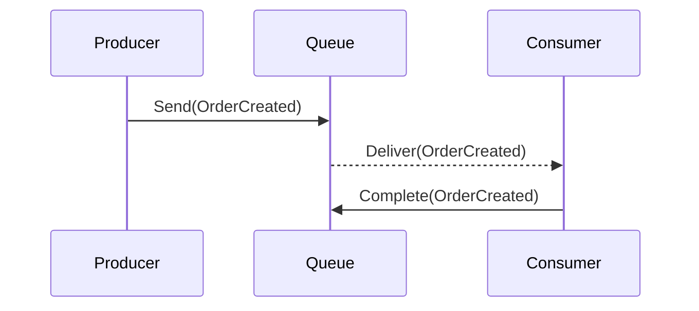

# Lab 01: Point-to-Point Messaging

> **In this document:**  
>
> [[_TOC_]]

In this lab, you will build two C# console applications:

- **`OrderProducer`:** This application sends an `OrderCreated` message containing details like `OrderId`, `CustomerId`, and `Amount`, to an Azure Service Bus queue named `workshop.point-to-point`.
- **`OrderConsumer`:** This application lists on the same queue for incoming `OrderCreated` messages, processes each order by logging its details to the console, and then completes the message so it is removed from the queue

This demo mimics a typical enterprise scenario where an order entry system (the producer) asynchronously hands off work to a fulfillment service (the consumer) via a durable message queue. You will experience how point-to-point messaging decouples sender and receiver lifecycles, enables load leveling, and provides reliable, at-least-once delivery.

---

## What is the Point-to-Point Pattern?

The **Point-to-Point** messaging pattern is one of the most fundamental forms of asynchronous communication in distributed systems. It allows a single producer to send a message to a queue and ensures that **exactly one consumer** receives and processes that message.

This pattern is ideal for scenarios where individual messages represent distinct units of work, and each unit should be handled by one recipient, such as processing orders, sending notifications, or updating inventory.

### How It Works

- **Producer:** Sends messages to a named queue.
- **Queue:** Temporarily stores messages in FIFO (First-In-First-Out) order until a consumer receives them.
- **Consumer:** Connects to the queue, retrieves one message at a time, and marks it as completed after processing.
- **Broker:** Guarantees message delivery and enforces exclusivity, so that only one consumer gets each message.

Each consumer instance receives a **single message**, ensuring no duplication or overlap. If a consumer fails during processing, the broker will redeliver the message after a lock timeout or based on the retry policy.



### Key Characteristics

| Feature               | Description                                                  |
| --------------------- | ------------------------------------------------------------ |
| One-to-One Delivery   | A single consumer handles each message.                      |
| Decoupled Services    | Producers and consumers do not need to know about each other's implementation. |
| Durable Messaging     | Messages persist until consumed or expire.                   |
| Simple Retry Handling | Consumers can abandon messages to be retried later.          |
| Guaranteed Order      | If using sessions, messages for a given key are processed sequentially. |

### Use Cases

- Order fulfillment systems
- Task processing engines
- Notification dispatching
- Invoice generation workflows

### Key Benefits

- **Isolation of Concerns:** Enables modular architecture; each service does one job without knowing the others.
- **Reliability:** Ensures at least once delivery with retry and dead-letter options.
- **Scalability (with extension):** When paired with Competing Consumers, Point-to-Point scales horizontally.
- **Simplicity:** Easy to implement with SDKs and emulators, making it ideal for foundational learning.

---

## Objectives

- Provision an Azure Service Bus namespace with a queue
- Implement a .NET-based message producer
- Implement a .NET-based message consumer
- Verify asynchronous message delivery and processing
- Explore basic error handling and cleanup

---

## Prerequisites

- [.NET SDK 8.0 or later](https://dotnet.microsoft.com/download)
- A text editor or IDE such as [Visual Studio Code](https://code.visualstudio.com/) or [Visual Studio](https://visualstudio.microsoft.com/) (any edition).
- [Docker Desktop](https://www.docker.com/products/docker-desktop)
- [Azure Service Bus Emulator](https://github.com/Azure/azure-service-bus-emulator-installer)

---

## Lab Steps

### Step 1 – Configure the Azure Service Bus Emulator

In this step, we will configure the emulator by creating the queue required for Point-to-Point messaging. This setup defines a single message queue the upcoming producer and consumer clients will use.

1. **Update the Emulator's `config.json` File**

   - **Locate the `config.json` file:** This file lives inside the installation folder of the Azure Service Emulator, under the following path: `{local-emulator-repository-folder}\ServiceBus-Emulator\Config\config.json`.

   - **Add the Processing Queue:** Modify the `Queues` array to include our `message-patterns.point-to-point` queue. Your updated `config.json` file should resemble:

     ```json
     {
       "UserConfig": {
         "Namespaces": [
           {
             "Name": "sbemulatorns",
             "Queues": [
               {
                 "Name": "message-patterns.point-to-point",
                 "Properties": {
                   "DeadLetteringOnMessageExpiration": false,
                   "DefaultMessageTimeToLive": "PT1H",
                   "DuplicateDetectionHistoryTimeWindow": "PT20S",
                   "ForwardDeadLetteredMessagesTo": "",
                   "ForwardTo": "",
                   "LockDuration": "PT1M",
                   "MaxDeliveryCount": 3,
                   "RequiresDuplicateDetection": false,
                   "RequiresSession": false
                 }
               }
             ],
             "Topics": []
           }
         ],
         "Logging": {
           "Type": "File"
         }
       }
     }
     ```

     > **Configuration Notes**
     >
     > - The **queue name** `message-patterns.point-to-point` clearly identifies this as the entry point for messages in our Point-to-Point lab.
     > - We have opted **not to require sessions** to keep this lab focused on one-to-one delivery mechanics.
     > - **Duplicate detection** and **dead-letter forwarding** are turned off for simplicity, but later labs could reintroduce these features for resilience capabilities.
     > - The `LockDuration` and `MaxDeliveryCount` ensure that messages can be retired if the consumer crashes or fails to complete processing.

2. **Start the Emulator**

   - Use the instructions provided in the Azure Service Bus Emulator installer to start the emulator for your OS (Windows, macOS, or Linux).
   - Confirm the emulator is running correctly.

### Step 2 - Create the Producer Console Application

In this step, you will create a standalone .NET console application that sends messages to the **Point-to-Point** queue on the local Azure Service Bus emulator. This activity helps reinforce key concepts like queue naming, message payloads, and one-way delivery mechanisms.

#### 2.1 Initialize the Project

1. Open a terminal in VS Code.

2. Navigate to the folder where you want to create the project.

3. Run the following command:

   ```bash
   dotnet new console -n PointToPoint.Producer
   ```

4. Open the newly created folder:

   ```bash
   cd PointToPoint.Producer
   ```

#### 2.2 Add the Necessary NuGet Packages

Run the following commands inside your project folder:

```bash
dotnet add package Microsoft.Extensions.Configuration
dotnet add package Microsoft.Extensions.Configuration.Json
dotnet add package Azure.Messaging.ServiceBus
dotnet add package Spectre.Console
dotnet add package Spectre.Console.Json
dotnet add package Bogus
```

> **NuGet Package Explanation**
>
> - `Microsoft.Extensions.Configuration` and `Microsoft.Extensions.Configuration.json`: Load and parse configuration values (e.g., connection string, queue name) from `appsettings.json`, which helps decouple configuration from code.
> - `Azure.Messaging.ServiceBus`: The core SDK for interacting with Azure Service Bus, used here to send messages to the queue.
> - `Spectre.Console` and `Spectre.Console.Json`: Enhance console output with styled text and formatted JSON; used to display banner and sent message details in a readable, interactive way.
> - `Bogus`: Generates realistic sample data and used to create randomized order message for the lab.

#### 2.3 Add Configuration for Connection and Queue Name

1. In the project root, create a file named `appsettings.json`.

2. Paste the following:

   ```json
   {
     "ServiceBus": {
       "ConnectionString": "Endpoint=sb://127.0.0.1;SharedAccessKeyName=RootManageSharedAccessKey;SharedAccessKey=SAS_KEY_VALUE;UseDevelopmentEmulator=true;",
       "QueueName": "message-patterns.point-to-point"
     }
   }
   ```

3. Edit the `.csproject` file to ensure the config is copied during build:

   ```xml
   <ItemGroup>
     <None Update="appsettings.json">
       <CopyToOutputDirectory>Always</CopyToOutputDirectory>
     </None>
   </ItemGroup>
   ```

#### 2.4 Implement the Producer Logic

Open `Program.cs` and update the file with the following code:

```c#
/// <summary>
/// This application sends sample order messages to an Azure Service Bus queue.
/// Configuration is loaded from appsettings.json for connection string and queue name.
/// The user can send multiple messages interactively until 'q' is pressed.
/// </summary>
using Azure.Messaging.ServiceBus;
using Bogus;
using Microsoft.Extensions.Configuration;
using Spectre.Console;
using Spectre.Console.Json;
using System.Text.Json;

try
{

	// Display application banner
	AnsiConsole.Write(new FigletText("Point to Point Producer").Centered().Color(Color.Green));

	// Load configuration from appsettings.json
	IConfigurationRoot config = new ConfigurationBuilder()
		.AddJsonFile("appsettings.json")
		.Build();

	string connectionString = config["ServiceBus:ConnectionString"]!;
	string queueName = config["ServiceBus:QueueName"]!;

	// Create Service Bus client and sender
	await using ServiceBusClient client = new(connectionString);
	ServiceBusSender sender = client.CreateSender(queueName);

	// Define a Faker for generating sample order data
	string[] fruit = ["Apple", "Banana", "Cherry", "Date", "Elderberry"];
	Faker<OrderDetails> testOrders = new Faker<OrderDetails>()
		.StrictMode(true)
		.RuleFor(o => o.OrderId, f => Guid.NewGuid())
		.RuleFor(o => o.Item, f => f.PickRandom(fruit))
		.RuleFor(o => o.Quantity, f => f.Random.Number(1, 10));

	// Prompt user to start sending messages
	Console.WriteLine();
	Console.WriteLine("Press any key to start sending messages to the queue...");
	Console.ReadKey(true);

	do
	{

		// Create sample order payload
		OrderDetails order = testOrders.Generate();
		string jsonPayload = JsonSerializer.Serialize(order);

		// Create and send Service Bus message
		ServiceBusMessage message = new(jsonPayload)
		{
			MessageId = order.OrderId.ToString()
		};
		await sender.SendMessageAsync(message);

		// Display message details in a formatted panel
		AnsiConsole.Write(new Panel(new JsonText(jsonPayload))
			.Header("Message Sent")
			.Collapse()
			.RoundedBorder()
			.BorderColor(Color.Yellow));

		// Prompt user for next action
		Console.WriteLine();
		Console.WriteLine("Press any key to send another message, or 'q' to quit.");

	} while (Console.ReadKey(true).Key != ConsoleKey.Q);

}
catch (Exception ex)
{
	// Display exception details in a formatted way
	AnsiConsole.WriteException(ex, ExceptionFormats.ShortenEverything | ExceptionFormats.ShowLinks);
}

/// <summary>
/// Represents the details of an order, including the order identifier, item name, and quantity.
/// </summary>
internal class OrderDetails
{
	public Guid OrderId { get; set; }
	public string Item { get; set; } = string.Empty;
	public int Quantity { get; set; }
}
```

> **Code Summary**
>
> This producer app demonstrates core concepts of one-way messaging with Azure Service Bus. After loading configuration values from `appsettings.json`, a message sender is created that is tied to the point-to-point queue. Each time the user presses a key, the app generates a randomized `OrderDetails` payload using the Bogus library, serializes it as JSON, and dispatches it to the queue. Spectre.Console renders both a banner and a collapsible message panel, making each transmission visually traceable and easy to inspect. The loop continues until the user presses **'q'**, at which point the session gracefully exits.

### Step 3 - Create the Consumer Console Application

#### 3.1 Create the Project

This step involves creating a .NET console app that listens to incoming messages on the `message-patterns.point-to-point` queue. The consumer simulates order fulfillment or acknowledgement in a loosely coupled, asynchronous design.

1. In the terminal, navigate to your lab root folder.

3. Run

   ```bash
   dotnet new console -n PointToPoint.Consumer
   ```

4. Navigate into the project folder:

   ```bash
   cd PointToPoint.Consumer
   ```

#### 3.2 Add the Azure Service Bus NuGet Package

Install the SDK using:

```bash
dotnet add package Microsoft.Extensions.Configuration
dotnet add package Microsoft.Extensions.Configuration.Json
dotnet add package Azure.Messaging.ServiceBus
dotnet add package Spectre.Console
dotnet add package Spectre.Console.Json
```

#### 3.3 Add Configuration for Connection and Queue

1. Create a new file named `appsettings.json` in the root of the `PointToPoint.Consumer` folder.

2. Paste the same configuration used by the producer:

   ```json
   {
     "ServiceBus": {
       "ConnectionString": "Endpoint=sb://127.0.0.1;SharedAccessKeyName=RootManageSharedAccessKey;SharedAccessKey=SAS_KEY_VALUE;UseDevelopmentEmulator=true;",
       "QueueName": "message-patterns.point-to-point"
     }
   }
   ```

3. Edit the `.csproject` file to ensure the config is copied during build:

   ```xml
   <ItemGroup>
     <None Update="appsettings.json">
       <CopyToOutputDirectory>Always</CopyToOutputDirectory>
     </None>
   </ItemGroup>
   ```

#### 3.4 Implement the Consumer Logic

Replace the contents of `Program.cs` with:

```c#
/// <summary>
/// Entry point for the Point to Point Consumer application.
/// This application connects to Azure Service Bus, listens for incoming order messages,
/// and displays them live in the console using Spectre.Console.
/// </summary>
using Azure.Messaging.ServiceBus;
using Microsoft.Extensions.Configuration;
using Spectre.Console;
using System.Collections.Concurrent;
using System.Text.Json;

try
{

	// Display application banner
	AnsiConsole.Write(new FigletText("Point to Point Consumer").Centered().Color(Color.Orange1));
	Console.WriteLine();

	// Start live order display
	ConcurrentQueue<OrderDetails> orders = StartLiveOrderDisplay();

	// Load configuration from appsettings.json
	IConfigurationRoot config = new ConfigurationBuilder()
		.AddJsonFile("appsettings.json")
		.Build();
	string connectionString = config["ServiceBus:ConnectionString"]!;
	string queueName = config["ServiceBus:QueueName"]!;

	// Create Service Bus client and processor
	ServiceBusClient client = new(connectionString);
	ServiceBusProcessor processor = client.CreateProcessor(queueName, new ServiceBusProcessorOptions
	{
		AutoCompleteMessages = false,
		MaxConcurrentCalls = 1
	});

	// Register event handlers for message processing
	processor.ProcessMessageAsync += async args =>
	{
		string body = args.Message.Body.ToString();
		try
		{
			OrderDetails? order = JsonSerializer.Deserialize<OrderDetails>(body);
			if (order is not null)
			{
				orders.Enqueue(order);
			}
		}
		catch (JsonException ex)
		{
			AnsiConsole.MarkupLine($"[red]Failed to deserialize message: {ex.Message}[/]");
		}
		await args.CompleteMessageAsync(args.Message);
	};

	// Register event handler for processing errors
	processor.ProcessErrorAsync += args =>
	{
		Console.WriteLine($"[!] Error: {args.Exception.Message}");
		return Task.CompletedTask;
	};

	AnsiConsole.MarkupLine("[yellow]Starting to process messages...[/]");
	AnsiConsole.MarkupLine("[yellow]Press any key to stop processing...[/]");
	await processor.StartProcessingAsync();

	Console.ReadLine();
	await processor.StopProcessingAsync();
	await processor.DisposeAsync();
	await client.DisposeAsync();
}
catch (Exception ex)
{
	AnsiConsole.WriteException(ex, ExceptionFormats.ShortenEverything | ExceptionFormats.ShowLinks);
}

/// <summary>
/// Starts a live display of incoming orders using Spectre.Console.
/// This method creates a concurrent queue to hold incoming <see cref="OrderDetails"/> objects,
/// sets up a Spectre.Console table for visualizing orders, and launches a background task
/// that continuously updates the table with new orders as they arrive.
/// Returns the queue to which new orders should be enqueued for display.
/// </summary>
/// <returns>
/// A <see cref="ConcurrentQueue{OrderDetails}"/> that holds incoming orders to be displayed live.
/// </returns>
static ConcurrentQueue<OrderDetails> StartLiveOrderDisplay()
{

	ConcurrentQueue<OrderDetails> orders = new();

	Table table = new Table()
		.Border(TableBorder.Rounded)
		.Title("")
		.AddColumn("Order ID")
		.AddColumn("Item")
		.AddColumn("Quantity");

	LiveDisplay live = AnsiConsole.Live(table)
		.Overflow(VerticalOverflow.Crop)
		.Cropping(VerticalOverflowCropping.Top);

	_ = Task.Run(async () =>
	{
		await AnsiConsole.Live(table)
		.Overflow(VerticalOverflow.Crop)
		.Cropping(VerticalOverflowCropping.Top)
		.StartAsync(async ctx =>
		{
			while (true)
			{
				while (orders.TryDequeue(out OrderDetails? order))
				{
					table.AddRow(
						$"[green]{order.OrderId}[/]",
						$"[blue]{order.Item}[/]",
						$"[red]{order.Quantity}[/]"
						);
				}
				ctx.Refresh();
				await Task.Delay(500);
			}
		});
	});

	return orders;

}

/// <summary>
/// Represents the details of an order.
/// </summary>
/// <param name="OrderId">The unique identifier for the order.</param>
/// <param name="Item">The name of the item ordered.</param>
/// <param name="Quantity">The quantity of the item ordered.</param>
internal record OrderDetails(Guid OrderId, string Item, int Quantity);
```

> **Code Summary**
>
> This consumer app listens for messages on the Point-to-Point queue and displays them in real time using Spectre.Console. Configuration is loaded from `appsettings.json`, and the app uses `ServiceBusProcessor` to handle message events. Messages are explicitly completed to ensure reliability, and malformed payloads are gracefully logged. Orders are visualized using a live-updating table that refreshes every half-second, providing immediate feedback without manual refresh. The session runs until the user presses a key, simulating a lightweight yet production-grade listener.
>
> This logic ensures that:
>
> - For simplicity, only one message is processed at a time (`MaxConcurrentCalls = 1`).
> - Messages are explicitly completed (`AutoCompleteMessages = false`).
> - Errors during processing are logged in real time.

### Step 4 - Run and Validate the Lab

Now it is time to run both applications (**Producer** and **Consumer**) and observe the Point-to-Point messaging pattern in action. You will see messages sent into a queue and processed by a single listener.

#### 4.1 Run the Producer App

1. Open a terminal window.

2. Navigate to your producer project folder:

   ```bash
   cd path/to/PointToPoint.Producer
   ```

3. Run the app:

   ```bash
   dotnet run
   ```

4. You should see output like:

   ```bash
                     ____            _           _       _               ____            _           _
                    |  _ \    ___   (_)  _ __   | |_    | |_    ___     |  _ \    ___   (_)  _ __   | |_
                    | |_) |  / _ \  | | | '_ \  | __|   | __|  / _ \    | |_) |  / _ \  | | | '_ \  | __|
                    |  __/  | (_) | | | | | | | | |_    | |_  | (_) |   |  __/  | (_) | | | | | | | | |_
                    |_|      \___/  |_| |_| |_|  \__|    \__|  \___/    |_|      \___/  |_| |_| |_|  \__|
   
                                   ____                       _
                                  |  _ \   _ __    ___     __| |  _   _    ___    ___   _ __
                                  | |_) | | '__|  / _ \   / _` | | | | |  / __|  / _ \ | '__|
                                  |  __/  | |    | (_) | | (_| | | |_| | | (__  |  __/ | |
                                  |_|     |_|     \___/   \__,_|  \__,_|  \___|  \___| |_|
   
   
   Press any key to start sending messages to the queue...
   ┌─Message Sent──────────────────────────────────────────┐
   │ {                                                     │
   │    "OrderId": "c1ccbcbb-f262-45c6-b2f8-6fdde95c1208", │
   │    "Item": "Elderberry",                              │
   │    "Quantity": 8                                      │
   │ }                                                     │
   └───────────────────────────────────────────────────────┘
   
   Press any key to send another message, or 'q' to quit.
   ```
   
   This confirms your message was successfully posted to the queue.

#### 4.2 Run the Consumer App

1. Open a second terminal window.

2. Navigate to your consumer project folder:

   ```bash
   cd path/to/PointToPoint.Consumer
   ```

3. Run the app:

   ```bash
   dotnet run
   ```

   You should see something like:

   ```shell
                     ____            _           _       _               ____            _           _
                    |  _ \    ___   (_)  _ __   | |_    | |_    ___     |  _ \    ___   (_)  _ __   | |_
                    | |_) |  / _ \  | | | '_ \  | __|   | __|  / _ \    | |_) |  / _ \  | | | '_ \  | __|
                    |  __/  | (_) | | | | | | | | |_    | |_  | (_) |   |  __/  | (_) | | | | | | | | |_
                    |_|      \___/  |_| |_| |_|  \__|    \__|  \___/    |_|      \___/  |_| |_| |_|  \__|
   
                                  ____
                                 / ___|   ___    _ __    ___   _   _   _ __ ___     ___   _ __
                                | |      / _ \  | '_ \  / __| | | | | | '_ ` _ \   / _ \ | '__|
                                | |___  | (_) | | | | | \__ \ | |_| | | | | | | | |  __/ | |
                                 \____|  \___/  |_| |_| |___/  \__,_| |_| |_| |_|  \___| |_|
   
   
   Starting to process messages...
   Press any key to stop processing...
   
   ┌──────────────────────────────────────┬────────────┬──────────┐
   │ Order ID                             │ Item       │ Quantity │
   ├──────────────────────────────────────┼────────────┼──────────┤
   │ c1ccbcbb-f262-45c6-b2f8-6fdde95c1208 │ Elderberry │ 8        │
   └──────────────────────────────────────┴────────────┴──────────┘
   ```
   
   This confirms the consumer retrieved and processed the message.

#### 4.3 Confirm Pattern Behavior

- Only one consumer receives each message (no duplication).
- Message delivery is asynchronous - the producer does not wait for an acknowledgement.
- If you rerun the producer multiple times, you will see the consumer react accordingly.

This validates the point-to-point pattern, a direct channel from one sender to one receiver using a queue.

---

## Next Steps

You have now seen the **Point-to-Point** messaging pattern in action. A single producer sends messages into a queue, while a lone consumer retrieves them asynchronously and independently. This pattern decouples sender and receiver logic, creating space for scale, resilience, and flexibility across distributed systems. With Azure Service Bus handling transport and Spectre.Console enhancing visibility, this lab bridges theory and practice in a hands-on, modular way.

In the next lab, you will level up by implementing **Competing Consumers**, where multiple instances of a consumer app process messages in parallel. This unlocks horizontal scalability, load distribution, and resilience in high-throughput scenarios.