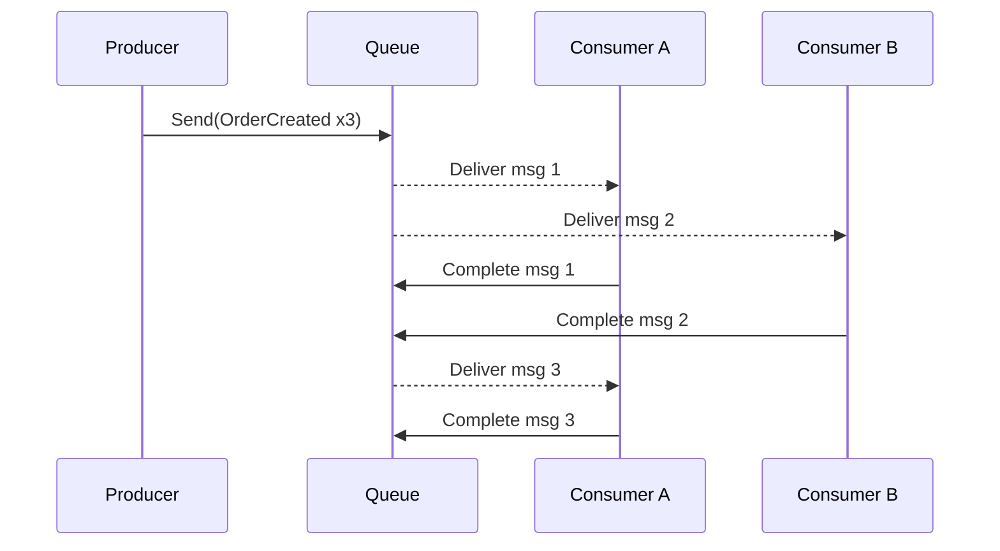

# Lab 02: Competing Consumers

> **In this document:**  
>
> [[_TOC_]]

In this lab, you will build on the foundations of the point-to-point messaging pattern by concurrently introducing multiple consumers who read from the same queue.

You will modify the existing producer to generate multiple messages and launch **two separate consumer applications** that "complete" those messages. Each consumer will receive a different subset of messages; no duplication or coordination is required.

This demo mimics a typical high-throughput scenario in which an enterprise system must scale horizontally to meet demand. Examples include payment processors, notification handlers, or shipping services, where multiple workers tackle queued tasks in parallel.

---

## What is the Competing Consumers Pattern?

The **Competing Consumers Pattern** enables multiple consumers to subscribe to the same queue and process incoming messages independently.

### How It Works

- The producer continues to send messages to a single queue.
- Two or more consumers listen on the queue simultaneously.
- When a message becomes available, one consumer grabs and locks it, preventing others from handling the same message.
- Once processed, the consumer explicitly completes the message to remove it from the queue.

Each consumer completes for messages—hence the name.



### Key Characteristics

| Feature                   | Description                                                  |
| ------------------------- | ------------------------------------------------------------ |
| Parallel Processing       | Multiple consumers handle different messages simultaneously. |
| Automatic Load Balancing  | Azure Service Bus distributes messages across listeners.     |
| Isolation and Scalability | Consumers do not coordinate; new instances can join freely.  |
| Reliability               | Failed messages can be retried or sent to dead-letter queues. |

### Key Benefits

- **Horizontal Scalability:** Add more consumers to improve throughput without architectural changes.
- **Workload Distribution:** Naturally balances processing across available resources.
- **Fault Isolation:** Individual consumers can fail or restart independently.

### Use Cases

This pattern is ideal for services like batch processors, email dispatchers, or background jobs that need high availability and throughput.

---

## Objectives

By the end of this lab, participants will be able to:

- **Describe** the purposes and structure of the **Competing Consumers** pattern in a message queue architecture.
- **Modify** an existing producer to generate multiple messages for concurrent consumption.
- **Implement** two independent consumer applications that read from the same Service Bus queue.
- **Demonstrate** how Azure Service Bus distributes messages across consumers without coordination.
- **Observe** message processing behavior under concurrent load and identify opportunities for horizontal scaling.
- **Discuss** potential fault-tolerance strategies such as retries and dead-letter handling in multi-consumer scenarios.
- **Reflect** on pattern fit for real-world applications like background processing, task queues, or notification systems.

---

## Prerequisites

- **[Lab 01](Lab01_PointToPoint.md) Completed:** The point-to-point producer and consumer are working, and messages are successfully flowing through the queue.
- [.NET SDK 8.0 or later](https://dotnet.microsoft.com/download)
- A text editor or IDE such as [Visual Studio Code](https://code.visualstudio.com/) or [Visual Studio](https://visualstudio.microsoft.com/) (any edition).
- [Docker Desktop](https://www.docker.com/products/docker-desktop)
- [Azure Service Bus Emulator](https://github.com/Azure/azure-service-bus-emulator-installer)

---

## Lab Steps

### Step 1 - Modify the Producer for Load Generation

This step sets the stage for stress-testing the queue by emitting multiple messages rapidly. You will adjust the producer logic from the Point-to-Point lab to simulate a realistic workload that supports parallel consumption.

1. **Open the Producer Project**

   - Locate the producer app from Lab 01.

2. **Implement Loop-Based Message Emission**

   - Replace your interactive loop with the following block side `Program.cs`

     ```c#
     	for (int i = 1; i < 10; i++)
     	{
     
     		// Create sample order payload
     		OrderDetails order = testOrders.Generate();
     		string jsonPayload = JsonSerializer.Serialize(order);
     
     		// Create and send Service Bus message
     		ServiceBusMessage message = new(jsonPayload)
     		{
     			MessageId = order.OrderId.ToString(),
     			Subject = "Order Created",
     			ApplicationProperties =
     			{
     				{ "Index", i },
     				{ "Lab", "CompetingConsumers" }
     			}
     		};
     		await sender.SendMessageAsync(message);
     
     		// Display message details in a formatted panel
     		AnsiConsole.Write(new Panel(new JsonText(jsonPayload))
     			.Header("Message Sent")
     			.Collapse()
     			.RoundedBorder()
     			.BorderColor(Color.Yellow));
     
     	}
     ```

### Step 2 - Create Consumer A

#### 2.1 Create the Project

This step involves creating a .NET console app that listens to incoming messages on the `message-patterns.point-to-point` queue. The consumer simulates order fulfillment or acknowledgement in a loosely coupled, asynchronous design.

1. In the terminal, navigate to your lab root folder.

2. Run

   ```bash
   dotnet new console -n PointToPoint.ConsumerA
   ```

3. Navigate into the project folder:

   ```bash
   cd PointToPoint.ConsumerA
   ```

#### 2.2 Add the Azure Service Bus NuGet Package

Install the SDK using:

```bash
dotnet add package Microsoft.Extensions.Configuration
dotnet add package Microsoft.Extensions.Configuration.Json
dotnet add package Azure.Messaging.ServiceBus
dotnet add package Spectre.Console
dotnet add package Spectre.Console.Json
```

#### 2.3 Add Configuration for Connection and Queue

1. Create a new file named `appsettings.json` in the root of the `PointToPoint.Consumer` folder.

2. Paste the same configuration used by the producer:

   ```json
   {
     "ServiceBus": {
       "ConnectionString": "Endpoint=sb://127.0.0.1;SharedAccessKeyName=RootManageSharedAccessKey;SharedAccessKey=SAS_KEY_VALUE;UseDevelopmentEmulator=true;",
       "QueueName": "message-patterns.point-to-point"
     }
   }
   ```

3. Edit the `.csproject` file to ensure the config is copied during build:

   ```xml
   <ItemGroup>
     <None Update="appsettings.json">
       <CopyToOutputDirectory>Always</CopyToOutputDirectory>
     </None>
   </ItemGroup>
   ```

#### 2.4 Implement the Consumer Logic

Replace the contents of `Program.cs` with:

```c#
// This program implements Consumer A for an Azure Service Bus queue.
// It loads configuration from appsettings.json, connects to the Service Bus,
// and listens for messages on the specified queue. When a message is received,
// it prints the message body to the console using Spectre.Console for formatting,
// and then completes the message. Errors during processing are also logged to the console.
// The consumer runs until a key is pressed, at which point it stops processing and exits.

using Azure.Messaging.ServiceBus;
using Microsoft.Extensions.Configuration;
using Spectre.Console;

// Load configuration
IConfigurationRoot config = new ConfigurationBuilder()
	.AddJsonFile("appsettings.json")
	.Build();
string connectionString = config["ServiceBus:ConnectionString"]!;
string queueName = config["ServiceBus:QueueName"]!;

// Create the Sevice Bus client and processor
await using ServiceBusClient client = new(connectionString);
ServiceBusProcessor processor = client.CreateProcessor(queueName);

// Register event handlers for message processing
processor.ProcessMessageAsync += async args =>
{
	string body = args.Message.Body.ToString();

	AnsiConsole.MarkupLine($"[green]Consumer A received:[/] {body}");

	await args.CompleteMessageAsync(args.Message);
};

// Register event handler for processing errors
processor.ProcessErrorAsync += args =>
{
	AnsiConsole.MarkupLine($"[red]Consumer A error:[/] {args.Exception.Message}");
	return Task.CompletedTask;
};

// Start processing incoming messages
await processor.StartProcessingAsync();

AnsiConsole.MarkupLine("[bold yellow]Consumer A listening... Press any key to stop.[/]");
Console.ReadKey();

await processor.StopProcessingAsync();
```

> **Code Summary**
>
> This consumer app listens for messages on the Point-to-Point queue and displays them in real time using Spectre.Console. Configuration is loaded from `appsettings.json`, and the app uses `ServiceBusProcessor` to handle message events. Messages are explicitly completed to ensure reliability, and malformed payloads are gracefully logged. Orders are visualized using a live-updating table that refreshes every half-second, providing immediate feedback without manual refresh. The session runs until the user presses a key, simulating a lightweight yet production-grade listener.
>
> This logic ensures that:
>
> - For simplicity, only one message is processed at a time (`MaxConcurrentCalls = 1`).
> - Messages are explicitly completed (`AutoCompleteMessages = false`).
> - Errors during processing are logged in real time.

### Step 3 - Create Consumer B

#### 3.1 Create the Project

This step mirrors Consumer A to simulate a competing client scenario. With both consumers running, Azure Service Bus will distribute messages between them, helping you visualize load balancing.

1. In the terminal, navigate to your lab root folder.

2. Run

   ```bash
   dotnet new console -n PointToPoint.ConsumerA
   ```

3. Navigate into the project folder:

   ```bash
   cd PointToPoint.ConsumerA
   ```

#### 3.2 Add the Azure Service Bus NuGet Package

Install the SDK using:

```bash
dotnet add package Microsoft.Extensions.Configuration
dotnet add package Microsoft.Extensions.Configuration.Json
dotnet add package Azure.Messaging.ServiceBus
dotnet add package Spectre.Console
dotnet add package Spectre.Console.Json
```

#### 3.3 Add Configuration for Connection and Queue

1. Create a new file named `appsettings.json` in the root of the `PointToPoint.Consumer` folder.

2. Paste the same configuration used by the producer:

   ```json
   {
     "ServiceBus": {
       "ConnectionString": "Endpoint=sb://127.0.0.1;SharedAccessKeyName=RootManageSharedAccessKey;SharedAccessKey=SAS_KEY_VALUE;UseDevelopmentEmulator=true;",
       "QueueName": "message-patterns.point-to-point"
     }
   }
   ```

3. Edit the `.csproject` file to ensure the config is copied during build:

   ```xml
   <ItemGroup>
     <None Update="appsettings.json">
       <CopyToOutputDirectory>Always</CopyToOutputDirectory>
     </None>
   </ItemGroup>
   ```

#### 3.4 Implement the Consumer Logic

Replace the contents of `Program.cs` with:

```c#
// This program implements Consumer B for an Azure Service Bus queue.
// It loads configuration from appsettings.json, connects to the Service Bus,
// and listens for messages on the specified queue. When a message is received,
// it prints the message body to the console using Spectre.Console for formatting,
// and then completes the message. Errors during processing are also logged to the console.
// The consumer runs until a key is pressed, at which point it stops processing and exits.

using Azure.Messaging.ServiceBus;
using Microsoft.Extensions.Configuration;
using Spectre.Console;

// Load configuration
IConfigurationRoot config = new ConfigurationBuilder()
	.AddJsonFile("appsettings.json")
	.Build();
string connectionString = config["ServiceBus:ConnectionString"]!;
string queueName = config["ServiceBus:QueueName"]!;

// Create the Sevice Bus client and processor
await using ServiceBusClient client = new(connectionString);
ServiceBusProcessor processor = client.CreateProcessor(queueName);

// Register event handlers for message processing
processor.ProcessMessageAsync += async args =>
{
	string body = args.Message.Body.ToString();

	AnsiConsole.MarkupLine($"[green]Consumer B received:[/] {body}");

	await args.CompleteMessageAsync(args.Message);
};

// Register event handler for processing errors
processor.ProcessErrorAsync += args =>
{
	AnsiConsole.MarkupLine($"[red]Consumer B error:[/] {args.Exception.Message}");
	return Task.CompletedTask;
};

// Start processing incoming messages
await processor.StartProcessingAsync();

AnsiConsole.MarkupLine("[bold yellow]Consumer B listening... Press any key to stop.[/]");
Console.ReadKey();

await processor.StopProcessingAsync();
```

### Step 4 - Run Concurrent Consumers

With your producer generating multiple messages and two consumers ready to compete, it is time to run the full flow and observe how Azure Service Bus distributes work across listeners.

1. **Start the Producer**

   In a terminal window:

   ```shell
   cd path/to/PointToPoint.Producer
   dotnet run
   ```

   - This sends 10 uniquely identifiable `OrderCreated` messages to the queue.
   - Each message includes trace metadata like `MessageId`, `Subject`, and `Index`.

2. **Start Consumer A**

   In a second terminal window:

   ```shell
   cd path/to/PointToPoint.ConsumerA
   dotnet run
   ```

   - Messages received will be labeled as `Consumer A received` in the console.

3. **Start Consumer B**

   In a third terminal window:

   ```shell
   cd path/to/PointToPoint.ConsumerB
   dotnet run
   ```

   - Messages received will be labeled as `Consumer B received` in the console.

   > [!TIP]
   >
   > If you see uneven message distribution (e.g., one consumer gets most messages), it is likely due to startup timing or processing concurrency. Do not worry; this is part of the pattern's flexibility and demonstrates how cloud services will load-balance incoming messages.
   
   ---
   
   ## Next Steps
   
   You have just explored how a message broker can enable scalable message consumption through the **Competing Consumers** pattern. This pattern allows multiple apps to pull from the same queue with automatic load distribution, establishing a strong foundation for horizontally scaling backend processes.
   
   Next, you will shift from a single shared queue to a multi-subscriber model emphasizing event broadcasting. In Lab 03, you will implement the **Publish/Subscribe** pattern using topics, where a single message can reach multiple, independent subscribers. This lab highlights how events can be decoupled from specific consumers, fostering more modular and extensible system designs while preserving guaranteed delivery.