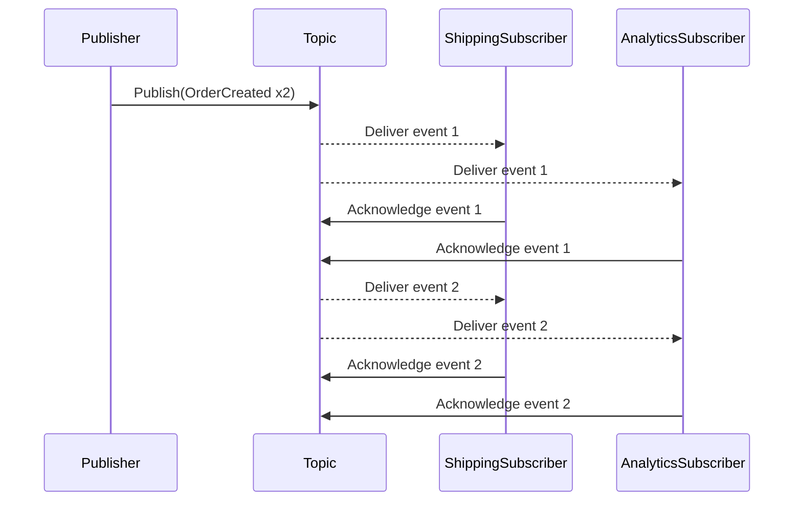

# Lab 03: Publish/Subscribe Messaging

> **In this document:**
>
> [[_TOC_]]

In this lab, you will build three C# console applications:

- **`OrderPublisher`:** Sends an `OrderCreated` event, including properties like `OrderId`, `CustomerId`, and `Amount`, to a shared topic named `workshop.pubsub`.
- **`ShippingSubscriber`:** This listens to a subscription for shipping services, processes incoming `OrderCreated` events by logging shipping-related details, and then marks them complete.
- **`AnalyticsSubscriber`:** Listens on a separate subscription for analytics services, consumes the same `OrderCreated` events in parallel, and writes summary data to the console.

This demo mirrors a real-world scenario where an order entry system broadcasts events to multiple downstream services—shipping, analytics, notifications, and more—without coupling the producer to any specific consumer. You will see firsthand how publish/subscribe messaging provides one-to-many delivery, durable event fan-out, and independent subscriber lifecycles, enabling highly extensible and resilient architectures.

---

## What is the Publish/Subscribe Pattern?

The Publish/Subscribe pattern lets a publisher broadcast events to multiple independent subscribers. Each subscriber receives a copy of every event, supporting one-to-many distributions without coupling senders to receivers.

### How It Works

- A publisher emits events to a shared topic.
- The topic holds durable subscriptions, each representing a logical recipient.
- The topic delivers a copy of every active subscription when an event arrives.
- Subscribers pull or receive events from their individual subscriptions and acknowledge processing.



### Key Characteristics

| Feature                           | Description                                                  |
| --------------------------------- | ------------------------------------------------------------ |
| One-to-Many Delivery              | A single publish operation fans out events to multiple subscriptions. |
| Decoupled Publishers/Subscribers  | Publishers and subscribers have no direct knowledge of each other's existence. |
| Durable Fan-Out                   | Events are stored in the topic until each subscription processes them. |
| Independent Subscriber Lifecycles | Subscribers can join, leave, or fail without impacting others. |

### Key Benefits

- **Extensibility:** Add or remove subscribers on the fly to introduce new capabilities.
- **Loose Coupling:** Publishers focus on event emission; subscribers handle their processing.
- **Resilience:** Subscriber failures are isolated; other consumers continue unhindered.
- **Replay and Auditing:** Unprocessed events remain in subscriptions, enabling replay or delayed handling.

### Use Cases

- Broadcasting order events to shipping, billing, and analytics systems.
- Fan-out of user activity streams to monitoring, auditing, and recommendation engines.
- Real-time notifications to multiple client applications (email, SMS, push).
- Event-driven microservices architectures require scalable, decoupled communication.

---

## Objectives

- Provision a topic named `messaging-patterns.pubsub` and create two subscriptions.
- Implement a .NET-based `OrderPublisher` to broadcast `OrderCreated` events.
- Build `ShippingSubscriber` and `AnalyticsSubscriber` console apps to process events independently.
- Verify one-to-many deliveries, durable fan-outs, and isolated subscriber lifecycles.
- Observe event persistence and replay capabilities through subscription offsets.

---

## Prerequisites

- [.NET SDK 8.0 or later](https://dotnet.microsoft.com/download)
- A text editor or IDE such as [Visual Studio Code](https://code.visualstudio.com/) or [Visual Studio](https://visualstudio.microsoft.com/) (any edition).
- [Docker Desktop](https://www.docker.com/products/docker-desktop)
- [Azure Service Bus Emulator](https://github.com/Azure/azure-service-bus-emulator-installer)

---

## Lab Steps

### Step 1 - Provision a Messaging Topic and Create Subscriptions

In this step, you will update your local Service Bus emulator's `config.json` to define a topic and two subscriptions.

1. **Locate the `config.json` File** 

   This file lives under your emulator installation, for example:

   ```
   {local-emulator-repository-folder}\ServiceBus-Emulator\Config\config.json
   ```

2. **Add the Topic and Subscriptions**

   Find the `Topics` array and insert a new entry for `message-patterns.pubsub` with `shipping` and `analytics` subscriptions. Your updated snippet should look like this:

   ```json
   {
     "UserConfig": {
       "Namespaces": [
         {
           "Name": "sbemulatorns",
           "Queues": [],
           "Topics": [
             {
               "Name": "message-patterns.pubsub",
               "Properties": {
                 "DefaultMessageTimeToLive": "PT1H",
                 "DuplicateDetectionHistoryTimeWindow": "PT20S",
                 "RequiresDuplicateDetection": false
               },
               "Subscriptions": [
                 {
                   "Name": "shipping",
                   "Properties": {
                     "DeadLetteringOnMessageExpiration": false,
                     "DefaultMessageTimeToLive": "PT1H",
                     "LockDuration": "PT1M",
                     "MaxDeliveryCount": 3,
                     "ForwardDeadLetteredMessagesTo": "",
                     "ForwardTo": "",
                     "RequiresSession": false
                   }
                 },
                 {
                   "Name": "analytics",
                   "Properties": {
                     "DeadLetteringOnMessageExpiration": false,
                     "DefaultMessageTimeToLive": "PT1H",
                     "LockDuration": "PT1M",
                     "MaxDeliveryCount": 3,
                     "ForwardDeadLetteredMessagesTo": "",
                     "ForwardTo": "",
                     "RequiresSession": false
                   }
                 }
               ]
             }
           ]
         }
       ],
       "Logging": {
         "Type": "File"
       }
     }
   }
   ```

3. **Restart the Emulator**

   - Stop and start the Service Bus emulator according to your OS instructions.
   - Confirm the emulator is running correctly.

### Step 2 - Scaffold Publisher and Subscriber Applications

Now that your topic and subscriptions are configured locally, let's start up the three console applications needed for this lab. These apps will handle publishing and consuming `OrderCreated` events to demonstrate one-to-many delivery.

#### 2.1 Create Project Structure

Inside your lab solution directory (e.g., `MessagingPatternsWorkshop`), add three new .NET console apps:

```shel
dotnet new console -n OrderPublisher
dotnet new console -n ShippingSubscriber
dotnet new console -n AnalyticsSubscriber
```

> **Note:** Target `.NET 8.0` for consistency and ensure all projects are added to your solution file (`.sln`) if you use one.

#### 2.2 Install Dependencies

All three projects (`OrderPublisher`, `ShippingSubscriber`, and `AnalyticsSubscriber`) should include:

```shell
dotnet add package Microsoft.Extensions.Configuration
dotnet add package Microsoft.Extensions.Configuration.Json
dotnet add package Azure.Messaging.ServiceBus
dotnet add package Spectre.Console
dotnet add package Spectre.Console.Json
```

> These packages give you rich console UIs, structured configuration loading, and enhanced event visibility via JSON rendering.

For **`OrderPublisher`** *only*, add the additional data generation package:

```shell
dotnet add package Bogus
```

> `Bogus` will help create synthetic `OrderCreated` payloads for a realistic pub/sub simulation.

#### 2.3 Add Configuration File

1. For each app, create an `appsettings.json` file to store your connection string and topic name:

   ```json
   {
     "ServiceBus": {
       "ConnectionString": "Endpoint=sb://127.0.0.1;SharedAccessKeyName=RootManageSharedAccessKey;SharedAccessKey=SAS_KEY_VALUE;UseDevelopmentEmulator=true;",
       "TopicName": "message-patterns.pubsub",
       "SubscriptionName": "shipping" // Change to "analytics" for AnalyticsSubscriber
     }
   }
   ```

   > You can remove the `SubscriptionName` node for the `OrderPublisher` project.

2. Edit each `.csproj` file to ensure the config is copied during build:

   ```xml
   <ItemGroup>
     <None Update="appsettings.json">
       <CopyToOutputDirectory>Always</CopyToOutputDirectory>
     </None>
   </ItemGroup>
   ```

   

### Step 3 - Implement the Publisher Logic

This step wires up the `OrderPublisher` to generate and dispatch synthetic `OrderCreated` events using `Bogus` and `Azure.Messaging.ServiceBus`.

#### 3.1 Create OrderCreated Model

In the `OrderPublisher` project, add a new file named `Models/OrderCreated.cs`:

```c#
namespace OrderPublisher.Models
{
    public class OrderCreated
    {
        public string OrderId { get; set; } = default!;
        public string ProductName { get; set; } = default!;
        public int Quantity { get; set; }
        public decimal Price { get; set; }
        public DateTime CreatedAt { get; set; }
    }
}
```

#### 3.2 Add Order Generator

Create a helper class `Services/OrderGenerator.cs` using `Bogus`:

```c#
using Bogus;
using OrderPublisher.Models;

namespace OrderPublisher.Services
{
	public static class OrderGenerator
	{
		public static OrderCreated Generate()
		{
			Faker<OrderCreated> faker = new Faker<OrderCreated>()
				.RuleFor(o => o.OrderId, f => Guid.NewGuid().ToString())
				.RuleFor(o => o.ProductName, f => f.Commerce.ProductName())
				.RuleFor(o => o.Quantity, f => f.Random.Int(1, 10))
				.RuleFor(o => o.Price, f => f.Finance.Amount(10, 500))
				.RuleFor(o => o.CreatedAt, f => DateTime.UtcNow);

			return faker.Generate();
		}
	}
}
```

> Random data injects realism and supports downstream analytics scenarios.

#### 3.3 Build and Send a Message

Update `Program.cs` with the publishing logic:

```c#
using Azure.Messaging.ServiceBus;
using Microsoft.Extensions.Configuration;
using OrderPublisher.Services;
using Spectre.Console;
using Spectre.Console.Json;

IConfigurationRoot config = new ConfigurationBuilder()
	.AddJsonFile("appsettings.json")
	.Build();
string connectionString = config["ServiceBus:ConnectionString"]!;
string topicName = config["ServiceBus:TopicName"]!;

ServiceBusClient client = new(connectionString);
ServiceBusSender sender = client.CreateSender(topicName);

while (true)
{
	OrderPublisher.Models.OrderCreated order = OrderGenerator.Generate();
	ServiceBusMessage message = new ServiceBusMessage(System.Text.Json.JsonSerializer.Serialize(order))
	{
		MessageId = order.OrderId,
		ContentType = "application/json"
	};

	await sender.SendMessageAsync(message);

	AnsiConsole.MarkupLine("[green]Published OrderCreated event[/]");
	AnsiConsole.Write(new JsonText(System.Text.Json.JsonSerializer.Serialize(order)));
	await Task.Delay(2000); // Simulate batch intervals
}
```

> You now have a modular publisher with live feedback in the terminal via Spectre.Console.

### Step 4 - Implement Subscriber Logic

This step equips your subscriber apps to listen for and process `OrderCreated` events from the `messaging-patterns.pubsub` topic, using structured logging and isolated configuration.

#### 4.1 Create OrderCreated Model

Add a shared `OrderCreated.cs` model to both subscriber projects (or link them to a common library):

```csharp
namespace ShippingSubscriber.Models // or AnalyticsSubscriber.Models
{
    public class OrderCreated
    {
        public string OrderId { get; set; } = default!;
        public string ProductName { get; set; } = default!;
        public int Quantity { get; set; }
        public decimal Price { get; set; }
        public DateTime CreatedAt { get; set; }
    }
}
```

#### 4.2 Configure Message Receiver

Update `Program.cs` in each subscriber:

```c#
using AnalyticsSubscriber.Models;
using Azure.Messaging.ServiceBus;
using Microsoft.Extensions.Configuration;
using Spectre.Console;
using Spectre.Console.Json;

IConfigurationRoot config = new ConfigurationBuilder()
	.AddJsonFile("appsettings.json")
	.Build();

string connectionString = config["ServiceBus:ConnectionString"]!;
string topicName = config["ServiceBus:TopicName"]!;
string subscriptionName = config["ServiceBus:SubscriptionName"]!;

ServiceBusClient client = new(connectionString);
ServiceBusProcessor processor = client.CreateProcessor(topicName, subscriptionName, new ServiceBusProcessorOptions
{
	AutoCompleteMessages = false,
	MaxConcurrentCalls = 1
});

processor.ProcessMessageAsync += async args =>
{
	try
	{
		string json = args.Message.Body.ToString();
		OrderCreated order = System.Text.Json.JsonSerializer.Deserialize<OrderCreated>(json)!;

		AnsiConsole.MarkupLine($"[blue]Received OrderCreated event in '{subscriptionName}'[/]");
		AnsiConsole.Write(new JsonText(json));

		await args.CompleteMessageAsync(args.Message);
	}
	catch (Exception ex)
	{
		AnsiConsole.MarkupLine($"[red]Error processing message: {ex.Message}[/]");
		await args.AbandonMessageAsync(args.Message);
	}
};

processor.ProcessErrorAsync += args =>
{
	AnsiConsole.MarkupLine($"[red]Receiver error: {args.Exception.Message}[/]");
	return Task.CompletedTask;
};

AnsiConsole.MarkupLine($"[green]Listening on subscription '{subscriptionName}'...[/]");
await processor.StartProcessingAsync();

await Task.Delay(-1); // Keep the app running
```

> You have now implemented durable, observable message receivers with simple error handling and tracing via Spectre.Console.

### Step 5 - Run the Lab: Observe the Pub/Sub Pattern in Action

With the publisher and subscribers wired up, you can run the lab and witness one-to-many messaging using publish/subscribe topics.

#### 5.1 Launch the Publisher

From the root of the solution, start the `OrderPublisher`:

```shell
dotnet run --project OrderPublisher
```

This will emit `OrderCreated` events every 2 seconds, rendered in the console with JSON formatting for traceability.

#### 5.2 Launch the Subscribers

In separate terminals, start the `ShippingSubscriber` and `AnalyticsSubscriber`:

```shell
dotnet run --project ShippingSubscriber
dotnet run --project AnalyticsSubscriber
```

> Each subscriber will receive **every message** sent to the topic, demonstrating the **fan-out** delivery semantics of topics and multiple subscriptions.

#### 5.3 Observe Behavior

Each consumer console should:

- Receive the same `OrderCreated` event (identical `OrderId`)
- Display structured JSON using Spectre.Console
- Log messages indicating successful receipt and processing

> [!TIP]
>
> If you observe disruption or missed events, confirm that your topic and subscription bindings match the configuration and that each receiver completes messages appropriately.

### Step 6 - Observability Enhancements

In this step, you will extend your published and subscribers to include metadata like `CorrelationId`, use structured console logging, and top into `ApplicationProperties` to tag and trace events across the pipeline.

#### 6.1 Enrich the Message Payload

Update the `OrderCreated` model in the publisher to include trace metadata:

```c#
public class OrderCreated
{
    public string OrderId { get; set; } = default!;
    public string ProductName { get; set; } = default!;
    public int Quantity { get; set; }
    public decimal Price { get; set; }
    public DateTime CreatedAt { get; set; }

    // Observability fields
    public string CorrelationId { get; set; } = default!;
    public string Source { get; set; } = "OrderPublisher";
}
```

Enhance your `OrderGenerator` to fill these values:

```c
.RuleFor(o => o.CorrelationId, _ => Guid.NewGuid().ToString())
.RuleFor(o => o.Source, _ => "OrderPublisher")
```

#### 6.2 Add Application Properties for Traceability

Update the message construction in `OrderPublisher` to attach metadata as headers:

```c#
	ServiceBusMessage message = new(System.Text.Json.JsonSerializer.Serialize(order))
	{
		MessageId = order.OrderId,
		ContentType = "application/json",
	};
	message.ApplicationProperties["CorrelationId"] = order.CorrelationId;
	message.ApplicationProperties["Source"] = order.Source;
	message.ApplicationProperties["EventType"] = "OrderCreated";
```

> [!TIP]
>
> These values are accessible to downstream consumers and can be used for tagging, filtering, or diagnostic logging

#### 6.3 Enhance Subscriber Logging

Inside each subscriber's `ProcessMessageAsync`, extract and display metadata:

```c#
string correlationId = (string)args.Message.ApplicationProperties["CorrelationId"]!;
string source = (string)args.Message.ApplicationProperties["Source"]!;
string eventType = (string)args.Message.ApplicationProperties["EventType"]!;

AnsiConsole.MarkupLine($"[yellow]Received {eventType}[/] from [bold]{source}[/] with CorrelationId: [underline]{correlationId}[/]");
AnsiConsole.Write(new JsonText(args.Message.Body.ToString()));

```

#### 6.4 Optional: Show System Properties

For even deeper insights, you can log system metadata like delivery attempts and enqueue time:

```c#
var deliveryCount = args.Message.DeliveryCount;
var enqueuedTime = args.Message.EnqueuedTime.UtcDateTime;

AnsiConsole.MarkupLine($"[gray]DeliveryAttempt: {deliveryCount}, EnqueuedAt: {enqueuedTime:O}[/]");
```

---

## Next Steps

You have now built a robust **Publish/Subscribe** system with embedded visibility. Metadata like `CorrelationId`, `Source`, and `EventType` flow through each message, while structured logging gives participants rich diagnostics and context visibility.

This lab highlighted:

- Loose coupling and fan-out distribution
- Metadata-driven tracing via `ApplicationProperties`
- Spectre.Console-powered output for real-time visibility
- Foundation for touring and specialized subscribers

In the next lab, you will dive into the **Request/Reply** messaging pattern:

- You will implement a direct message exchange where one service requests data and another replies.
- You will model the correlation between requests and replies using `CorrelationId`.
- You will explore queue-based implementations for handling reply routing and timeouts.

This pattern introduces **two-way communication**, enabling dynamic workflows like data lookups, transactional validation, or external system orchestration, all while preserving system modularity.