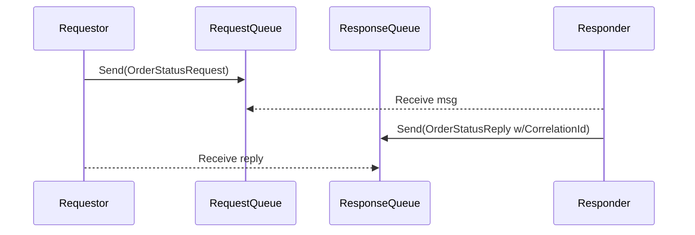

# Lab 04: Request/Reply Messaging

> **In this document:**  
>
> [[_TOC_]]

In this lab,  you will build two C# console applications:

- **`OrderClient`:** This application sends a message requesting fulfillment details for a given `OrderId`. Each request includes metadata such as `CorrelationId` and `ReplyTo` to identify and route responses correctly.
- **`FulfillmentService`:** This application listens for incoming requests, processes each one by generating mock fulfillment data (e.g., shipping estimate, warehouse location), and replies directly to the sender using the specified `ReplyTo` address and preserving the original `CorrelationId`.

This lab simulates an enterprise scenario where a client application initiates a request for information or action, and a backend service replies with a result. Unlike point-to-point or publish/subscribe patterns, Request/Reply introduces a **two-way exchange**, enabling synchronous-like workflows across asynchronous boundaries. You will learn how reply queues, correlation IDs, and durable messaging provide reliable, traceable interactions between loosely coupled components.

---

## What is the Request/Reply Pattern?

The **Request/Reply** pattern enables two-way communication between distributed components: one service sends a request, and another returns a response. This pattern is essential for workflows that require immediate data retrieval, transactional validation, or conditional handshakes.

### How it Works

- A **requestor** sends a message containing a `CorrelationId` and `ReplyTo` address.
- A **responder** listens for incoming requests, processes the payload, and creates a reply message.
- The response message is sent to the `ReplyTo` queue, carrying the original `CorrelationId`.
- The requester listens on that queue and matches responses to in-flight requests based on `CorrelationId`.



### Key Characteristics

| Feature               | Description                                                  |
| --------------------- | ------------------------------------------------------------ |
| Message Pairing       | Requests and replies are matched via a shared `CorrelationId`. |
| Asynchronous Exchange | Messaging infrastructure decouples communication timing.     |
| Reply Routing         | Replies target the requestor's `ReplyTo` address, enabling dynamic flows. |
| Stateless Interaction | Responder does not track requestor state beyond message metadata. |

### Key Benefits

- **Modular Communication:** Services exchange data without direct references or persistent connections.
- **Transactional Integrity:** Supports workflows needing confirmation, validation, or data retrieval.
- **Operational Resilience:** Timeout handling and retries preserve reliability without synchronous blocking.
- **Flexibility:** Reply destinations can be configured dynamically to support multitenancy or session-like behavior.

### Uses Cases

- Checking product inventory before placing an order.
- Requesting shipping estimates or tax calculations from a fulfillment service.
- Orchestrating a workflow where a controller queries downstream services for status updates.
- External integrations, such as retrieving user profiles from an identity provider.

---

## Objectives

By the end of the lab, you will be able to:

- **Explain the mechanics of the Request/Reply messaging pattern**, including correlation and reply routing.
- **Design a message exchange using Azure Service Bus** that supports asynchronous request/reply flows.
- **Implement correlation identifiers** to trace and associate paired messages in distributed systems.
- **Configure queues and message handlers** to separate request and reply channels for operational clarity.
- **Evaluate where the pattern fits best** in integration scenarios and when alternative patterns like fire-and-forget or publish/subscribe are preferable.

---

## Prerequisites

- [.NET SDK 8.0 or later](https://dotnet.microsoft.com/download)
- A text editor or IDE such as [Visual Studio Code](https://code.visualstudio.com/) or [Visual Studio](https://visualstudio.microsoft.com/) (any edition).
- [Docker Desktop](https://www.docker.com/products/docker-desktop)
- [Azure Service Bus Emulator](https://github.com/Azure/azure-service-bus-emulator-installer)

---

## Lab Steps

### Step 1: Configure Messaging Emulator with Request and Reply Queues

In this step, you will update your local Service Bus emulator's `config.json` to define a topic and two subscriptions.

1. **Locate the `config.json` File**

   This file lives under your emulator installation, for example:

   ```
   {local-emulator-repository-folder}\ServiceBus-Emulator\Config\config.json
   ```

2. **Add Queue Definitions**

   Insert entries for the request and reply queues:

   ```
   {
     "UserConfig": {
       "Namespaces": [
         {
           "Name": "sbemulatorns",
           "Queues": [
             {
               "Name": "message-patterns.request-reply.order-requests",
               "Properties": {
                 "DeadLetteringOnMessageExpiration": false,
                 "DefaultMessageTimeToLive": "PT1H",
                 "DuplicateDetectionHistoryTimeWindow": "PT20S",
                 "ForwardDeadLetteredMessagesTo": "",
                 "ForwardTo": "",
                 "LockDuration": "PT1M",
                 "MaxDeliveryCount": 3,
                 "RequiresDuplicateDetection": false,
                 "RequiresSession": false
               }
             },
             {
               "Name": "message-patterns.request-reply.order-replies",
               "Properties": {
                 "DeadLetteringOnMessageExpiration": false,
                 "DefaultMessageTimeToLive": "PT1H",
                 "DuplicateDetectionHistoryTimeWindow": "PT20S",
                 "ForwardDeadLetteredMessagesTo": "",
                 "ForwardTo": "",
                 "LockDuration": "PT1M",
                 "MaxDeliveryCount": 3,
                 "RequiresDuplicateDetection": false,
                 "RequiresSession": false
               }
             }
           ],
   
           "Topics": [
           ]
         }
       ],
       "Logging": {
         "Type": "File"
       }
     }
   }
   ```

3. **Restart the Emulator**

   - Stop and start the Service Bus emulator according to your OS instructions.
   - Confirm the emulator is running correctly.

### Step 2: Scaffold the Request/Reply Solution

You will create the lab solutions with the necessary projects in this step.

**Create the Solution Folder**

```shell
mkdir Lab04_RequestReply && cd Lab04_RequestReply
dotnet new sln -n Lab04Messaging
```

### Step 3: Implement the Message Contracts

#### 3.1 Create Messaging Contracts Project

```shell
dotnet new classlib -n MessagingContracts
dotnet sln add MessagingContracts/MessagingContracts.csproj
del MessagingContracts/Class1.cs
```

#### 3.2 Define the `OrderRequest` Message Contract

The client will send this message to request data for a specific order.

1. Create the `OrderRequest.cs` file:

   ```shell
   code MessagingContracts/OrderRequest.cs
   ```

2. Define the class by pasting the following code into the class file:

   ```c#
   namespace MessagingContracts;
   
   /// <summary>
   /// Represents a request for data from the Fulfillment Service.
   /// </summary>
   public record OrderRequest
   {
   	/// <summary>
   	/// Gets or sets the unique identifier for the order.
   	/// </summary>
   	public required string OrderId { get; set; }
   
   	/// <summary>
   	/// Gets or sets the unique identifier for the customer placing the order.
   	/// </summary>
   	public required string CustomerId { get; set; }
   }
   ```

#### 3.3 Define the `FulfillmentResponse` Message Contract

The fulfillment service will publish this response once the request has been processed.

1. Create the `FilfillmentResponse.cs` file:

   ```shell
   code MessagingContracts/FulfillmentResponse.cs
   ```

2. Define the class by pasting the following code into the class file:

   ```c#
   namespace MessagingContracts;
   
   /// <summary>
   /// Represents the response for a fulfillment operation, including order and customer details,
   /// fulfillment status, error information, and metadata about the fulfillment.
   /// </summary>
   public record FulfillmentResponse
   {
   	/// <summary>
   	/// Gets or sets the unique identifier of the order.
   	/// </summary>
   	public required string OrderId { get; set; }
   
   	/// <summary>
   	/// Gets or sets the unique identifier of the customer associated with the order.
   	/// </summary>
   	public required string CustomerId { get; set; }
   
   	/// <summary>
   	/// Gets or sets a value indicating whether the fulfillment operation was successful.
   	/// </summary>
   	public bool IsSuccessful { get; set; }
   
   	/// <summary>
   	/// Gets or sets the error code if the fulfillment operation failed; otherwise, null.
   	/// </summary>
   	public string? ErrorCode { get; set; }
   
   	/// <summary>
   	/// Gets or sets the error message if the fulfillment operation failed; otherwise, null.
   	/// </summary>
   	public string? ErrorMessage { get; set; }
   
   	/// <summary>
   	/// Gets or sets a value indicating whether the order has been fulfilled.
   	/// </summary>
   	public bool IsFulfilled { get; set; }
   
   	/// <summary>
   	/// Gets or sets the date and time when the order was fulfilled.
   	/// </summary>
   	public DateTime FulfilledAt { get; set; }
   
   	/// <summary>
   	/// Gets or sets the identifier of the entity or user who fulfilled the order.
   	/// </summary>
   	public string? FulfilledBy { get; set; }
   }
   ```

#### 3.4 Build the Message Contracts Library

Compile `MessagingContracts` to ensure there are no errors:

```shell
dotnet build MessagingContracts
```

### Step 4: Implement Persistence Models

#### 4.1 Create Persistence Models Project

```shell
dotnet new classlib -n Persistence
dotnet sln add Persistence/Persistence.csproj
del Persistence/Class1.cs
```

#### 4.2 Install Dependencies

```shell
dotnet add Persistence package Azure.Data.Tables
```

#### 4.2 Define the `OrderRequestTracking` Data Model

You will use this model in the `OrderClient` to persist each outbound request to allow future correlation with incoming replies.

1. Create the `OrderRequestTracking.cs` file:

   ```shell
   code Persistence/Models/OrderRequestTracking.cs
   ```

2. Define the model by pasting the following code into the class file:

   ```c#
   using Azure;
   using Azure.Data.Tables;
   
   namespace Persistence.Models
   {
   	public class OrderRequestTracking : ITableEntity
   	{
   		public required string PartitionKey { get; set; }
   		public required string RowKey { get; set; }
   		public string? CorrelationId { get; set; }
   		public string? CustomerId { get; set; }
   		public string? OrderId { get; set; }
   		public bool IsSuccessful { get; set; }
   		public long RequestTicks { get; set; }
   		public long ResponseTicks { get; set; }
   		public DateTimeOffset? Timestamp { get; set; }
   		public ETag ETag { get; set; }
   	}
   }
   ```

#### 4.3 Build the Persistence Library

Compile `Persistence` to ensure there are no errors:

```shell
dotnet build Persistence
```

### Step 5: Create Order Client Console App

#### 5.1 Create Order Client Project

```shell
dotnet new console -n OrderClient
dotnet sln add OrderClient/OrderClient.csproj
```

#### 5.2 Install Dependencies

```shell
dotnet add OrderClient package Azure.Messaging.ServiceBus
dotnet add OrderClient package Microsoft.Extensions.Configuration
dotnet add OrderClient package Microsoft.Extensions.Configuration.Json
dotnet add OrderClient package Azure.Data.Tables
dotnet add OrderClient package Spectre.Console
dotnet add OrderClient package Spectre.Console.Json
dotnet add OrderClient package Bogus
```

#### 5.3 Add Reference to Messaging Contracts

```shell
dotnet add OrderClient reference MessagingContracts
dotnet add OrderClient reference Persistence
```

#### 5.4 Add Configuration File

1. Create the Configuration File

   ```shell
   code OrderClient/appsettings.json
   ```

2. Paste the following into the `appsettings.json` file:

   ```json
   {
     "ServiceBus": {
       "ConnectionString": "Endpoint=sb://127.0.0.1;SharedAccessKeyName=RootManageSharedAccessKey;SharedAccessKey=SAS_KEY_VALUE;UseDevelopmentEmulator=true;",
       "RequestQueueName": "message-patterns.request-reply.order-requests",
       "ReplyQueueName": "message-patterns.request-reply.order-replies"
     },
     "Storage": {
       "ConnectionString": "UseDevelopmentStorage=true",
       "TrackingTableName": "OrderRequestTracking"
     }
   }
   ```

3. Add the following to the `OrderClient.csproj` file so that the `appsettings.json` file is copied to the output directory during builds:

   ```xml
   <ItemGroup>
     <None Update="appsettings.json">
       <CopyToOutputDirectory>Always</CopyToOutputDirectory>
     </None>
   </ItemGroup>
   ```

#### 5.5 Add Order Request Generator

1. Create the `OrderRequestGenerator.cs` file:

   ```shell
   code OrderClient/Services/OrderRequestGenerator.cs
   ```

2. Create the helper class using `Bogus` to randomly generate `OrderRequest` objects by pasting the following code into the `OrderRequestGenerator.cs` file:

   ```c#
   using MessagingContracts;
   
   namespace OrderClient.Services;
   
   internal static class OrderRequestGenerator
   {
   	internal static OrderRequest Generate() => new Bogus.Faker<OrderRequest>()
   		.RuleFor(o => o.OrderId, f => $"ORD-{f.Random.Int(10000, 99999)}")
   		.RuleFor(o => o.CustomerId, f => $"CUST-{f.Random.Int(10000, 99999)}");
   }
   ```

#### 5.6 Implement the Request Logic

Update `Program.cs` with the request logic:

```c#
using Azure.Data.Tables;
using Azure.Messaging.ServiceBus;
using MessagingContracts;
using Microsoft.Extensions.Configuration;
using OrderClient.Services;
using Persistence.Models;
using Spectre.Console;
using System.Text.Json;

AnsiConsole.Write(new FigletText("Order Client").Centered().Color(Color.Green));
Console.WriteLine();

IConfigurationRoot config = new ConfigurationBuilder()
		.SetBasePath(Directory.GetCurrentDirectory())
		.AddJsonFile("appsettings.json", optional: false, reloadOnChange: true)
		.Build();
string serviceBusConnectionString = config["ServiceBus:ConnectionString"]!;
string requestQueueName = config["ServiceBus:RequestQueueName"]!;
string replyQueueName = config["ServiceBus:ReplyQueueName"]!;
string storageAccountConnectionString = config["Storage:ConnectionString"]!;
string trackingTableName = config["Storage:TrackingTableName"]!;

ServiceBusClient client = new(serviceBusConnectionString);
ServiceBusSender sender = client.CreateSender(requestQueueName);

TableClient tableClient = new(storageAccountConnectionString, trackingTableName);
await tableClient.CreateIfNotExistsAsync();

Console.WriteLine("Press any key to start sending OrderRequest messages...");
Console.ReadKey(true);

while (true)
{

	Console.WriteLine();
	AnsiConsole.MarkupLine("[yellow]Press [bold]Q[/] to stop sending requests.[/]");

	if (Console.KeyAvailable && Console.ReadKey(true).Key == ConsoleKey.Q)
	{
		AnsiConsole.MarkupLine("[yellow]No longer sending requests...[/]");
		break;
	}

	OrderRequest orderRequest = OrderRequestGenerator.Generate();
	long requestTicks = DateTime.Now.Ticks;
	string correlationId = Guid.NewGuid().ToString();

	await SendOrderRequest(orderRequest, correlationId);
	await TrackOrderRequest(orderRequest, correlationId);

	AnsiConsole.MarkupLine($"[green]Published OrderRequest event[/] [blue]CorrelationId: {correlationId}[/]");
	AnsiConsole.MarkupLine($"\t[grey]OrderId:[/] {orderRequest.OrderId}");
	AnsiConsole.MarkupLine($"\t[grey]CustomerId:[/] {orderRequest.CustomerId}");
	AnsiConsole.MarkupLine($"\t[grey]Request Ticks:[/] {requestTicks}");

	await Task.Delay(2000); // Simulate batch intervals
}

async Task TrackOrderRequest(OrderRequest orderRequest, string correlationId)
{
	OrderRequestTracking entity = new()
	{
		PartitionKey = orderRequest.CustomerId,
		RowKey = correlationId,
		CorrelationId = correlationId,
		CustomerId = orderRequest.CustomerId,
		OrderId = orderRequest.OrderId,
		RequestTicks = DateTime.Now.Ticks,
		Timestamp = DateTimeOffset.UtcNow
	};

	await tableClient.UpsertEntityAsync(entity);
}

async Task SendOrderRequest(OrderRequest orderRequest, string correlationId)
{
	ServiceBusMessage message = new(JsonSerializer.Serialize(orderRequest))
	{
		ContentType = "application/json",
		CorrelationId = correlationId,
		ReplyTo = replyQueueName
	};
	await sender.SendMessageAsync(message);
}
```

### Step 6: Create Fulfillment Service Console App

#### 6.1 Create Fulfillment Service Project

```shell
dotnet new console -n FulfillmentService
dotnet sln add FulfillmentService/FulfillmentService.csproj
```

#### 6.2 Install Dependencies

```shell
dotnet add FulfillmentService package Azure.Messaging.ServiceBus
dotnet add FulfillmentService package Microsoft.Extensions.Configuration
dotnet add FulfillmentService package Microsoft.Extensions.Configuration.Json
dotnet add FulfillmentService package Spectre.Console
dotnet add FulfillmentService package Spectre.Console.Json
dotnet add FulfillmentService package Bogus
```

#### 6.3 Add Reference to Messaging Contracts

```shell
dotnet add FulfillmentService reference MessagingContracts
```

#### 6.4 Add Configuration File

1. Create the Configuration File

   ```shell
   code FulfillmentService/appsettings.json
   ```

2. Paste the following into the `appsettings.json` file:

   ```json
   {
     "ServiceBus": {
       "ConnectionString": "Endpoint=sb://127.0.0.1;SharedAccessKeyName=RootManageSharedAccessKey;SharedAccessKey=SAS_KEY_VALUE;UseDevelopmentEmulator=true;",
       "RequestQueueName": "message-patterns.request-reply.order-requests"
     }
   }
   ```

3. Add the following to the `FulfillmentService.csproj` file so that the `appsettings.json` file is copied to the output directory during builds:

   ```xml
   <ItemGroup>
     <None Update="appsettings.json">
       <CopyToOutputDirectory>Always</CopyToOutputDirectory>
     </None>
   </ItemGroup>
   ```

#### 6.5 Add Order Request Message

1. Create the `OrderRequestMessage.cs` file:

   ```shell
   code FulfillmentService/Models/OrderRequestMessage.cs
   ```

2. Create the helper class using `Bogus` to randomly generate `FulfillmentResponse` objects by pasting the following code into the `OrderRequestGenerator.cs` file:

   ```c#
   using MessagingContracts;
   
   namespace FulfillmentService.Models;
   
   internal record OrderRequestMessage
   {
   	internal required OrderRequest OrderRequest { get; set; }
   	internal required string CorrelationId { get; set; }
   	internal required string ReplyTo { get; set; }
   }
   ```

#### 6.6 Implement the Reply Logic

Update `Program.cs` with the request logic:

```c#
using Azure.Messaging.ServiceBus;
using Bogus;
using FulfillmentService.Models;
using MessagingContracts;
using Microsoft.Extensions.Configuration;
using Spectre.Console;
using System.Text.Json;

AnsiConsole.Write(new FigletText("Fulfillment Service").Centered().Color(Color.Magenta1));
Console.WriteLine();

IConfigurationRoot config = new ConfigurationBuilder()
		.SetBasePath(Directory.GetCurrentDirectory())
		.AddJsonFile("appsettings.json", optional: false, reloadOnChange: true)
		.Build();
string serviceBusConnectionString = config["ServiceBus:ConnectionString"]!;
string requestQueueName = config["ServiceBus:RequestQueueName"]!;

ServiceBusClient client = new(serviceBusConnectionString);
ServiceBusProcessor processor = client.CreateProcessor(requestQueueName, new ServiceBusProcessorOptions
{
	AutoCompleteMessages = false,
	MaxConcurrentCalls = 1
});

JsonSerializerOptions jsonSerializeOptions = new()
{
	PropertyNameCaseInsensitive = true
};

processor.ProcessMessageAsync += async args =>
{
	try
	{
		Console.WriteLine();

		if (await IsRequestValidAsync(args))
		{
			OrderRequestMessage orderRequestMessage = ReceiveIncomingMessage(args);
			FulfillmentResponse fulfillmentResponse = await GetFulfillmentResponseAsync(orderRequestMessage);
			await SendFulfillmentResponseAsync(fulfillmentResponse, orderRequestMessage);
			await args.CompleteMessageAsync(args.Message);
		}
	}
	catch (Exception ex)
	{
		await args.AbandonMessageAsync(args.Message);
		AnsiConsole.WriteException(ex, ExceptionFormats.ShortenEverything);
	}
};

processor.ProcessErrorAsync += args =>
{
	AnsiConsole.MarkupLine($"[red]Error processing message: {args.Exception.Message}[/]");
	return Task.CompletedTask;
};

AnsiConsole.MarkupLine($"[green]Listening on Service Bus queue: {requestQueueName}[/]");
await processor.StartProcessingAsync();

await Task.Delay(-1); // Keep the application running until manually stopped

// ----------------------------------------------------------------------------
// Helper methods
// ----------------------------------------------------------------------------

OrderRequestMessage ReceiveIncomingMessage(ProcessMessageEventArgs args)
{
	OrderRequestMessage orderRequestMessage = new()
	{
		OrderRequest = JsonSerializer.Deserialize<OrderRequest>(args.Message.Body, jsonSerializeOptions)!,
		CorrelationId = args.Message.CorrelationId,
		ReplyTo = args.Message.ReplyTo
	};

	AnsiConsole.MarkupLine("[green]Received OrderRequest event[/]");
	AnsiConsole.MarkupLine($"\t[grey]OrderId:[/] {orderRequestMessage.OrderRequest.OrderId}");
	AnsiConsole.MarkupLine($"\t[grey]CustomerId:[/] {orderRequestMessage.OrderRequest.CustomerId}");
	AnsiConsole.MarkupLine($"\t[grey]CorrelationId:[/] {orderRequestMessage.CorrelationId}");
	AnsiConsole.MarkupLine($"\t[grey]ReplyTo:[/] {orderRequestMessage.ReplyTo}");

	return orderRequestMessage;
}

static async Task<bool> IsRequestValidAsync(ProcessMessageEventArgs args)
{
	return await IsRequestMessageValidAsync(args) &&
		await IsCorrelationIdPresentAsync(args) &&
		await IsReplyToPresentAsync(args);
}

static async Task<bool> IsRequestMessageValidAsync(ProcessMessageEventArgs args)
{
	JsonDocument document = JsonDocument.Parse(args.Message.Body);
	if (!document.RootElement.TryGetProperty("OrderId", out var orderIdProp) ||
			!document.RootElement.TryGetProperty("CustomerId", out var customerIdProp) ||
			orderIdProp.ValueKind != JsonValueKind.String ||
			customerIdProp.ValueKind != JsonValueKind.String)
	{
		AnsiConsole.MarkupLine("[red]Invalid OrderRequest JSON schema.[/]");
		await args.DeadLetterMessageAsync(args.Message, "InvalidSchema", "The OrderRequest message does not conform to the expected schema.");
		return false;
	}
	return true;
}

static async Task<bool> IsCorrelationIdPresentAsync(ProcessMessageEventArgs args)
{
	if (string.IsNullOrWhiteSpace(args.Message.CorrelationId))
	{
		AnsiConsole.MarkupLine("[red]CorrelationId is missing in the message.[/]");
		await args.DeadLetterMessageAsync(args.Message, "MissingCorrelationId", "The OrderRequest message is missing a CorrelationId.");
		return false;
	}
	return true;
}

static async Task<bool> IsReplyToPresentAsync(ProcessMessageEventArgs args)
{
	if (string.IsNullOrWhiteSpace(args.Message.ReplyTo))
	{
		AnsiConsole.MarkupLine("[red]ReplyTo is missing in the message.[/]");
		await args.DeadLetterMessageAsync(args.Message, "MissingReplyTo", "The OrderRequest message is missing a ReplyTo address.");
		return false;
	}
	return true;
}

static async Task<FulfillmentResponse> GetFulfillmentResponseAsync(OrderRequestMessage orderRequestMessage)
{
	await Task.Delay(3000); // Wait three seconds to simulate processing time
	AnsiConsole.MarkupLine($"[yellow]Generating FulfillmentResponse for CorrelationId: {orderRequestMessage.CorrelationId}...[/]");
	return new Faker<FulfillmentResponse>()
		.RuleFor(r => r.OrderId, f => orderRequestMessage.OrderRequest.OrderId)
		.RuleFor(r => r.CustomerId, f => orderRequestMessage.OrderRequest.CustomerId)
		.RuleFor(r => r.IsSuccessful, f => f.Random.Bool(0.9f)) // 90% success rate
		.RuleFor(r => r.ErrorCode, (f, r) => r.IsSuccessful ? null : f.PickRandom("ERR-400", "ERR-500", "ERR-TIMEOUT"))
		.RuleFor(r => r.ErrorMessage, (f, r) => r.IsSuccessful ? null : f.Lorem.Sentence())
		.RuleFor(r => r.IsFulfilled, (f, r) => r.IsSuccessful && f.Random.Bool(0.95f)) // most successful are fulfilled
		.RuleFor(r => r.FulfilledAt, (f, r) => r.IsFulfilled ? f.Date.Recent() : DateTime.MinValue)
		.RuleFor(r => r.FulfilledBy, (f, r) => r.IsFulfilled ? f.Internet.UserName() : null);
}

async Task SendFulfillmentResponseAsync(FulfillmentResponse fulfillmentResponse, OrderRequestMessage orderRequestMessage)
{
	AnsiConsole.MarkupLine($"[green]Sending FulfillmentResponse for CorrelationId: {orderRequestMessage.CorrelationId}...[/]");
	await using ServiceBusSender replySender = client.CreateSender(orderRequestMessage.ReplyTo);
	replySender.SendMessageAsync(new ServiceBusMessage(JsonSerializer.Serialize(fulfillmentResponse))
	{
		ContentType = "application/json",
		CorrelationId = orderRequestMessage.CorrelationId
	}).GetAwaiter().GetResult();
}
```

### Step 7: Create Reply Handler Console App

#### 7.1 Create Reply Handler Project

```shell
dotnet new console -n ReplyHandler
dotnet sln add ReplyHandler/ReplyHandler.csproj
```

#### 7.2 Install Dependencies

```shell
dotnet add ReplyHandler package Azure.Messaging.ServiceBus
dotnet add ReplyHandler package Microsoft.Extensions.Configuration
dotnet add ReplyHandler package Microsoft.Extensions.Configuration.Json
dotnet add ReplyHandler package Azure.Data.Tables
dotnet add ReplyHandler package Spectre.Console
dotnet add ReplyHandler package Spectre.Console.Json
```

#### 7.3 Add Reference to Shared Libraries

```shell
dotnet add ReplyHandler reference MessagingContracts
dotnet add ReplyHandler reference Persistence
```

#### 7.4 Add Configuration File

1. Create the Configuration File

   ```shell
   code ReplyHandler/appsettings.json
   ```

2. Paste the following into the `appsettings.json` file:

   ```json
   {
     "ServiceBus": {
       "ConnectionString": "Endpoint=sb://127.0.0.1;SharedAccessKeyName=RootManageSharedAccessKey;SharedAccessKey=SAS_KEY_VALUE;UseDevelopmentEmulator=true;",
       "ReplyQueueName": "message-patterns.request-reply.order-replies"
     },
     "Storage": {
       "ConnectionString": "UseDevelopmentStorage=true",
       "TrackingTableName": "OrderRequestTracking"
     }
   }
   ```

3. Add the following to the `FulfillmentService.csproj` file so that the `appsettings.json` file is copied to the output directory during builds:

   ```xml
   <ItemGroup>
     <None Update="appsettings.json">
       <CopyToOutputDirectory>Always</CopyToOutputDirectory>
     </None>
   </ItemGroup>
   ```

#### 7.5 Implement the Reply Handler Logic

Update `Program.cs` with the request logic:

```c#
using Azure.Data.Tables;
using Azure.Messaging.ServiceBus;
using MessagingContracts;
using Microsoft.Extensions.Configuration;
using Persistence.Models;
using Spectre.Console;
using System.Text.Json;

AnsiConsole.Write(new FigletText("Reply Handler").Centered().Color(Color.Cyan1));
Console.WriteLine();

JsonSerializerOptions jsonSerializeOptions = new()
{
	PropertyNameCaseInsensitive = true
};

IConfigurationRoot config = new ConfigurationBuilder()
		.SetBasePath(Directory.GetCurrentDirectory())
		.AddJsonFile("appsettings.json", optional: false, reloadOnChange: true)
		.Build();
string serviceBusConnectionString = config["ServiceBus:ConnectionString"]!;
string replyQueueName = config["ServiceBus:ReplyQueueName"]!;
string storageAccountConnectionString = config["Storage:ConnectionString"]!;
string trackingTableName = config["Storage:TrackingTableName"]!;

TableClient tableClient = new(storageAccountConnectionString, trackingTableName);
await tableClient.CreateIfNotExistsAsync();

ServiceBusClient client = new(serviceBusConnectionString);
ServiceBusProcessor processor = client.CreateProcessor(replyQueueName, new ServiceBusProcessorOptions
{
	AutoCompleteMessages = false,
	MaxConcurrentCalls = 1
});

processor.ProcessMessageAsync += async args =>
{

	long responseTicks = DateTime.Now.Ticks;

	Console.WriteLine();
	AnsiConsole.MarkupLine("[green]Processing FulfillmentResponse message...[/]");

	if (!await IsResponseValid(args))
	{
		await args.DeadLetterMessageAsync(args.Message, "InvalidMessage", "The FulfillmentResponse message is invalid or missing required properties.");
		return;
	}
	FulfillmentResponse fulfillmentResponse = JsonSerializer.Deserialize<FulfillmentResponse>(args.Message.Body, jsonSerializeOptions)!;

	OrderRequestTracking? orderRequestTracking = await GetOrderRequestTrackingAsync(fulfillmentResponse.CustomerId, args.Message.CorrelationId);
	if (orderRequestTracking is null)
	{
		await args.DeadLetterMessageAsync(args.Message, "TrackingNotFound", "No tracking information found for the provided CorrelationId.");
		return;
	}

	await PersistResponseDetailsAsync(tableClient, responseTicks, fulfillmentResponse, orderRequestTracking);
	DisplayResponse(args, fulfillmentResponse, orderRequestTracking);

	await args.CompleteMessageAsync(args.Message);

};

processor.ProcessErrorAsync += args =>
{
	AnsiConsole.MarkupLine($"[red]Error processing message: {args.Exception.Message}[/]");
	return Task.CompletedTask;
};

AnsiConsole.MarkupLine($"[green]Listening for FulfillmentResponse messages on queue: {replyQueueName}[/]");
await processor.StartProcessingAsync();

await Task.Delay(-1); // Keep the application running until manually stopped

/// ---------------------------------------------------------------------------
/// Helper Methods
/// ----------------------------------------------------------------------------

static async Task<bool> IsResponseValid(ProcessMessageEventArgs args)
{
	return await IsCorrelationIdPresentAsync(args)
		&& await IsResponseMessageValidAsync(args);
}

static async Task<bool> IsCorrelationIdPresentAsync(ProcessMessageEventArgs args)
{
	if (string.IsNullOrWhiteSpace(args.Message.CorrelationId))
	{
		AnsiConsole.MarkupLine("[red]CorrelationId is missing in the message.[/]");
		await args.DeadLetterMessageAsync(args.Message, "MissingCorrelationId", "The OrderRequest message is missing a CorrelationId.");
		return false;
	}
	return true;
}

static async Task<bool> IsResponseMessageValidAsync(ProcessMessageEventArgs args)
{
	JsonDocument document = JsonDocument.Parse(args.Message.Body);

	if (!document.RootElement.TryGetProperty("OrderId", out JsonElement orderIdProp) ||
			!document.RootElement.TryGetProperty("CustomerId", out JsonElement customerIdProp) ||
			!document.RootElement.TryGetProperty("IsSuccessful", out JsonElement isSuccessfulProp) ||
			!document.RootElement.TryGetProperty("IsFulfilled", out JsonElement isFulfilledProp) ||
			!document.RootElement.TryGetProperty("FulfilledAt", out JsonElement fulfilledAtProp) ||
			orderIdProp.ValueKind != JsonValueKind.String ||
			customerIdProp.ValueKind != JsonValueKind.String ||
			isSuccessfulProp.ValueKind != JsonValueKind.True && isSuccessfulProp.ValueKind != JsonValueKind.False ||
			isFulfilledProp.ValueKind != JsonValueKind.True && isFulfilledProp.ValueKind != JsonValueKind.False ||
			fulfilledAtProp.ValueKind != JsonValueKind.String) // DateTime is serialized as string
	{
		AnsiConsole.MarkupLine("[red]Invalid FulfillmentResponse JSON schema.[/]");
		await args.DeadLetterMessageAsync(args.Message, "InvalidSchema", "The FulfillmentResponse message does not conform to the expected schema.");
		return false;
	}

	return true;
}

async Task<OrderRequestTracking?> GetOrderRequestTrackingAsync(string customerId, string correlationId)
{
	Azure.NullableResponse<TableEntity> nullableEntity = await tableClient.GetEntityIfExistsAsync<TableEntity>(customerId, correlationId);
	if (nullableEntity is null || !nullableEntity.HasValue || nullableEntity.Value is null)
	{
		AnsiConsole.MarkupLine("[red]No tracking information found for CorrelationId: {0}[/]", correlationId);
		return null;
	}
	else
	{
		return new OrderRequestTracking
		{
			PartitionKey = nullableEntity.Value.PartitionKey,
			RowKey = nullableEntity.Value.RowKey,
			CorrelationId = nullableEntity.Value.GetString("CorrelationId"),
			OrderId = nullableEntity.Value.GetString("OrderId"),
			CustomerId = nullableEntity.Value.GetString("CustomerId"),
			RequestTicks = nullableEntity.Value.GetInt64("RequestTicks") ?? 0,
			ResponseTicks = nullableEntity.Value.GetInt64("ResponseTicks") ?? 0,
			Timestamp = nullableEntity.Value.Timestamp,
			ETag = nullableEntity.Value.ETag
		};
	}
}

static void DisplayResponse(ProcessMessageEventArgs args, FulfillmentResponse fulfillmentResponse, OrderRequestTracking orderRequestTracking)
{
	TimeSpan timeTaken = TimeSpan.FromTicks(orderRequestTracking.ResponseTicks - orderRequestTracking.RequestTicks);
	AnsiConsole.MarkupLine($"[green]Fulfillment Response received:[/] [blue]CorrelationId: {args.Message.CorrelationId}[/]");
	AnsiConsole.MarkupLine($"\t[grey]Order Id:[/] {fulfillmentResponse.OrderId}");
	AnsiConsole.MarkupLine($"\t[grey]Customer Id:[/] {fulfillmentResponse.CustomerId}");
	AnsiConsole.MarkupLine($"\t[grey]Is Successful:[/] {fulfillmentResponse.IsSuccessful}");
	AnsiConsole.MarkupLine($"\t[grey]Time Taken:[/] {timeTaken.TotalMilliseconds} milliseconds");
	if (fulfillmentResponse.IsSuccessful)
	{
		AnsiConsole.MarkupLine($"\t[grey]Is Fulfilled:[/] {fulfillmentResponse.IsFulfilled}");
		if (fulfillmentResponse.IsFulfilled)
		{
			AnsiConsole.MarkupLine($"\t[green]Order Fulfilled![/]");
			AnsiConsole.MarkupLine($"\t\t[grey]Fulfilled At:[/] {fulfillmentResponse.FulfilledAt}");
			AnsiConsole.MarkupLine($"\t\t[grey]Fulfilled By:[/] {fulfillmentResponse.FulfilledBy}");
		}
		else
		{
			AnsiConsole.MarkupLine("\t[yellow]Order is not fulfilled yet.[/]");
		}
	}
	else
	{
		AnsiConsole.MarkupLine($"\t[red]Request failed![/]");
		AnsiConsole.MarkupLine($"\t\t[grey]Error Code:[/] {fulfillmentResponse.ErrorCode}");
		AnsiConsole.MarkupLine($"\t\t[grey]Error Message:[/] {fulfillmentResponse.ErrorMessage}");
	}
}

static async Task PersistResponseDetailsAsync(TableClient tableClient, long responseTicks, FulfillmentResponse fulfillmentResponse, OrderRequestTracking orderRequestTracking)
{
	orderRequestTracking.IsSuccessful = fulfillmentResponse.IsSuccessful;
	orderRequestTracking.ResponseTicks = responseTicks;
	await tableClient.UpdateEntityAsync(orderRequestTracking, orderRequestTracking.ETag, TableUpdateMode.Replace);
}
```

### Step 8: Run the Lab - Observe the Request/Reply Pattern In Action

With everything in place and wired up, you can run the lab and witness the request/reply pattern.

#### 8.1 Launch Azurite

From a terminal, start the Azurite service:

```shell
azurite --silent --location ./azurite_workspace --debug ./azurite_debug.log
```

#### 8.2 Launch the Order Client

In a separate terminal and from the root of the solution, start the `OrderClient`:

```shell
dotnet run --project OrderClient
```

>  This will emit `OrderRequest` events every 2 seconds using random customer and order information.

#### 8.3 Launch the Fulfillment Service

In a separate terminal, start the `FulfillmentService` project:

```shell
dotnet run --project FulfillmentService
```

> This will receive the `OrderRequest` events and process them.

#### 8.4 Launch the Reply Handler

In a separate terminal, start the `ReplyHandler` project:

```shell
dotnet run --project ReplyHandler
```

#### 8.5 Observe Behavior

Click a key on the `OrderClient` terminal window, and you should see the following happening:

1. An `OrderRequest` event will be emitted every two seconds to request fulfillment information for a random customer and order.
2. The `FulfillmentService` will receive the `OrderRequest` messages, process the request, and return the fulfillment details. The request processing will take 3 seconds.
3. The `ReplyHandler` will process the incoming `FulfillmentResponse`.

---

## Next Steps

Congratulations, you have completed the **Core Messaging Patterns** module and successfully implemented a request/reply architecture with observability and traceability backed in.  You now understand:

- How to model and emit messages with correlation identifiers.
- How to route responses using metadata like `ReplyTo`.
- How to persist interactions for tracking and telemetry.
- How to build loosely coupled messaging services with self-contained responsibilities.

### Core Messaging Patterns Recap

In this module, we explored foundational patterns that underpin reliable and scalable distributed systems. Each lab reinforced hands-on skills and design decisions that shape real-world messaging solutions.

#### Point-to-Point

- Delivers a message from one sender to one receiver.
- Ensures a direct, predictable communication flow.
- Often used with queues to decouple producers and consumers.

#### Competing Consumers

- Multiple consumers listen to the same queue.
- Each message is processed by only one consumer.
- Enables horizontal scalability and load distribution.

#### Publish/Subscribe

- One message is delivered to multiple subscribers.
- Promotes loose coupling and extensibility.
- Uses **topics and subscriptions** to route messages to interested parties.

#### Request/Reply

- The sender expects a response from the receiver.
- Enables synchronous-like behavior over asynchronous messaging.
- Implemented via correlation identifiers, metadata routing (`ReplyTo`), and durable tracking.

### Up Next: Routing and Processing Module

The next module builds on your foundational skills and introduces messaging strategies for dynamic routing, advanced message handling, and multi-event coordination.

You will explore:

- **Message Routing:** Direct messages across multiple targets using topics, subscriptions, and routing keys.
- **Dead Letter Queues (DLQ):** Capture and inspect failed messages for diagnostics or replay.
- **Message Filtering:** Apply rules and metadata-based filtering to control subscription behavior.
- **Aggregator Pattern:** Consolidate multiple messages into a single outcome.
- **Scatter-Gather Pattern:** Dispatch messages to multiple handlers and collect their responses.

#### Upcoming Labs

Each concept will be reinforced through hands-on labs, just like this module, with:

- Simulated failures for DLQ inspection
- Filter configuration
- Aggregator workflows with timed windowing
- Scatter-gather scenarios with concurrent handlers and synthetic latency