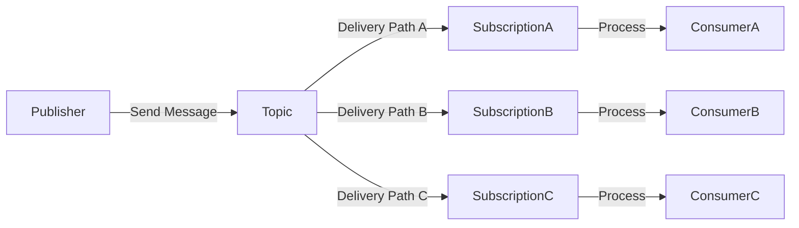

# Lab 05: Message Routing

> **In this document:**  
>
> [[_TOC_]]

As messaging ecosystems grow more complex, controlling where messages travel becomes essential for ensuring scalability, traceability, and performance. This lab explores designing deliberate routing paths using topics, subscriptions, and metadata strategies, enabling messages to reach the right consumers at the right time through well-defined channels.

Building on the foundational Publish/Subscribe pattern, we now focus on **multi-path delivery**, a technique for distributing messages across consumers based on characteristics like message intent, tenant boundaries, or processing tiers.

By the end of this lab, you will be equipped to design routing topologies that blend structure with adaptability, preparing the groundwork for more advanced delivery controls in future labs.

---

## What is Messaging Routing?

The **Message Routing** pattern governs how messages are distributed across consumers in a messaging ecosystem. Rather than sending every message to subscribers, routing enables **targeted delivery** based on factors like message intent, tenant context, or processing tier.

This pattern is foundational to designing scalable, modular, and operationally efficient systems.

### How it Works

- A **publisher** sends a message to a central **topic**.
- Multiple **subscriptions** are defined on that topic, each representing a unique delivery path.
- The message includes **metadata** (e.g., `tenantId`, `region`, `eventType`) that informs routing decisions.
- Each subscription receives the message if it aligns with its defined delivery criteria.
- **Consumers** listen to those subscriptions to process the message relevant to their role.



### Key Characteristics

| Feature             | Description                                                  |
| ------------------- | ------------------------------------------------------------ |
| Multi-Path Delivery | Messages are delivered to one or more subscriptions based on routing logic. |
| Metadata-Driven     | Routing decisions rely on message properties such as `region` or `tenantId`. |
| Decoupled Topology  | Publishers are unaware of the number or nature of downstream consumers. |
| Subscription-Based  | Each subscription defines its own delivery context and processing behavior. |

### Key Benefits

- **Scalable Fan-Out:** Enables efficient message distribution without overloading consumers.
- **Contextual Delivery:** Message reaches consumers aligned with their domain or processing tier.
- **Operational Clarity:** Clear routing paths support observability, troubleshooting, and ownership.
- **Modularity:** Subscriptions act as pluggable endpoints for evolving workflows and consumers.

### Use Cases

- Broadcasting events to multiple regional processors or data centers.
- Delivery tenant-specific messages in a multi-tenant SaaS platform.
- Segregating system notifications by business function (e.g., billing, customer support, logistics).
- Enabling priority-based routing for time-sensitive alerts.

---

## Objectives

By the end of this lab, you will be able to:

- **Understand the purpose of message routing.**

  Learn why routing is critical in distributed systems to enable tenant isolation, workload segmentation, and traceable event delivery.

- **Configure topic subscriptions with filters and rules.**

  Gain hands-on experience creating subscriptions that deliver messages based on metadata conditions, promoting efficient and context-driven processing.

- **Design routing logic for scalable event flows.**

  Explore patterns for decoupling publishers from consumers, using routing to manage growing system complexity without introducing fragility.

- **Visualize routed message flows for observability.**

  Implement tracing strategies to follow messages across routing paths and improve insight into system behavior and operational health.

- **Compare routing strategies.**

  Evaluate alternatives (e.g., multiple queues versus filtered subscriptions) and articulate trade-offs to guide architectural decisions.

---

## Prerequisites

- [.NET SDK 8.0 or later](https://dotnet.microsoft.com/download)
- A text editor or IDE such as [Visual Studio Code](https://code.visualstudio.com/) or [Visual Studio](https://visualstudio.microsoft.com/) (any edition).
- [Docker Desktop](https://www.docker.com/products/docker-desktop)
- [Azure Service Bus Emulator](https://github.com/Azure/azure-service-bus-emulator-installer)

---

## Lab Steps

### Step 1: Configure Messaging Emulator with Topic and Subscriptions

In this step, you will update your local Service Bus emulator's `config.json` file to define a **topic** and multiple **subscriptions** to route messages based on metadata like tenant and event type.

1. **Locate the `config.json` File**

   This file resides inside your emulator installation directory, for example:

   ```
   {local-emulator-repository-folder}\ServiceBus-Emulator\Config\config.json
   ```

2. **Add Topic and Subscription Definitions**

   Update your namespace block to include the topic `message-patterns.request-reply.message-routing` and three routing subscriptions:

   ```json
   {
     "UserConfig": {
       "Namespaces": [
         {
           "Name": "sbemulatorns",
           "Queues": [
           ],
           "Topics": [
             {
               "Name": "message-patterns.message-routing",
               "Properties": {
                 "DefaultMessageTimeToLive": "PT1H",
                 "DuplicateDetectionHistoryTimeWindow": "PT20S",
                 "RequiresDuplicateDetection": false
               },
               "Subscriptions": [
                 {
                   "Name": "tenant-alpha",
                   "Properties": {
                     "DeadLetteringOnMessageExpiration": false,
                     "DefaultMessageTimeToLive": "PT1H",
                     "LockDuration": "PT1M",
                     "MaxDeliveryCount": 3,
                     "ForwardDeadLetteredMessagesTo": "",
                     "ForwardTo": "",
                     "RequiresSession": false
                   },
                   "Rules": [
                     {
                       "Name": "tenant-alpha-rule",
                       "Properties": {
                         "FilterType": "Sql",
                         "SqlFilter": {
                           "SqlExpression": "tenantId = 'Alpha'"
                         },
                         "Action" : {
                           "SqlExpression": "SET sys.To = 'Entity'"
                         }
                       }
                     }
                   ]
                 },
                 {
                   "Name": "inventory",
                   "Properties": {
                     "DeadLetteringOnMessageExpiration": false,
                     "DefaultMessageTimeToLive": "PT1H",
                     "LockDuration": "PT1M",
                     "MaxDeliveryCount": 3,
                     "ForwardDeadLetteredMessagesTo": "",
                     "ForwardTo": "",
                     "RequiresSession": false
                   },
                   "Rules": [
                     {
                       "Name": "inventory-rule",
                       "Properties": {
                         "FilterType": "Sql",
                         "SqlFilter": {
                           "SqlExpression": "eventType LIKE 'Inventory%'"
                         },
                         "Action" : {
                           "SqlExpression": "SET sys.To = 'Entity'"
                         }
                       }
                     }
                   ]
                 },
                 {
                   "Name": "fallback",
                   "Properties": {
                     "DeadLetteringOnMessageExpiration": false,
                     "DefaultMessageTimeToLive": "PT1H",
                     "LockDuration": "PT1M",
                     "MaxDeliveryCount": 3,
                     "ForwardDeadLetteredMessagesTo": "",
                     "ForwardTo": "",
                     "RequiresSession": false
                   },
                   "Rules": [
                     {
                       "Name": "fallback-rule",
                       "Properties": {
                         "FilterType": "Sql",
                         "SqlFilter": {
                           "SqlExpression": "1=1"
                         },
                         "Action" : {
                           "SqlExpression": "SET sys.To = 'Entity'"
                         }
                       }
                     }
                   ]
                 }
               ]
             }
           ]
         }
       ],
       "Logging": {
         "Type": "File"
       }
     }
   }
   ```

   > These filters represent routing logic:
   >
   > - `tenant-alpha`: receives events tagged for tenant `alpha`.
   > - `inventory`: receives messages of type `inventory`.
   > - `fallback`: receives all messages (acts as a catch-all).

3. **Restart the Emulator**

   - Stop and start the Service Bus emulator according to your OS instructions.
   - Confirm the emulator is running correctly.

### Step 2: Create and Implement the Publisher Application

These steps create a runnable Service Bus publisher that emits metadata-enriched events to the `message-patterns.message-routing` topic.

#### 2.1 Set Up the Solution and Project

```shell
mkdir Lab05_MessageRouting && cd Lab05_MessageRouting
dotnet new sln -n Lab05Messaging
dotnet new console -n EventPublisher
dotnet sln add EventPublisher/EventPublisher.csproj
```

#### 2.2 Install NuGet Dependencies

```shell
dotnet add EventPublisher package Azure.Messaging.ServiceBus
dotnet add EventPublisher package Microsoft.Extensions.Configuration
dotnet add EventPublisher package Microsoft.Extensions.Configuration.Json
dotnet add EventPublisher package Spectre.Console
```

#### 2.3 Add Configuration File

1. Create the `appsettings.json` file:

   ```shell
   code EventPublisher/appsettings.json
   ```

2. Add the emulator settings:

   ```json
   {
     "ServiceBus": {
       "ConnectionString": "Endpoint=sb://127.0.0.1;SharedAccessKeyName=RootManageSharedAccessKey;SharedAccessKey=SAS_KEY_VALUE;UseDevelopmentEmulator=true;",
       "TopicName": "message-patterns.message-routing"
     }
   }
   ```

3. Update the `.csproj` to include

   ```xml
   <ItemGroup>
     <None Update="appsettings.json">
       <CopyToOutputDirectory>Always</CopyToOutputDirectory>
     </None>
   </ItemGroup>
   ```

#### 2.4 Implement the Event Publisher

Paste the following into `Program.cs`. It sends three sample events with tenant and event-type metadata:

```c#
using Azure.Messaging.ServiceBus;
using Microsoft.Extensions.Configuration;
using Spectre.Console;
using System.Diagnostics;

AnsiConsole.Write(new FigletText("Publisher").LeftJustified().Color(Color.Yellow));

IConfigurationRoot config = new ConfigurationBuilder()
	.AddJsonFile("appsettings.json")
	.Build();
string connectionString = config["ServiceBus:ConnectionString"]!;
string topicName = config["ServiceBus:TopicName"]!;

ServiceBusClient client = new(connectionString);
ServiceBusSender sender = client.CreateSender(topicName);

var events = new[]
{
		new { Tenant = "Alpha", EventType = "Inventory.Created" },
		new { Tenant = "Beta", EventType = "Order.Placed" },
		new { Tenant = "Alpha", EventType = "Order.Cancelled" }
};

string correlationId = ActivityTraceId.CreateRandom().ToString();

Console.WriteLine("Press any key to publish events...");
Console.ReadKey(true);

foreach (var evt in events)
{
	var message = new ServiceBusMessage($"Event from {evt.Tenant}: {evt.EventType}");
	message.ApplicationProperties["tenant"] = evt.Tenant;
	message.ApplicationProperties["eventType"] = evt.EventType;
	message.ApplicationProperties["correlationId"] = correlationId;
	message.ApplicationProperties["publishedAt"] = DateTimeOffset.UtcNow;

	await sender.SendMessageAsync(message);
	AnsiConsole.MarkupLine($"[cyan]Published:[/] {evt.EventType} → Tenant: {evt.Tenant} | Correlation: {correlationId}");
}

await sender.DisposeAsync();
await client.DisposeAsync();
```

### Step 3: Build a Shared Library for Subscription Processing

This step introduces `EventConsumer.Core`, a reusable class library that encapsulates all logic for connecting to a Service Bus topic subscription and handling messages. It will expose a lightweight API that consumer applications can invoke with minimal configuration.

#### 3.1 Create the Shared Library

```shell
dotnet new classlib -n EventConsumerCore
dotnet sln add EventConsumerCore/EventConsumerCore.csproj
delete EventConsumerCore/Class1.cs
```

#### 3.2 Install Dependencies

```shell
dotnet add EventConsumerCore package Azure.Messaging.ServiceBus
dotnet add EventConsumerCore package Spectre.Console
```

#### 3.3 Implement the `SubscriptionListener` Class

1. Create the `SubscriptionListener.cs` file:

   ```shell
   code EventConsumerCore/SubscriptionListener.cs
   ```

2. Define the logic:

   ```c#
   using Azure.Messaging.ServiceBus;
   using Spectre.Console;
   
   namespace EventConsumerCore;
   
   public class SubscriptionListener(string connectionString, string topicName, string subscriptionName)
   {
   
   	private readonly string _connectionString = connectionString;
   	private readonly string _topicName = topicName;
   	private readonly string _subscriptionName = subscriptionName;
   
   	public async Task StartListeningAsync()
   	{
   		AnsiConsole.Write(new FigletText(_subscriptionName).LeftJustified().Color(Color.Blue));
   
   		ServiceBusClient client = new(_connectionString);
   		ServiceBusProcessor processor = client.CreateProcessor(_topicName, _subscriptionName, new ServiceBusProcessorOptions
   		{
   			AutoCompleteMessages = false,
   			MaxConcurrentCalls = 1
   		});
   
   		processor.ProcessMessageAsync += async args =>
   		{
   			ServiceBusReceivedMessage message = args.Message;
   
   			AnsiConsole.MarkupLine("[green]Received routed event:[/]");
   			AnsiConsole.MarkupLine($"\t[grey]Tenant:[/] {message.ApplicationProperties["tenant"]}");
   			AnsiConsole.MarkupLine($"\t[grey]Event Type:[/] {message.ApplicationProperties["eventType"]}");
   			AnsiConsole.MarkupLine($"\t[grey]Body:[/] {message.Body}");
   			AnsiConsole.MarkupLine($"\t[grey]Correlation ID:[/] {message.ApplicationProperties["correlationId"]}");
   			AnsiConsole.MarkupLine($"\t[grey]Published At:[/] {message.ApplicationProperties["publishedAt"]}");
   
   			await args.CompleteMessageAsync(message);
   		};
   
   		processor.ProcessErrorAsync += args =>
   		{
   			AnsiConsole.MarkupLine($"[red]Error:[/] {args.Exception.Message}");
   			return Task.CompletedTask;
   		};
   
   		AnsiConsole.MarkupLine($"[green]Listening on subscription:[/] {_subscriptionName}");
   		await processor.StartProcessingAsync();
   		await Task.Delay(-1);
   	}
   }
   ```

### Step 4: Create Routed Subscription Consumers

Now that the `SubscriptionListener` class is defined in `EventConsumer.Core`, each consumer project will configure its subscription name and invoke the listener. This modular approach ensures consistency and supports future extensibility.

#### 4.1 Create the Consumer Projects

```bash
dotnet new console -n AlphaConsumer
dotnet new console -n InventoryConsumer
dotnet new console -n FallbackConsumer

dotnet sln add AlphaConsumer/AlphaConsumer.csproj
dotnet sln add InventoryConsumer/InventoryConsumer.csproj
dotnet sln add FallbackConsumer/FallbackConsumer.csproj
```

#### 4.2 Add Project References and Configuration

1. For each project, add a reference to the shared library and install config support:

   ```shell
   dotnet add AlphaConsumer reference EventConsumer.Core/EventConsumer.Core.csproj
   dotnet add AlphaConsumer package Microsoft.Extensions.Configuration
   dotnet add AlphaConsumer package Microsoft.Extensions.Configuration.Json
   ```

   Repeat for `InventoryConsumer` and `FallbackConsumer`.

2. .Then add an `appsettings.json` file to each with is specific subscription:

   ```xml
   {
     "ServiceBus": {
       "ConnectionString": "Endpoint=sb://127.0.0.1;SharedAccessKeyName=RootManageSharedAccessKey;SharedAccessKey=SAS_KEY_VALUE;UseDevelopmentEmulator=true;",
       "TopicName": "message-patterns.message-routing",
       "SubscriptionName": "tenant-alpha"
     }
   }
   ```

   | Project             | Subscription Name |
   | ------------------- | ----------------- |
   | `AlphaConsumer`     | `tenant-alpha`    |
   | `InventoryConsumer` | `inventory`       |
   | `FallbackConsumer`  | `fallback`        |

3. Update the `.csproj` file in all three projects:

   ```xml
   <ItemGroup>
     <None Update="appsettings.json">
       <CopyToOutputDirectory>Always</CopyToOutputDirectory>
     </None>
   </ItemGroup>
   ```

#### 4.3 Implement `Program.cs`

Each consumer now has a concise entry point:

```c#
using EventConsumerCore;
using Microsoft.Extensions.Configuration;

IConfigurationRoot config = new ConfigurationBuilder()
	.AddJsonFile("appsettings.json")
	.Build();

string connectionString = config["ServiceBus:ConnectionString"]!;
string topicName = config["ServiceBus:TopicName"]!;
string subscriptionName = config["ServiceBus:SubscriptionName"]!;

SubscriptionListener listener = new(connectionString, topicName, subscriptionName);
await listener.StartListeningAsync();
```

Repeat this structure for `InventoryConsumer` and `FallbackConsumer`

### Step 5: Run the Routing Lab and Observe Event Behavior

You will spin up all components (consumers and publishers), then trigger events with diagnostic metadata. You will validate:

- Filtered routing per subscription
- Correlation identifier propagation across consumers
- Delivery timing and metadata consistency

#### 7.1 Launch the Consumers

Open **three terminal windows**, one for each consumer project:

```shell
dotnet run --project AlphaConsumer
dotnet run --project InventoryConsumer
dotnet run --project FallbackConsumer
```

Watch for:

- Routed messages with enriched metadata
- Correct delivery based on filters: `tenant`, `eventType`

#### 7.2 Run the Publisher

In a separate terminal:

```shell
dotnet run --project RoutedEventPublisher
```

You will see confirmations as each event is published, showing its `tenant`, `eventType`, and shared `correltationId`.

Each consumer should light up with matching events:

| Consumer          | Should Receive                       |
| ----------------- | ------------------------------------ |
| AlphaConsumer     | Events with `"tenant": "alpha"`      |
| InventoryConsumer | Events with `"Tenant": "inventory"`  |
| FallbackConsumer  | Events not matched by other filters. |

#### 7.3 Observe Routing and Metadata

Each event should show:

- Tenant-based delivery
- Correlation identifier visibility
- Published timestamp
- Event type differentiation

---

## Next Steps

You have now implemented and validated message routing using Azure Service Bus's topic and subscription model, a powerful strategy for directing messaging to the right consumer at the right time. This lab emphasized **metadata-driven delivery**, **fan-out infrastructure**, and **subscription-based targeting**. key tools for scalable, maintainable event systems

### What You Accomplished

In this lab, you:

- Configured topic subscriptions with **SQL filters** to route events by `tenant` and `eventType`.
- Built a **shared listener abstraction** to consume routed messages consistently.
- Injected **correlation metadata** (`correlationId`, `publishedAt`) to trace delivery paths.
- Validated routing behavior across distinct consumers, each representing a contextual slice of the system.

### Ways to Extend This Lab

This lab sets the stage for deeper delivery optimization. Further enhancements could include:

- **Composite filters:** Combine multiple routing rules to support regional and functional targeting.
- **Observability tooling:** Integrate with structured logging frameworks or distributed tracing (e.g., OpenTelemetry).

### What's Next: Message Filtering

The next lab zooms in on **Message Filtering**, a complementary strategy that enhances subscription precision. Instead of routing messages broadly, filtering allows consumers to define **fine-grained criteria** for message acceptance, reducing noise and improving intent-driven delivery.

You will explore:

- Crafting advanced **SQL filter rules** based on metadata like tenant, region, or event type.
- Using **custom properties** to control access or visibility.
- Manage **filter overlap** and precedence.
- Comparing inclusion filters (`eventType = 'inventory'`) versus suppression filters (`eventType != 'internal.log`).
- Testing dynamic filtering behaviors in multi-subscription scenarios.

By the end of that lab, you will understand how filtering sharpens delivery semantics, enabling event consumers to express precisely what they care about and ignore everything else.