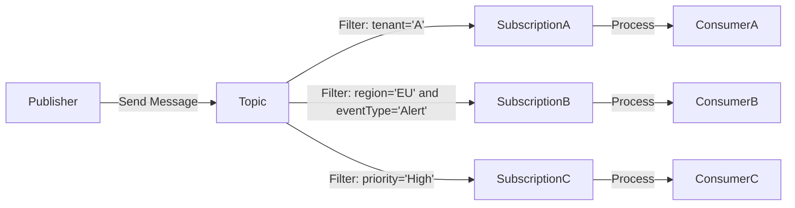

# Lab 06: Messaging Filtering

In this lab, you will extend your messaging system by configuring topic subscriptions with filters, allowing consumers to receive only the messages that match specific criteria.

Instead of sending every message to every subscription, you will build logic that inspects message metadata (like `tenant`, `eventType`, or `region`) and applies rules that determine delivery.

You will:

- Define filtered subscriptions using SQL-like expressions.
- Test delivery using the same events with varied properties.
- Observe how filters refine message flow and reduce noise.

This lab builds on the routing foundation by introducing **message-level selectivity**, ensuring each consumer sees only the events that matter to them.

---

## What is Message Filtering?

The **Message Filtering** pattern refines how messages are delivered within a routing system. While routing establishes multiple delivery paths, filtering ensures that **only relevant messages travel down each one**, reducing noise and increasing precision.

This pattern enhances modularity and observability by applying declarative rules that inspect message metadata before delivery.

### How it Works

- A **publisher** sends a message to a central **topic**.
- Multiple **subscriptions** are defined on that topic, each with **filter rules**.
- To determine eligibility, these rules evaluate message metadata (e.g., `tenant`, `eventType`, `priority`).
- Only subscriptions with matching filters receive the message.
- **Consumers** connected to those subscription processes and received the qualified messages.



### Key Characteristics

| Feature             | Description                                                  |
| ------------------- | ------------------------------------------------------------ |
| Declarative Logic   | Filters are defined using expressions against message properties. |
| Metadata-Based      | Delivery is driven by values like `eventType`, `tenant`, or custom attributes. |
| Selective Fan-Out   | Messages are sent only to subscriptions whose filters evaluate to true. |
| Rule-Based Delivery | Each subscription defines logic that governs what it receives. |

### Key Benefits

- **Reduced Noise:** Consumers only receive messages relevant to their domain or role.
- **Operational Precision:** Filtering enables cleaner logs, dashboards, and altered flows.
- **Scalable Personalization:** Subscriptions can be tailored for tenants, tiers, or event types.
- **Modular Control:** Teams can evolve their filters independently without affecting publishers.

#### Use Cases

- Filtering tenant-specific traffic in a shared topic without duplicating infrastructure.
- Delivering alerts to security teams based on `eventType=Alert` and `priority=High`.
- Segregating billing events (`eventType=Invoice`) from customer notifications (`eventType=Welcome`).
- Implementing region-specific data flows across global consumers.

---

## Objectives

By the end of this lab, you will be able to:

- Configure Azure Service Bus **topic subscriptions with filters**.
- Apply **SQL-like filter expressions** to control message delivery.
- Observe how filtering reduces **messaging noise** and improves delivery precision.
- Compare filtering to routing to understand **layered messaging control**.
- Use sample events to **test and validate** filtered subscriptions.

This lab bridges infrastructure setup with delivery logic, helping teams refine how messages move through distributed systems.

---

## Prerequisites

- [.NET SDK 8.0 or later](https://dotnet.microsoft.com/download)
- A text editor or IDE such as [Visual Studio Code](https://code.visualstudio.com/) or [Visual Studio](https://visualstudio.microsoft.com/) (any edition).
- [Docker Desktop](https://www.docker.com/products/docker-desktop)
- [Azure Service Bus Emulator](https://github.com/Azure/azure-service-bus-emulator-installer)

---

## Lab steps

### Step 1: Define Filtered Subscriptions

In this step, you will update the local Service Bus emulator's `config.json` to create topic subscriptions that apply **SQL filter expressions**. These filters inspect message metadata (e.g., `eventType`, `priority`, or `tenantId`) to determine whether a subscription should receive the message.

1. **Locate the `config.json` File**

   This file resides inside your emulator installation directory, for example:

   ```
   {local-emulator-repository-folder}\ServiceBus-Emulator\Config\config.json
   ```

2. **Add Topic and Subscription Definitions**

   Update your namespace block to include the topic `message-patterns.message-filtering`, and two filtered subscriptions:

   ```json
   {
     "UserConfig": {
       "Namespaces": [
         {
           "Name": "sbemulatorns",
           "Queues": [
           ],
           "Topics": [
             {
               "Name": "message-patterns.message-filtering",
               "Properties": {
                 "DefaultMessageTimeToLive": "PT1H",
                 "DuplicateDetectionHistoryTimeWindow": "PT20S",
                 "RequiresDuplicateDetection": false
               },
               "Subscriptions": [
                 {
                   "Name": "high-priority",
                   "Properties": {
                     "DeadLetteringOnMessageExpiration": false,
                     "DefaultMessageTimeToLive": "PT1H",
                     "LockDuration": "PT1M",
                     "MaxDeliveryCount": 3,
                     "ForwardDeadLetteredMessagesTo": "",
                     "ForwardTo": "",
                     "RequiresSession": false
                   },
                   "Rules": [
                     {
                       "Name": "high-priority-rule",
                       "Properties": {
                         "FilterType": "Sql",
                         "SqlFilter": {
                           "SqlExpression": "priority = 'High'"
                         },
                         "Action" : {
                           "SqlExpression": "SET sys.To = 'Entity'"
                         }
                       }
                     }
                   ]
                 },
                 {
                   "Name": "low-priority",
                   "Properties": {
                     "DeadLetteringOnMessageExpiration": false,
                     "DefaultMessageTimeToLive": "PT1H",
                     "LockDuration": "PT1M",
                     "MaxDeliveryCount": 3,
                     "ForwardDeadLetteredMessagesTo": "",
                     "ForwardTo": "",
                     "RequiresSession": false
                   },
                   "Rules": [
                     {
                       "Name": "low-priority-rule",
                       "Properties": {
                         "FilterType": "Sql",
                         "SqlFilter": {
                           "SqlExpression": "priority != 'High'"
                         },
                         "Action" : {
                           "SqlExpression": "SET sys.To = 'Entity'"
                         }
                       }
                     }
                   ]
                 }
               ]
             }
           ]
         }
       ],
       "Logging": {
         "Type": "File"
       }
     }
   }
   ```

   > This setup ensures:
   >
   > - `priority = 'High'`:  goes to the `high-priority` subscription.
   > - All other priorities go to a `low-priority` subscription.

3. **Restart the Emulator**

   - Stop and start the Service Bus emulator according to your OS instructions.
   - Confirm the emulator is running correctly.

### Step 2: Create and Implement the Publisher Application

These steps create a runnable Service Bus publisher that emits metadata-enriched events to the `message-patterns.message-filtering` topic.

#### 2.1 Set Up the Solution and Project

```shell
mkdir Lab06_MessageFiltering && cd Lab06_MessageFiltering
dotnet new sln -n Lab06_MessageFiltering
dotnet new console -n FilteredEventPublisher
dotnet sln add FilteredEventPublisher/FilteredEventPublisher.csproj
```

#### 2.2 Install NuGet Dependencies

```shell
dotnet add FilteredEventPublisher package Azure.Messaging.ServiceBus
dotnet add FilteredEventPublisher package Microsoft.Extensions.Configuration
dotnet add FilteredEventPublisher package Microsoft.Extensions.Configuration.Json
dotnet add FilteredEventPublisher package Spectre.Console
```

#### 2.3 Add Configuration File

1. Create the `appsettings.json` file:

   ```shell
   code FilteredEventPublisher/appsettings.json
   ```

2. Add the emulator settings:

   ```json
   {
     "ServiceBus": {
       "ConnectionString": "Endpoint=sb://127.0.0.1;SharedAccessKeyName=RootManageSharedAccessKey;SharedAccessKey=SAS_KEY_VALUE;UseDevelopmentEmulator=true;",
       "TopicName": "message-patterns.message-filtering"
     }
   }
   ```

3. Update the `.csproj` to include

   ```xml
   <ItemGroup>
     <None Update="appsettings.json">
       <CopyToOutputDirectory>Always</CopyToOutputDirectory>
     </None>
   </ItemGroup>
   ```

#### 2.4 Implement the Event Publisher

Paste the following into `Program.cs`. It sends sample events with a priority metadata:

```c#
using Azure.Messaging.ServiceBus;
using Microsoft.Extensions.Configuration;
using Spectre.Console;
using System.Diagnostics;

AnsiConsole.Write(new FigletText("Publisher").LeftJustified().Color(Color.Yellow));

IConfigurationRoot config = new ConfigurationBuilder()
	.AddJsonFile("appsettings.json")
	.Build();
string connectionString = config["ServiceBus:ConnectionString"]!;
string topicName = config["ServiceBus:TopicName"]!;

ServiceBusClient client = new(connectionString);
ServiceBusSender sender = client.CreateSender(topicName);

Random rand = new();

Console.WriteLine("Press any key to start sending messages...");
Console.ReadKey(true);

using CancellationTokenSource cts = new();
Console.CancelKeyPress += (_, e) =>
{
	e.Cancel = true; // Prevent the process from terminating immediately
	cts.Cancel();
	AnsiConsole.MarkupLine("[red]Cancellation requested...[/]");
};

while (!cts.Token.IsCancellationRequested)
{
	Console.WriteLine();
	AnsiConsole.MarkupLine("[yellow]Press [bold]Q[/] to stop sending messages.[/]");

	if (Console.KeyAvailable && Console.ReadKey(true).Key == ConsoleKey.Q)
	{
		AnsiConsole.MarkupLine("[yellow]No longer sending messages...[/]");
		cts.Cancel(); // Trigger cancellation manually
		break;
	}

	string priority = GetPriority();
	string correlationId = ActivityTraceId.CreateRandom().ToString();
	var message = new ServiceBusMessage($"This is a `{priority}` event.");
	message.ApplicationProperties["correlationId"] = correlationId;
	message.ApplicationProperties["publishedAt"] = DateTimeOffset.UtcNow;
	message.ApplicationProperties["priority"] = priority;

	await sender.SendMessageAsync(message, cts.Token); // Pass token to operation
	AnsiConsole.MarkupLine($"[cyan]Published:[/] Priority: {priority} | Correlation: {correlationId}");

	try
	{
		await Task.Delay(2000, cts.Token);
	}
	catch (TaskCanceledException)
	{
		break; // Exit loop if delay was cancelled
	}
}

// ----------------------------------------------------------------------------
// Helper methods
// ----------------------------------------------------------------------------

string GetPriority() => rand.Next(1, 101) switch
{
	<= 25 => "High",
	_ => rand.Next(0, 2) == 0 ? "Medium" : "Low"
};
```

### Step 3: Build a Shared Library for Subscription Processing

This step introduces `EventConsumer.Core`, a reusable class library that encapsulates all logic for connecting to a Service Bus topic subscription and handling messages. It will expose a lightweight API that consumer applications can invoke with minimal configuration.

#### 3.1 Create the Shared Library

```shell
dotnet new classlib -n EventConsumerCore
dotnet sln add EventConsumerCore/EventConsumerCore.csproj
delete EventConsumerCore/Class1.cs
```

#### 3.2 Install Dependencies

```shell
dotnet add EventConsumerCore package Azure.Messaging.ServiceBus
dotnet add EventConsumerCore package Spectre.Console
```

#### 3.3 Implement the `SubscriptionListener` Class

1. Create the `SubscriptionListener.cs` file:

   ```shell
   code EventConsumerCore/SubscriptionListener.cs
   ```

2. Define the logic:

   ```c#
   using Azure.Messaging.ServiceBus;
   using Spectre.Console;
   
   namespace EventConsumerCore;
   
   public class SubscriptionListener(string connectionString, string topicName, string subscriptionName, int maxMessages, int millisecondsDelay)
   {
   
   	private readonly string _connectionString = connectionString;
   	private readonly string _topicName = topicName;
   	private readonly string _subscriptionName = subscriptionName;
   	private readonly int _maxMessages = maxMessages;
   	private readonly int _millisecondsDelay = millisecondsDelay;
   
   	public async Task StartListeningAsync()
   	{
   		AnsiConsole.Write(new FigletText(_subscriptionName).Centered().Color(Color.Blue));
   
   		ServiceBusClient client = new(_connectionString);
   		ServiceBusProcessor processor = client.CreateProcessor(_topicName, _subscriptionName, new ServiceBusProcessorOptions
   		{
   			AutoCompleteMessages = false,
   			MaxConcurrentCalls = 1
   		});
   
   		int messageCount = 0;
   
   		processor.ProcessMessageAsync += async args =>
   		{
   			ServiceBusReceivedMessage message = args.Message;
   			DisplayMessage(message);
   			await args.CompleteMessageAsync(message);
   			messageCount = await PauseLowerPriorityQueues(messageCount);
   		};
   
   		processor.ProcessErrorAsync += args =>
   		{
   			AnsiConsole.MarkupLine($"[red]Error:[/] {args.Exception.Message}");
   			return Task.CompletedTask;
   		};
   
   		AnsiConsole.MarkupLine($"[green]Listening on subscription:[/] {_subscriptionName}");
   		await processor.StartProcessingAsync();
   		await Task.Delay(-1);
   	}
   
   	private async Task<int> PauseLowerPriorityQueues(int messageCount)
   	{
   		messageCount++;
   		Console.WriteLine();
   		AnsiConsole.MarkupLine($"[blue]Processed message count:[/] {messageCount}");
   		if (_maxMessages > 0 && messageCount >= _maxMessages)
   		{
   			AnsiConsole.MarkupLine($"[yellow]Maximum message count reached: {_maxMessages}[/]");
   			AnsiConsole.MarkupLine($"[yellow]Pausing message processing for {_millisecondsDelay} milliseconds.[/]");
   			await Task.Delay(_millisecondsDelay);
   			messageCount = 0;
   		}
   		return messageCount;
   	}
   
   	private static void DisplayMessage(ServiceBusReceivedMessage message)
   	{
   		AnsiConsole.MarkupLine("[green]Received filtered event:[/]");
   		AnsiConsole.MarkupLine($"\t[grey]Priority:[/] {message.ApplicationProperties["priority"]}");
   		AnsiConsole.MarkupLine($"\t[grey]Body:[/] {message.Body}");
   		AnsiConsole.MarkupLine($"\t[grey]Correlation ID:[/] {message.ApplicationProperties["correlationId"]}");
   		AnsiConsole.MarkupLine($"\t[grey]Published At:[/] {message.ApplicationProperties["publishedAt"]}");
   	}
   }
   ```

### Step 4: Create Filtered Subscription Consumers

Now that the `SubscriptionListener` class is defined in `EventConsumerCore`, each consumer project will configure its subscription name and invoke the listener. This modular approach ensures consistency and supports future extensibility.

#### 4.1 Create the Consumer Projects

```bash
dotnet new console -n HighPriorityConsumer
dotnet new console -n LowPriorityConsumer

dotnet sln add HighPriorityConsumer/HighPriorityConsumer.csproj
dotnet sln add LowPriorityConsumer/LowPriorityConsumer.csproj
```

#### 4.2 Add Project References and Configuration

1. For each project, add a reference to the shared library and install config support:

   ```shell
   dotnet add HighPriorityConsumer reference EventConsumerCore/EventConsumerCore.csproj
   dotnet add HighPriorityConsumer package Microsoft.Extensions.Configuration
   dotnet add HighPriorityConsumer package Microsoft.Extensions.Configuration.Json
   ```

   Repeat for `LowPriorityConsumer`.

2. Then add an `appsettings.json` file to each with is specific subscription:

   ```json
   {
     "ServiceBus": {
       "ConnectionString": "Endpoint=sb://127.0.0.1;SharedAccessKeyName=RootManageSharedAccessKey;SharedAccessKey=SAS_KEY_VALUE;UseDevelopmentEmulator=true;",
       "TopicName": "message-patterns.message-filtering",
       "SubscriptionName": "high-priority"
     },
     "PriorityQueueHandling": {
       "MaxMessagesPerSession": 0,
       "MillisecondsDelay": 0
     }
   }
   ```

   | Project                | `SubscriptionName` | `MaxMessagesPerSession` | `MillisecondsDelay |
   | ---------------------- | ------------------ | ----------------------- | ------------------ |
   | `HighPriorityConsumer` | `high-priority`    | 0                       | 0                  |
   | `LowPriorityConsumer`  | `low-priority`     | 5                       | 5000               |

3. Update the `.csproj` file in all three projects:

   ```xml
   <ItemGroup>
     <None Update="appsettings.json">
       <CopyToOutputDirectory>Always</CopyToOutputDirectory>
     </None>
   </ItemGroup>
   ```

#### 4.3 Implement `Program.cs`

Each consumer now has a concise entry point:

```c#
using EventConsumerCore;
using Microsoft.Extensions.Configuration;

IConfigurationRoot config = new ConfigurationBuilder()
	.AddJsonFile("appsettings.json")
	.Build();

string connectionString = config["ServiceBus:ConnectionString"]!;
string topicName = config["ServiceBus:TopicName"]!;
string subscriptionName = config["ServiceBus:SubscriptionName"]!;

if (!int.TryParse(config["PriorityQueueHandling:MaxMessagesPerSession"], out int maxMessages))
{
	maxMessages = 5; // Default to 5 if not set or invalid
}
if (!int.TryParse(config["PriorityQueueHandling:MillisecondsDelay"], out int millisecondsDelay))
{
	millisecondsDelay = 5000; // Default to 5000 ms if not set or invalid
}

SubscriptionListener listener = new(connectionString, topicName, subscriptionName, maxMessages, millisecondsDelay);
await listener.StartListeningAsync();
```

Repeat this structure for `LowPriorityConsumer`.

### Step 5: Run the Filtering Lab and Observe Event Behavior

You will spin up all components (consumers and publishers), then trigger events with diagnostic metadata. You will validate:

- Filtering per subscription
- Correlation identifier propagation across consumers
- Delivery timing and metadata consistency

#### 5.1 Launch the Consumers

Open **three terminal windows**, one for each consumer project:

```shell
dotnet run --project HighPriorityConsumer
dotnet run --project LowPriorityConsumer
```

Watch for:

- Filtered messages with enriched metadata
- Correct delivery based on filters: `tenant`, `eventType`

#### 5.2 Run the Publisher

In a separate terminal:

```shell
dotnet run --project FilteredEventPublisher
```

You will see confirmations as each event is published, showing its `priority` and `correlationId`.

Each consumer should light up with matching events:

| Consumer               | Should Receive                   |
| ---------------------- | -------------------------------- |
| `HighPriorityConsumer` | Events with `"priority": "High"` |
| `LowPriorityConsumer`  | All other events                 |

#### 5.3 Observe Routing and Metadata

Each event should show:

- Tenant-based delivery
- Correlation identifier visibility
- Published timestamp
- Event type differentiation

---

## Next Steps

### What You Accomplished

You built and validated a modular, metadata-driven filtering system using **Service Bus topic subscriptions** with SQL-based rules. Throughout this lab, you:

- Defined **filtered subscriptions** that route events based on `priority`.
- Build a **publisher app** to emit enriched events.
- Created a **shared processing library** for scalable consumer implementation.
- Deployed **dedicated consumers** for high and low priority subscriptions.
- Verified behavior across the system with live message publishing and filtering.

This lab reinforces best practices in **event metadata**, **subscription modularity**, and **traceable messaging**, which all mirror production-ready architecture patterns.

### Ways to Extend This Lab

Want to push it further? Try exploring:

- **Multi-property filters:** Add SQL rules involving other properties to test composite routing behavior.
- **Observability hooks:** Integrate Application Insights or a logging framework to track delivery latency or dropped messages.
- **Negative tests:** Publish malformed or underspecified events to confirm filter safeguards and delivery boundaries.

### What's Next: Dead Letter Queue Processing

In the next lab, you will confront the realities of message failures head-on. We will cover:

- Why messages land in the **Dead Letter Queue (DLQ)**.
- How do you **access and inspect** DLQ content via a dedicated processor?
- Strategies to **recover, log, or escalate** dead-lettered events.
- Techniques to **correlate DLQ messages** back to their original context using enriched metadata.

You will build tooling that illuminates delivery breakdowns, a critical skill for keeping distributed systems observable, resilient, and accountable.