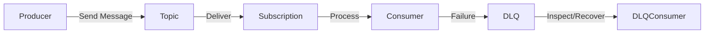

# Lab 07: Dead Letter Queues (DLQ)

In this lab, you will explore what happens when messages cannot be delivered or processed successfully and how to capture, inspect, and respond to these failures using the **Dead Letter Queue** pattern.

Dead-lettering helps systems remain resilient, accountable, and observable even under error conditions. Instead of silently discarding problematic messages, the system moves them into a dedicated sub-queue for diagnostics and recovery.

In this lab, you will:

- Configure queues to forward undeliverable messages to their **dead-letter queue**.
- Build a **DLQ consumer** to extract and inspect message metadata, including error context.
- Simulate failures to route events into the DLQ intentionally.
- Trace messages back to their original context using properties like `correlationId` and `publishedAt`.

This lab adds the tooling and awareness needed to troubleshoot real-world message systems, and lays the foundation for retry workflows, alerting, and analytics.

---

## What is Dead Lettering?

The **Dead Lettering** pattern ensures that undeliverable or unprocessable messages are captured rather than lost. Instead of failing silently, the system moves these messages to a dedicated **Dead Letter Queue (DLQ)** for later inspection, remediation, and analysis.

This mechanism maintains transparency and reliability in distributed message systems, especially when message loss or silent failure is unacceptable.

### How it Works

- A **producer** sends a message to a central **queue** or **topic**.
- A **consumer** attempts to process the message.
- The message is moved to the **Dead Letter Queue** if delivery exceeds a maximum retry limit or processing fails due to an error.
- The DLQ retains the **original payload** and **failure metadata** (e.g., `deadLetterReason`, `deadLetterErrorDescription`).
- A **DLQ consumer** can inspect, trace, and reprocess the dead-lettered messages.



### Key Characteristics

| Feature               | Description                                                  |
| --------------------- | ------------------------------------------------------------ |
| Failure Isolation     | Messages are quarantined without affecting the main delivery pipeline. |
| Metadata Preservation | Full traceability through original message properties and error details. |
| Automatic Handling    | DLQ behavior is built into Azure Service Bus for queues and subscriptions. |
| Recovery Possibility  | DLQ messages can be inspected, replayed, or rerouted as needed. |

### Key Benefits

- **Operational Resilience:** Prevents silent failures by capturing problematic messages.
- **Enhanced Observability:** Supports root-cause analysis through error metadata.
- **Safe Remediation:** Enables controlled message recovery without polluting primary flows.
- **Governance & Traceability:** Aligns with auditing, compliance, and support workflows.

### Use Cases

- Investigating deserialization errors due to schema mismatches.
- Capturing messages with expired TTL or authorization failures.
- Diagnosing unrouteable events or malformed payloads.
- Building dashboards that monitor DLQ activity for specific event types or tenants.

---

## Objectives

By the end of this lab, you will be able to:

- **Configure Dead Letter Queues** for Azure Service Bus queues and topic subscriptions.
- **Simulate message failures** to observe how undeliverable messages are handled.
- **Extract and inspect DLQ messages**, including metadata like `deadLetterReason` and `correlationId`.
- **Trace message origins** to identify the flow and failure context across system boundaries.

---

## Prerequisites

- [.NET SDK 8.0 or later](https://dotnet.microsoft.com/download)
- A text editor or IDE such as [Visual Studio Code](https://code.visualstudio.com/) or [Visual Studio](https://visualstudio.microsoft.com/) (any edition).
- [Docker Desktop](https://www.docker.com/products/docker-desktop)
- [Azure Service Bus Emulator](https://github.com/Azure/azure-service-bus-emulator-installer)

---

## Lab Steps

### Step 1: Configure Messaging Emulator

In this step, you will update your local Service Bus emulator's `config.json` to define a queue with pertinent dead lettering property settings.

1. **Locate the `config.json` File**

   This file lives under your emulator installation, for example:

   ```
   {local-emulator-repository-folder}\ServiceBus-Emulator\Config\config.json
   ```

2. **Add Queue Definitions**

   Insert entries for the request and reply queues:

   ```
   {
     "UserConfig": {
       "Namespaces": [
         {
           "Name": "sbemulatorns",
           "Queues": [
             {
               "Name": "message-patterns.dead-lettering",
               "Properties": {
                 "DeadLetteringOnMessageExpiration": true,
                 "DefaultMessageTimeToLive": "PT1H",
                 "DuplicateDetectionHistoryTimeWindow": "PT20S",
                 "ForwardDeadLetteredMessagesTo": "",
                 "ForwardTo": "",
                 "LockDuration": "PT1M",
                 "MaxDeliveryCount": 3,
                 "RequiresDuplicateDetection": false,
                 "RequiresSession": false
               }
             }
           ],
           "Topics": [
           ]
         }
       ],
       "Logging": {
         "Type": "File"
       }
     }
   }
   ```

   > **Key Properties**
   >
   > - `maxDeliveryCount`: Number of delivery attempts before dead-lettering.
   > - `DeadLetteringOnMessageExpiration`: Ensures TTL-expired messages go to the DLQ. Which in this case is 1 hour.
   >
   > The DLQ is implicitly created as `messaging-patterns.dead-lettering/$DeadLetterQueue`.

3. **Restart the Emulator**

   - Stop and start the Service Bus emulator according to your OS instructions.
   - Confirm the emulator is running correctly.

### Step 2: Create the Producer Console Application

In this step, you will create a standalone .NET console application that sometimes sends an invalid message. This will allow you to see Dead Letter Queues in action in the upcoming steps.

#### 2.1 Set Up the Solution and Project

```shell
mkdir Lab07_DeadLettering && cd Lab07_DeadLettering
dotnet new sln -n Lab07_DeadLettering
dotnet new console -n Producer
dotnet sln add Producer/Producer.csproj
```

#### 2.2 Install NuGet Dependencies

```shell
dotnet add Producer package Azure.Messaging.ServiceBus
dotnet add Producer package Microsoft.Extensions.Configuration
dotnet add Producer package Microsoft.Extensions.Configuration.Json
dotnet add Producer package Microsoft.Extensions.Configuration.Binder
dotnet add Producer package Spectre.Console
```

#### 2.3 Add Configuration File

1. Create the `appsettings.json` file:

   ```shell
   code Producer/appsettings.json
   ```

2. Add the emulator settings:

   ```json
   {
     "ServiceBus": {
       "ConnectionString": "Endpoint=sb://127.0.0.1;SharedAccessKeyName=RootManageSharedAccessKey;SharedAccessKey=SAS_KEY_VALUE;UseDevelopmentEmulator=true;",
       "QueueName": "message-patterns.dead-lettering"
     },
     "Sending": {
       "DelayMilliseconds": 2000
     }
   }
   ```

3. Update the `.csproj` to include

   ```xml
   <ItemGroup>
     <None Update="appsettings.json">
       <CopyToOutputDirectory>Always</CopyToOutputDirectory>
     </None>
   </ItemGroup>
   ```

#### 2.4 Implement the Event Producer

Paste the following into `Program.cs`. It sends sample events, some with schema errors, to simulate messages that must go to the DLQ.

```c#
using Azure.Messaging.ServiceBus;
using Microsoft.Extensions.Configuration;
using Spectre.Console;
using System.Text.Json;

AnsiConsole.Write(new FigletText("Publisher").LeftJustified().Color(Color.Yellow));

IConfigurationRoot config = new ConfigurationBuilder()
		.SetBasePath(Directory.GetCurrentDirectory())
		.AddJsonFile("appsettings.json", optional: false, reloadOnChange: true)
		.Build();
string serviceBusConnectionString = config["ServiceBus:ConnectionString"]!;
string queueName = config["ServiceBus:QueueName"]!;
int delayMilliseconds = config.GetValue<int>("Sending:DelayMilliseconds", 2000);

ServiceBusClient client = new(serviceBusConnectionString);
ServiceBusSender sender = client.CreateSender(queueName);

Random rand = new();

Console.WriteLine("Press any key to start sending messages...");
Console.ReadKey(true);

using CancellationTokenSource cts = new();
Console.CancelKeyPress += (_, e) =>
{
	e.Cancel = true; // Prevent the process from terminating immediately
	cts.Cancel();
	AnsiConsole.MarkupLine("[red]Cancellation requested...[/]");
};

while (!cts.Token.IsCancellationRequested)
{

	bool isValidSchema = rand.NextDouble() > 0.4; // ~60% valid; ~40% invalid
	ServiceBusMessage message;

	if (isValidSchema)
	{
		message = BuildValidOrderMessage(rand);
	}
	else
	{
		message = BuildInvalidOrderMessage(rand);
	}

	await sender.SendMessageAsync(message, cts.Token);

	try
	{
		await Task.Delay(delayMilliseconds, cts.Token);
	}
	catch (TaskCanceledException)
	{
		break;
	}
}

static ServiceBusMessage BuildValidOrderMessage(Random rand)
{
	ServiceBusMessage message;
	var payload = new
	{
		OrderId = Guid.NewGuid().ToString(),
		CustomerId = $"CUST-{rand.Next(100, 999)}",
		Items = new[] { new { Sku = "SKU-" + rand.Next(1000, 9999), Quantity = rand.Next(1, 4) } },
		TotalAmount = Math.Round(rand.NextDouble() * 500, 2),
		Timestamp = DateTime.UtcNow
	};

	message = new ServiceBusMessage(JsonSerializer.Serialize(payload))
	{
		ContentType = "application/json",
		MessageId = payload.OrderId,
		CorrelationId = "OrderCorrelationTest",
		Subject = "OrderCreated",
		TimeToLive = TimeSpan.FromMinutes(1),
		ApplicationProperties =
		{
			{ "eventType", "OrderCreated" },
			{ "channel", "WebPortal" },
			{ "schemaHint", "GoodSchema" }
		}
	};

	AnsiConsole.Write(
		new Panel($"[green]VALID[/]\nOrderId: [bold]{payload.OrderId}[/]")
			.Border(BoxBorder.Rounded)
			.Header("[green]Message Sent[/]")
	);
	return message;
}

static ServiceBusMessage BuildInvalidOrderMessage(Random rand)
{
	ServiceBusMessage message;
	var sneakyPayload = new
	{
		OrderId = Guid.NewGuid().ToString(),
		CustomerId = $"CUST-{rand.Next(100, 999)}",
		Items = new[]
		{
			new { Sku = "SKU-1234", Quantity = "Two" }	// 'Quantity' should be an int, not a string
    },
		TotalAmount = Math.Round(rand.NextDouble() * 500, 2),
		Timestamp = DateTime.UtcNow
	};

	message = new ServiceBusMessage(JsonSerializer.Serialize(sneakyPayload))
	{
		ContentType = "application/json",
		MessageId = sneakyPayload.OrderId,
		CorrelationId = "SchemaFailTest",
		Subject = "OrderCreated",
		TimeToLive = TimeSpan.FromMinutes(1),
		ApplicationProperties =
		{
			{ "eventType", "OrderCreated" },
			{ "channel", "WebPortal" },
			{ "schemaHint", "QuantityAsString" }
		}
	};

	AnsiConsole.Write(
		new Panel($"[yellow]SNEAKY BAD[/]\nOrderId: [bold]{sneakyPayload.OrderId}[/]\nQuantity is a string!")
			.Border(BoxBorder.Rounded)
			.Header("[yellow]Message Sent[/]")
	);
	return message;
}
```

> [!TIP]
>
> As messages are sent, the console will display color-coded Spectre panels:
>
> - **[green]VALID[/]** panels for schema-compliant orders.
> - **[yellow]SNEAKY BAD[/]** panels for malformed payloads (e.g., Quantity as string).
>
> This live feedback gives you immediate visual cues tied to message quality, essential for grasping how misbehaving payloads end up in the Dead Letter Queue.

### Step 3: Create the Consumer Console Application

In this step, you will build a .NET console app that reads messages from the queue, validates their structure against an expected schema, and sends any malformed messages to the Dead Letter Queue using Azure Service Bus's built-in routing mechanism. This consumer acts as your gatekeeper, ensuring only well-formed messages progress through the system.

#### 3.1 Set Up the Project

```shell
dotnet new console -n Consumer
dotnet sln add Consumer/Consumer.csproj
```

#### 3.2 Install NuGet Dependencies

```shell
dotnet add Consumer package Azure.Messaging.ServiceBus
dotnet add Consumer package Microsoft.Extensions.Configuration
dotnet add Consumer package Microsoft.Extensions.Configuration.Json
dotnet add Consumer package Spectre.Console
```

#### 3.3 Add Configuration File

1. Create the `appsettings.json` file:

   ```shell
   code Consumer/appsettings.json
   ```

2. Add the emulator settings:

   ```json
   {
     "ServiceBus": {
       "ConnectionString": "Endpoint=sb://127.0.0.1;SharedAccessKeyName=RootManageSharedAccessKey;SharedAccessKey=SAS_KEY_VALUE;UseDevelopmentEmulator=true;",
       "QueueName": "message-patterns.dead-lettering"
     }
   }
   ```

3. Update the `.csproj` to include

   ```xml
   <ItemGroup>
     <None Update="appsettings.json">
       <CopyToOutputDirectory>Always</CopyToOutputDirectory>
     </None>
   </ItemGroup>
   ```

#### 3.4 Define POCO Models for Deserialization

To validate the schema of incoming messages, you will define two Plain Old CLR Objects (POCOs) that represent the expected structure of a valid payload. The consumer will attempt to deserialize each message using these models; if the structure does not match, it will send the message to the Dead Letter Queue.

1. **Create the `Models` Folder**

   In the `Consumer` project directory, create a folder named `Models`:

   ```shell
   mkdir Models
   ```

2. **Add `OrderMessage.cs`**

   ```c#
   public class OrderMessage
   {
       public string OrderId { get; set; } = default!;
       public string CustomerId { get; set; } = default!;
       public Item[] Items { get; set; } = default!;
       public decimal TotalAmount { get; set; }
       public DateTime Timestamp { get; set; }
   }
   ```

   This model mirrors the shape of a correctly formed business event, such as an order submission.

3. **Add `Item.cs`**

   ```c#
   public class Item
   {
       public string Sku { get; set; } = default!;
       public int Quantity { get; set; }
   }
   ```

   Each `OrderMessage` contains an array of `Item` objects. The deserialization process depends on `Quantity` being a valid integer and `Sku` being a non-empty string; violations will trigger Dead Letter routing.

> [!TIP]
>
> You will see these models in Step 3.5 to deserialize incoming messages inside your `ServiceBusProcessor` logic.

#### 3.4 Deserialize and Route Incoming Messages

With the POCO models in place, the consumer can now attempt to parse incoming messages from the Service Bus queue. Messages that conform to the schema will be processed and acknowledged. Any violations will route the message to the **Dead Letter Queue (DLQ)** for isolation and analysis.

1. **Define Using and Console Banner**

   Add the following `using` directives at the top of your `Program.cs`

   ```c#
   using Azure.Messaging.ServiceBus;
   using Microsoft.Extensions.Configuration;
   using Spectre.Console;
   using System.Text.Json;
   ```

   Use Spectre.Console to show a banner and set the tone of the app:

   ```c#
   AnsiConsole.Write(new FigletText("Consumer").Centered().Color(Color.Green));
   ```

2. **Load Configuration**

   Read the Service Bus settings from `appsettings.json`:

   ```c#
   // Load configuration
   IConfiguration config = new ConfigurationBuilder()
   	.SetBasePath(Directory.GetCurrentDirectory())
   	.AddJsonFile("appsettings.json", optional: false)
   	.Build();
   
   string connectionString = config["ServiceBus:ConnectionString"]!;
   string queueName = config["ServiceBus:QueueName"]!;
   ```

3. **Register the Processor**

   Now configure and create the processor with custom options:

   ```c#
   // Register the Processor
   ServiceBusClient client = new(connectionString);
   ServiceBusProcessor processor = client.CreateProcessor(queueName, new ServiceBusProcessorOptions
   {
   	AutoCompleteMessages = false,
   	MaxConcurrentCalls = 5
   });
   ```

4. **Handle Incoming Messages**

   Attach a message handler to process and validate each incoming payload:

   ```C#
   // Message handler
   processor.ProcessMessageAsync += async args =>
   {
   	ServiceBusReceivedMessage message = args.Message;
   	string body = message.Body.ToString();
   
   	AnsiConsole.Write(new Rule($"[bold]{message.Subject}[/] — {message.MessageId}").RuleStyle("grey"));
   
   	try
   	{
   		OrderMessage? payload = JsonSerializer.Deserialize<OrderMessage>(body) ?? throw new JsonException("Deserialized payload is null");
   
   		AnsiConsole.Write(
   			new Panel($"[green]Parsed Order[/]\nOrderId: [bold]{payload.OrderId}[/]\nCustomerId: {payload.CustomerId}")
   				.Header("[green]Valid Message[/]")
   				.Border(BoxBorder.Rounded)
   		);
   
   		await args.CompleteMessageAsync(message);
   	}
   	catch (Exception)
   	{
   		await args.DeadLetterMessageAsync(
   			message,
   			"DeserializationFailure",
   			"Unable to parse message"
   		);
   
   		AnsiConsole.Write(
   			new Panel($"[red]Schema Violation[/]\nSent to DLQ with reason: DeserializationFailure")
   				.Header("[red]Message Re-Routed[/]")
   				.Border(BoxBorder.Rounded)
   		);
   	}
   };
   ```

   > [!TIP]
   >
   > This block ensures that only schema-compliant messages reach the business logic. Schema violations are routed to the DLQ for analysis.

5. **Error Diagnostics**

   Add a simple handler to surface infrastructure-level failures:

   ```c#
   // Error handler
   processor.ProcessErrorAsync += args =>
   {
   	AnsiConsole.MarkupLine($"[red bold]Processor error:[/] {args.Exception.Message}");
   	return Task.CompletedTask;
   };
   ```

6. **Start the Processor**

   Launch the consumer and manage shutdown with graceful cancellation:

   ```c#
   // Start processing
   await processor.StartProcessingAsync();
   
   AnsiConsole.MarkupLine("[yellow]Processor running. Press Ctrl+C to stop...[/]");
   
   using CancellationTokenSource cts = new();
   Console.CancelKeyPress += (_, e) =>
   {
   	e.Cancel = true;
   	cts.Cancel();
   };
   
   // Wait indefinitely until cancellation is requested
   try
   {
   	await Task.Delay(-1, cts.Token);
   }
   catch (TaskCanceledException)
   {
   	// Expected when Ctrl+C is pressed
   }
   
   await processor.StopProcessingAsync();
   await processor.DisposeAsync();
   await client.DisposeAsync();
   
   AnsiConsole.MarkupLine("[yellow]Consumer shut down gracefully.[/]");
   ```

### Step 4: Inspect Dead Letter Messages Locally

In a production-grade Azure Service Bus instance, the **Dead Letter Queue (DLQ)** can be inspected via the Azure Portal or diagnostic tools like Service Bus Explorer. However, those inspection tools are unavailable when working with the **local emulator**. Instead, we will build a custom console application to retrieve and review DLQ messages manually.

This app will:

- Connect to the same queue used in the consumer.
- Automatically redirect to the queue's DLQ path.
- Print details of each dead-lettered message, including the error reason and body.
- Support graceful shutdown for developer ergonomics.

#### 4.1 Create the DLQ Inspector Project

Add a new project to your solution named `DlqInspector`:

```shell
dotnet new console -n DlqInspector
```

Install the required NuGet packages:

```shell
dotnet add Consumer package Azure.Messaging.ServiceBus
dotnet add Consumer package Microsoft.Extensions.Configuration
dotnet add Consumer package Microsoft.Extensions.Configuration.Json
dotnet add Consumer package Spectre.Console
```

#### 4.2 Add Configuration File

1. Create the `appsettings.json` file:

   ```shell
   code Consumer/appsettings.json
   ```

2. Add the emulator settings:

   ```json
   {
     "ServiceBus": {
       "ConnectionString": "Endpoint=sb://127.0.0.1;SharedAccessKeyName=RootManageSharedAccessKey;SharedAccessKey=SAS_KEY_VALUE;UseDevelopmentEmulator=true;",
       "QueueName": "message-patterns.dead-lettering"
     }
   }
   ```

3. Update the `.csproj` to include

   ```xml
   <ItemGroup>
     <None Update="appsettings.json">
       <CopyToOutputDirectory>Always</CopyToOutputDirectory>
     </None>
   </ItemGroup>
   ```

#### 4.3 Implement the DLQ Inspector Logic

1. **Define Using and Console Banner**

   Add the following `using` directives at the top of your `Program.cs`

   ```c#
   using Azure.Messaging.ServiceBus;
   using Microsoft.Extensions.Configuration;
   using Spectre.Console;
   using Spectre.Console.Json;
   ```

   Use Spectre.Console to show a banner and set the tone of the app:

   ```c#
   AnsiConsole.Write(new FigletText("DLQ Inspector").Centered().Color(Color.Green));
   ```

2. **Load Configuration**

   Read the Service Bus settings from `appsettings.json`:

   ```c#
   // Load configuration
   IConfiguration config = new ConfigurationBuilder()
   	.SetBasePath(Directory.GetCurrentDirectory())
   	.AddJsonFile("appsettings.json", optional: false)
   	.Build();
   
   string connectionString = config["ServiceBus:ConnectionString"]!;
   string queueName = config["ServiceBus:QueueName"]!;
   ```

3. **Register the Processor**

   Now, configure and create the processor with custom options:

   ```c#
   // Register the Processor
   ServiceBusClient client = new(connectionString);
   ServiceBusProcessor dlqProcessor = client.CreateProcessor(queueName, new ServiceBusProcessorOptions
   {
   	AutoCompleteMessages = false,
   	MaxConcurrentCalls = 5,
   	SubQueue = SubQueue.DeadLetter
   });
   ```

4. **Message Inspection Logic**

   Use Spectre.Console to surface helpful visuals for each message:

   ```C#
   // Message Inspection Logic
   dlqProcessor.ProcessMessageAsync += async args =>
   {
   	ServiceBusReceivedMessage msg = args.Message;
   
   	Console.WriteLine();
   
   	// Create a JSON panel for the message body
   	JsonText messageBody = new(msg.Body.ToString());
   	Panel jsonPanel = new Panel(messageBody)
   		.Header("Message Body")
   		.Collapse()
   		.RoundedBorder()
   		.BorderColor(Color.Yellow);
   
   	// Compose all DLQ message details
   	Markup messageDetails = new($"[bold red]Dead Letter Queue Message Detected:[/]\n" +
   															$"[bold gray]Message ID:[/] {msg.MessageId}\n" +
   															$"[bold gray]Subject:[/] {msg.Subject}\n" +
   															$"[bold gray]Dead Letter Reason:[/] {msg.DeadLetterReason}\n" +
   															$"[bold gray]Dead Letter Error Description:[/] {msg.DeadLetterErrorDescription}");
   
   	// Create the outer panel with inner JSON panel
   	Panel outerPanel = new Panel(new Rows([messageDetails, jsonPanel]))
   		.Header($"DLQ Message: {msg.MessageId}")
   		.RoundedBorder()
   		.BorderColor(Color.Red);
   
   	AnsiConsole.Write(outerPanel);
   
   	await args.CompleteMessageAsync(msg);
   };
   ```

5. **Error Diagnostics**

   Add a simple handler to surface infrastructure-level failures:

   ```c#
   // Error handler
   dlqProcessor.ProcessErrorAsync += args =>
   {
   	AnsiConsole.MarkupLine($"[red bold]Processor error:[/] {args.Exception.Message}");
   	return Task.CompletedTask;
   };
   ```

6. **Start the Processor**

   Launch the consumer and manage shutdown with graceful cancellation:

   ```c#
   // Start the processor
   await dlqProcessor.StartProcessingAsync();
   AnsiConsole.MarkupLine("[yellow]DLQ Inspector running. Press Ctrl+C to stop...[/]");
   
   // Handle graceful shutdown
   using CancellationTokenSource cts = new();
   Console.CancelKeyPress += (_, e) =>
   {
   	e.Cancel = true;
   	cts.Cancel();
   };
   
   // Wait indefinitely until cancellation is requested
   try
   {
   	await Task.Delay(-1, cts.Token);
   }
   catch (TaskCanceledException)
   {
   	// Expected when Ctrl+C is pressed
   }
   
   // Stop and dispose the processor and client
   await dlqProcessor.StopProcessingAsync();
   await dlqProcessor.DisposeAsync();
   await client.DisposeAsync();
   
   // Notify shutdown
   AnsiConsole.MarkupLine("[green]DLQ Inspector shut down.[/]");
   ```

### Step 5: Run the Lab and Observe Dead Lettering in Action

Now it is time to validate your setup. With the **Producer** and **Consumer** applications in place, this step walks you through executing the labs and inspecting how schema violations are routed to the Dead Letter Queue.

#### 5.1 Start the Consumer

Before sending any messages, ensure the Consumer console app runs and actively processes from the queue. This allows it to receive and evaluate incoming payloads immediately.

```shell
dotnet run --project Consumer
```

#### 5.2 Start the Producer

In a separate terminal, launch the Producer app:

```shell
dotnet run --project Producer
```

It will continuously send a mix of valid and subtly malformed messages (e.g., `Quantity` as string). You will see color-coded output for each event type.

#### 5.3 Observe DLQ Routing

As the Consumer detects malformed messages:

- They will be **automatically sent to the DLQ** using the native `DeadLetterMessageAsync` method.
- Each rejection is shown in red with an error reason.

This confirms schema enforcement and DLQ behavior in real time.

#### 5.4 Run the DLQ Inspector

Now, start the inspector app to browse and verify the messages coming into the DLQ:

```shell
dotnet run --project DlqInspector
```

You will see:

- The original subject and message identifier
- The dead-letter reason (`DerializationFailure`)
- The raw message body for deeper analysis

### Step 6: Remediate and Resubmit Failed Messages

Once malformed messages have been inspected in the Dead Letter Queue (DLQ), remediation strategies will be applied. This step covers how to:

- Inspect and correct payloads of DLQ messages
- Resend the correct version back to the original queue for normal processing

> This mirrors real-world scenarios in which temporary failures, schema issues, or data entry errors must be triaged and resolved.

#### 6.1 Remediation Logic

Add the `RemediationStrategy.cs` class to the `DlqInspector` project with the following logic:

```C#
using System.Text.Json;

namespace DlqInspector;

public static class RemediationStrategy
{
	public static object? AttemptFix(string json)
	{
		try
		{
			JsonElement root = JsonDocument.Parse(json).RootElement;

			if (!root.TryGetProperty("Items", out JsonElement itemsElement) || itemsElement.ValueKind != JsonValueKind.Array)
				return null;
			List<Dictionary<string, object>> items = new List<Dictionary<string, object>>();

			foreach (JsonElement item in root.GetProperty("Items").EnumerateArray())
			{
				Dictionary<string, object> fixedItem = new Dictionary<string, object>
				{
					["Sku"] = item.GetProperty("Sku").GetString() ?? "UNKNOWN"
				};

				JsonElement qtyElement = item.GetProperty("Quantity");
				if (qtyElement.ValueKind == JsonValueKind.String)
				{
					if (!int.TryParse(qtyElement.GetString(), out int qty))
					{
						// If it's a word like "one", convert it to a number
						qty = WordToNumber(qtyElement.GetString()!);
					}
					fixedItem["Quantity"] = qty;
				}
				else
				{
					fixedItem["Quantity"] = qtyElement.GetInt32();
				}

				items.Add(fixedItem);
			}

			Dictionary<string, object> corrected = new Dictionary<string, object>
			{
				["OrderId"] = root.GetProperty("OrderId").GetString()!,
				["CustomerId"] = root.GetProperty("CustomerId").GetString()!,
				["Items"] = items,
				["TotalAmount"] = root.GetProperty("TotalAmount").GetDecimal(),
				["Timestamp"] = root.GetProperty("Timestamp").GetString()!
			};

			return corrected;
		}
		catch
		{
			return null;
		}
	}

	static int WordToNumber(string word)
	{
		Dictionary<string, int> numberWords = new()
		{
						{ "zero", 0 },
						{ "one", 1 },
						{ "two", 2 },
						{ "three", 3 },
						{ "four", 4 },
						{ "five", 5 },
						{ "six", 6 },
						{ "seven", 7 },
						{ "eight", 8 },
						{ "nine", 9 },
						{ "ten", 10 }
				};

		return numberWords.TryGetValue(word.ToLower(), out int value)
				? value
				: throw new ArgumentException($"Unrecognized number word: {word}");
	}
}
```

> **Remediation Strategy Explained**
>
> The `AttemptFix` method inspects incoming JSON messages and applies a corrective transformation to known schema violations. Specifically, it traverses into nested objects (e.g., within `Items`) to normalize fields such as `Quantity`.
>
> - String values like `"Two"` are parsed into numeric form using a word-to-number dictionary for resilience against common data entry errors.
> - The corrected structure mirrors the expected payload format, preserving top-level fields and message fidelity for downstream consumers.
> - If no safe remediation can be performed (e.g., unrecognized values or missing fields), the method returns `null` to avoid propagating incomplete or invalid data.

#### 6.2 Updated Inspection Logic

In the `Program.cs`, add the following using statements:

```c#
using DlqInspector;
using System.Text.Json;
```

Add a Service Bus Sender to attempt the remediation:

```C#
// Add a sender to attempt remediation
ServiceBusSender remediationSender = client.CreateSender(queueName);
```

Replace the message inspection logic with the following:

```c#
// Message Inspection Logic
dlqProcessor.ProcessMessageAsync += async args =>
{
	ServiceBusReceivedMessage msg = args.Message;

	Console.WriteLine();

	// Create a JSON panel for the message body
	JsonText messageBody = new(msg.Body.ToString());
	Panel jsonPanel = new Panel(messageBody)
		.Header("Message Body")
		.Collapse()
		.RoundedBorder()
		.BorderColor(Color.Yellow);

	// Compose all DLQ message details
	Markup messageDetails = new($"[bold red]Dead Letter Queue Message Detected:[/]\n" +
															$"[bold gray]Message ID:[/] {msg.MessageId}\n" +
															$"[bold gray]Subject:[/] {msg.Subject}\n" +
															$"[bold gray]Dead Letter Reason:[/] {msg.DeadLetterReason}\n" +
															$"[bold gray]Dead Letter Error Description:[/] {msg.DeadLetterErrorDescription}");

	// Create the outer panel with inner JSON panel
	Panel outerPanel = new Panel(new Rows([messageDetails, jsonPanel]))
		.Header($"DLQ Message: {msg.MessageId}")
		.RoundedBorder()
		.BorderColor(Color.Red);

	AnsiConsole.Write(outerPanel);

	// Attempt remediation if the message body is JSON
	if (msg.DeadLetterReason == "DeserializationFailure")
	{
		Console.WriteLine();
		AnsiConsole.MarkupLine("[orange1 bold]Attempting remediation for deserialization failure...[/]");
		try
		{
			string jsonBody = msg.Body.ToString();
			object? fixedMessage = RemediationStrategy.AttemptFix(jsonBody);
			if (fixedMessage is not null)
			{
				// Send the fixed message back to the original queue
				ServiceBusMessage remediationMessage = new(JsonSerializer.Serialize(fixedMessage))
				{
					MessageId = msg.MessageId, // Preserve original message ID
					Subject = msg.Subject // Preserve original subject
				};
				remediationMessage.ApplicationProperties["OriginalMessageId"] = msg.MessageId; // Track original message ID
				remediationMessage.ApplicationProperties["RemediationApplied"] = true; // Mark as remediated
                remediationMessage.ApplicationProperties["RemediationContext"] = "QuantityFieldNormalized";
				remediationMessage.CorrelationId = msg.CorrelationId; // Preserve correlation ID
				await remediationSender.SendMessageAsync(remediationMessage);
				AnsiConsole.MarkupLine("[green]Remediation successful. Message sent back to the original queue.[/]");
			}
			else
			{
				AnsiConsole.MarkupLine("[red]Failed to remediate the message. No valid fix found.[/]");
			}
		}
		catch (Exception ex)
		{
			AnsiConsole.MarkupLine($"[red]Error during remediation: {ex.Message}[/]");
		}
	}

	await args.CompleteMessageAsync(msg);
};
```

> **Inspection Logic Enhancements**
>
> The revised message inspection flow introduces remediation-aware processing for deserialization failures. Key changes include:
>
> - **Remediation Hook:** Messages with a `"DeserializationFailure"` reason now trigger the `AttemptFix` logic to resolve common schema violations.
> - **Safe Reprocessing:** Successfully fixed messages are returned to the original queue with metadata markers such as `RemediationApplied`, `OriginalMessageId`, and a `RemediationContext`.
> - **Preserved Identifiers:** Original `MessageId`, `Subject`, and `CorrelationId` values are retained to maintain traceability across hops.
> - **Feedback Loop:** All actions, including the success/failure of remediation, are surfaced to the console to keep operators informed in real time.

#### 6.3 Run the Lab and Validate Remediation

Now that your inspection logic includes built-in remediation, it is time to see schema healing in action.

1. **Start the Consumer**

   If you have not already, run the Consumer app to begin processing incoming messages:

   ```shell
   dotnet run --project Consumer
   ```

   Watch for Spectre.Console panels indicating success or schema violations that trigger dead-lettering.

2. **Start the Producer**

   In a separate terminal, start the Producer app:

   ```shell
   dotnet run --project Producer
   ```

   This will emit a mix of valid and invalid messages, some deliberately malformed (`Quantity` as a string or word).

3. **Launch the DLQ Inspector with Remediation**

   Finally, run the `DlqInspector`, which will inspect failed messages and automatically attempt remediation:

   ```c#
   dotnet run --project DlqInspector
   ```

You will observe:

- Color-coded panels display DLQ message metadata.
- Inline remediation attempts for deserialization failures.
- Success notifications for healed payloads are sent back to the original queue.
- Preserved message identifiers and metadata for traceability.

---

## Next Steps

In this lab, you explored the full lifecycle of **dead-lettering** in Azure Service Bus:

- Build a **Producer** app that emits both valid and intentionally malformed messages.
- Developed a **Consumer** app that enforces schema validation and routes violations to the DLQ.
- Implemented a custom **DLQ Inspector** to visualize and analyze rejected messages.
- Developed **automated remediation logic** to fix common schema issues and resubmit corrected messages.
- Closed the loop by returning healed messages to the original queue for reprocessing.

You have now seen how schema enforcement, error isolation, and message recovery can be integrated into a reliable event-driven architecture.

### Up Next: Aggregator Messaging Pattern

In the next lab, you will dive into the **Aggregator** messaging pattern, a strategy used to coordinate multiple messages into a unified event stream. This includes:

- Correlating related messages across systems.
- Aggregating data based on logical groupings (e.g., Order + Payment + Inventory).
- Emitting composite messages once all required inputs are received.
- Handling partial inputs, timeouts, and out-of-order delivery.
- Observe the pattern's impact on traceability and system resilience.

This pattern benefits order fulfillment, data consolidation, and multi-service orchestration across distributed systems.

By layering this pattern on top of what you have built, you will learn how to **compose complex flows from discrete messages** while maintaining clarity, consistency, and reliability across services.