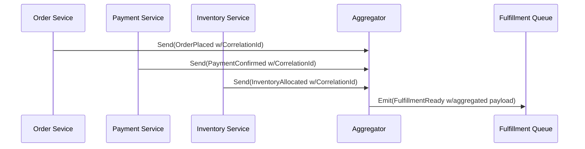

# Lab 08: Aggregator Messaging Pattern

> **In this document:**  
> [[_TOC_]]

Receiving fragmented data from multiple sources is common in distributed systems. The **Aggregator** pattern helps unify these pieces into a coherent whole by buffering messages, applying correlation logic, and emitting a single, meaningful output.

In this lab, you will build a solution that:

- Receives multiple related events such as `OrderPlaced`, `PaymentConfirmed`, and `InventoryAllocated`.
- Correlates and buffers them based on a shared identifier.
- Emits a `FulfillmentReady` message once all required events have arrived.
- Handles edge cases like timeouts, partial data, and duplicate messages.

This pattern lays the groundwork for orchestrating workflows across loosely coupled services, turning asynchronous chaos into composable, predictable flows.

---

## What is the Aggregator Pattern?

The **Aggregator** pattern coordinates multiple messages into a single composite output, enabling distributed systems to synthesize related events into meaningful work units. It is ideal when no single message provides sufficient context or completeness.

### How It Works

- Multiple messages are emitted independently, e.g., `OrderPlaced`, `PaymentConfirmed`, and `InventoryAllocated`.
- A **correlator** or **aggregator** collects these messages using a shared `CorrelationId`.
- Buffered messages are evaluated for completeness based on predefined rules.
- Once all required inputs are available, a **composite message** (e.g., `FulfillmentReady`) is emitted.
- Optional timeout logic handles missing or delayed messages to prevent indefinite stalling.



### Key Characteristics

| Feature             | Description                                                  |
| ------------------- | ------------------------------------------------------------ |
| Correlation Logic   | Messages are grouped using a shared `CorrelationId`.         |
| Buffered Processing | Events are held until the aggregation criteria are satisfied. |
| Composite Emission  | A single output is emitted once all inputs are present.      |
| Timeout Handling    | Incomplete aggregations can be terminated gracefully.        |

### Key Benefits

- **Workflow Coordination:** Aligns disparate services toward a unified outcome.
- **Event Completeness:** Allows processing only when sufficient data is available.
- **Scalable Composition:** Each aggregator instance operates independently per `CorrelationId`.
- **Resilience:** Supports partial data, retries, and duplicate suppression for robustness.

### Use Cases

- Fulfillment orchestration where order, payment, and inventory signals must align.
- Building composite views from telemetry or monitoring events.
- Aggregating customer interactions across channels into a unified profile.
- Coordinating approvals or conditions before triggering downstream actions.

---

## Objectives

By the end of the lab, you will be able to:

- **Explain the purpose and mechanics of the Aggregator messaging pattern**, including correlation and composite emission.
- **Design a message flow using Azure Service Bus** that buffers and combines related events using `CorrelationId`.
- **Implement a stateful aggregator component** that waits for multiple inputs before emitting a unified output message.
- **Handle edge cases like duplicate messages, partial data, and timeouts** to ensure reliable processing.
- **Evaluate how aggregation enhances workflow coordination**, and when alternative patterns like choreography or Publish/Subscribe might be more appropriate.

---

## Prerequisites

- [.NET SDK 8.0 or later](https://dotnet.microsoft.com/download)
- A text editor or IDE such as [Visual Studio Code](https://code.visualstudio.com/) or [Visual Studio](https://visualstudio.microsoft.com/) (any edition).
- [Docker Desktop](https://www.docker.com/products/docker-desktop)
- [Azure Service Bus Emulator](https://github.com/Azure/azure-service-bus-emulator-installer)

---

## Lab Steps

### Step 1: Configure Messaging Emulator for Aggregator Lab

In this step, you will configure the Azure Service Bus local emulator's `config.json` to define the queues needed for the Aggregator pattern, plus one output topic with multiple subscriptions for observation or downstream fan-out.

#### 1.1 Locate the `config.json` File

```
{local-emulator-repository-folder}\ServiceBus-Emulator\Config\config.json
```

#### 1.2 Add Queue and Topic Definitions

Insert the following entities into your configuration


### Step 1: Configure Messaging Emulator with Request and Reply Queues

In this step, you will update your local Service Bus emulator's `config.json` to define a topic and two subscriptions.

1. **Locate the `config.json` File**

   This file lives under your emulator installation, for example:

   ```
   {local-emulator-repository-folder}\ServiceBus-Emulator\Config\config.json
   ```

2. **Add Queue Definitions**

   Insert entries for the request and reply queues:

   ```
   {
     "UserConfig": {
       "Namespaces": [
         {
           "Name": "sbemulatorns",
           "Queues": [
             }
           ],
           "Topics": [
             {
               "Name": "message-patterns.aggregator.orders.created",
               "Properties": {
                 "DefaultMessageTimeToLive": "PT1H",
                 "DuplicateDetectionHistoryTimeWindow": "PT20S",
                 "RequiresDuplicateDetection": false
               },
               "Subscriptions": [
                 {
                   "Name": "payment",
                   "Properties": {
                     "DeadLetteringOnMessageExpiration": false,
                     "DefaultMessageTimeToLive": "PT1H",
                     "LockDuration": "PT1M",
                     "MaxDeliveryCount": 3,
                     "ForwardDeadLetteredMessagesTo": "",
                     "ForwardTo": "",
                     "RequiresSession": false
                   }
                 },
                 {
                   "Name": "inventory",
                   "Properties": {
                     "DeadLetteringOnMessageExpiration": false,
                     "DefaultMessageTimeToLive": "PT1H",
                     "LockDuration": "PT1M",
                     "MaxDeliveryCount": 3,
                     "ForwardDeadLetteredMessagesTo": "",
                     "ForwardTo": "",
                     "RequiresSession": false
                   }
                 },
                 {
                   "Name": "aggregator",
                   "Properties": {
                     "DeadLetteringOnMessageExpiration": false,
                     "DefaultMessageTimeToLive": "PT1H",
                     "LockDuration": "PT1M",
                     "MaxDeliveryCount": 3,
                     "ForwardDeadLetteredMessagesTo": "",
                     "ForwardTo": "",
                     "RequiresSession": false
                   }
                 }
               ]
             },
             {
               "Name": "message-patterns.aggregator.payments.completed",
               "Properties": {
                 "DefaultMessageTimeToLive": "PT1H",
                 "DuplicateDetectionHistoryTimeWindow": "PT20S",
                 "RequiresDuplicateDetection": false
               },
               "Subscriptions": [
                 {
                   "Name": "aggregator",
                   "Properties": {
                     "DeadLetteringOnMessageExpiration": false,
                     "DefaultMessageTimeToLive": "PT1H",
                     "LockDuration": "PT1M",
                     "MaxDeliveryCount": 3,
                     "ForwardDeadLetteredMessagesTo": "",
                     "ForwardTo": "",
                     "RequiresSession": false
                   }
                 }
               ]
             },
             {
               "Name": "message-patterns.aggregator.inventory.reserved",
               "Properties": {
                 "DefaultMessageTimeToLive": "PT1H",
                 "DuplicateDetectionHistoryTimeWindow": "PT20S",
                 "RequiresDuplicateDetection": false
               },
               "Subscriptions": [
                 {
                   "Name": "aggregator",
                   "Properties": {
                     "DeadLetteringOnMessageExpiration": false,
                     "DefaultMessageTimeToLive": "PT1H",
                     "LockDuration": "PT1M",
                     "MaxDeliveryCount": 3,
                     "ForwardDeadLetteredMessagesTo": "",
                     "ForwardTo": "",
                     "RequiresSession": false
                   }
                 }
               ]
             },
             {
               "Name": "message-patterns.aggregator.fulfillment.ready",
               "Properties": {
                 "DefaultMessageTimeToLive": "PT1H",
                 "DuplicateDetectionHistoryTimeWindow": "PT20S",
                 "RequiresDuplicateDetection": false
               },
               "Subscriptions": [
                 {
                   "Name": "console-output",
                   "Properties": {
                     "DeadLetteringOnMessageExpiration": false,
                     "DefaultMessageTimeToLive": "PT1H",
                     "LockDuration": "PT1M",
                     "MaxDeliveryCount": 3,
                     "ForwardDeadLetteredMessagesTo": "",
                     "ForwardTo": "",
                     "RequiresSession": false
                   }
                 },
                 {
                   "Name": "logging-service",
                   "Properties": {
                     "DeadLetteringOnMessageExpiration": false,
                     "DefaultMessageTimeToLive": "PT1H",
                     "LockDuration": "PT1M",
                     "MaxDeliveryCount": 3,
                     "ForwardDeadLetteredMessagesTo": "",
                     "ForwardTo": "",
                     "RequiresSession": false
                   }
                 }
               ]
             }
           ]
         }
       ],
       "Logging": {
         "Type": "File"
       }
     }
   }
   ```

   > **Queue Breakdown**
   >
   > | Topic Name                      | Purpose                                                      |
   > | ------------------------------- | ------------------------------------------------------------ |
   > | `aggregator.orders.created`     | Indicates that an order has been created and acts as the trigger for the Payments and Inventory services to begin processing the order. |
   > | `aggregator.payments.completed` | Indicates that the payment has been completed for an order.  |
   > | `aggregator.inventory.reserved` | Indicates that the inventory has been reserved for an order. |
   > | `aggregator.fulfillment.ready`  | Indicates that all of the order fulfillment prerequisites have been completed. |

1. **Restart the Emulator**
   - Shutdown the emulator instance.
   - Restart it to load the new configuration using the OS-specification script.
   - Confirm the emulator is running correctly.

### **Step 2: Set Up the Solution Structure**

In this step, you will create a structured .NET solution to implement the Aggregator pattern across multiple event producers and a central consumer. This modular approach mirrors real-world distributed systems, where different services publish related events to a shared infrastructure.

```mermaid
flowchart LR

    subgraph Initiator
        OrderProducer(Order producer):::emitter
    end

    subgraph SharedLib
        SLEventSchemas[Event Schemas]:::shared
        SLCorrelationUtils[Correlation Utils]:::shared
    end

    subgraph Producers
        PaymentProducer(Payment producer):::emitter
        InventoryProducer(Inventory producer):::emitter
    end

    subgraph AzureServiceBus
        OrderCreatedTopic[Orders Created topic]:::topic
        OrderCreatedPaymentServiceSub[Payment Service subscription]:::observer
        OrderCreatedInventoryServiceSub[Inventory Service subscription]:::observer
        PaymentProcessedTopic[Payments Processed topic]:::topic
        PaymentProcessedAggregatorSub[Aggregator sub]:::observer
        InventoryReservedTopic[Inventory Reserved topic]:::topic
        InventoryReservedAggregatorSub[aggregator sub]:::observer
        FulfillmentReadyTopic[Fulfillment Ready topic]:::topic
        ConsoleOutputSub(Console Output subscription):::observer
        LoggingServiceSub(Logging Service subscription):::observer
    end

    subgraph Aggregator
        AggregatorConsumer(Aggregator consumer):::correlator
    end

    %% Order Service initiates process
    OrderProducer --> OrderCreatedTopic
    OrderCreatedTopic --> OrderCreatedPaymentServiceSub
    OrderCreatedTopic --> OrderCreatedInventoryServiceSub
    
    %% Order Created subs trigger producers
    OrderCreatedPaymentServiceSub --> PaymentProducer
    OrderCreatedInventoryServiceSub --> InventoryProducer

    %% Producers emit events
    PaymentProducer --> PaymentProcessedTopic
    PaymentProcessedTopic --> PaymentProcessedAggregatorSub
    InventoryProducer --> InventoryReservedTopic
    InventoryReservedTopic --> InventoryReservedAggregatorSub

    %% Aggregator consumes events
    PaymentProcessedAggregatorSub --> AggregatorConsumer
    InventoryReservedAggregatorSub --> AggregatorConsumer

    %% Aggregator sends result to topic
    AggregatorConsumer --> FulfillmentReadyTopic

    %% Topic subscribers receive fulfillment signal
    FulfillmentReadyTopic --> ConsoleOutputSub
    FulfillmentReadyTopic --> LoggingServiceSub

    classDef orchestrator fill:#fff7e6,stroke:#cc9900,color:#000;
    classDef emitter fill:#e6f7ff,stroke:#2b7ebd,color:#000;
    classDef correlator fill:#fff4e6,stroke:#e69900,color:#000;
    classDef queue fill:#f0f0f0,stroke:#999999,color:#000;
    classDef topic fill:#ddeeff,stroke:#0059b3,color:#000;
    classDef observer fill:#f6e6ff,stroke:#a64dff,color:#000;
    classDef shared fill:#e6ffe6,stroke:#339933,color:#000;
```



> This diagram illustrates a decoupled messaging pipeline, in which each producer emits domain-specific messages to its respective queue. The Aggregator Consumer subscribes to all three event queues, applies correlation logic, and emits a unified composite event once the necessary inputs have been received

#### Create the Solution and Projects

Run the following commands to scaffold the solution and primary projects:

```shell
mkdir Lab08_AggregatorPattern && cd Lab08_AggregatorPattern
dotnet new sln -n Lab08_AggregatorPattern

dotnet new classlib -n SharedLib
dotnet new console -n OrderProducer
dotnet new console -n PaymentProducer
dotnet new console -n InventoryProducer
dotnet new console -n AggregatorConsumer
dotnet new console -n FulfillmentObserver

dotnet sln add SharedLib/SharedLib.csproj
dotnet sln add OrderProducer/OrderProducer.csproj
dotnet sln add PaymentProducer/PaymentProducer.csproj
dotnet sln add InventoryProducer/InventoryProducer.csproj
dotnet sln add AggregatorConsumer/AggregatorConsumer.csproj
dotnet sln add FulfillmentObserver/FulfillmentObserver.csproj

delete SharedLib/Class1.cs
```

> Each producer will simulate event publishing for a distinct domain: orders, payments, and inventory. The aggregator will subscribe to all three queues, apply correlation logic, and emit a unified event when all components are received.

### **Step 3: Define Event Schemas**

Here we introduce strongly typed models to represent domain events and ensure compatibility across all services. These models will reside in the **SharedLib** project.

#### 3.1 Initialize the Project

1. **Install NuGet Dependencies**

   ```shell
   dotnet add SharedLib package Azure.Messaging.ServiceBus
   ```

2. **Add `Models` Folder**

   Create a `Models` folder inside the `SharedLib`.

3. **Define Global Usings**

   Multiple classes are using the `Azure.Messaging.ServiceBus` namespace, so we will promote it to a global using. Add `global.cs` to the project with the following statements:

   ```C#
   global using Azure.Messaging.ServiceBus;
   ```

#### 3.2 Serialization Strategy

Add the following `EventSerializer.cs` utility to the shared library:

```c#
using System.Text.Json;

namespace SharedLib;

public static class EventSerializer
{
	private static readonly JsonSerializerOptions _options = new()
	{
		PropertyNamingPolicy = JsonNamingPolicy.CamelCase,
		WriteIndented = true
	};

	public static string Serialize<T>(T obj) => JsonSerializer.Serialize(obj, _options);
	public static T Deserialize<T>(string json)
	{
		T? result = JsonSerializer.Deserialize<T>(json, _options);
		return result is null ? throw new InvalidOperationException("Deserialization returned null.") : result;
	}
}
```

#### 3.3 Shared Event Models

Create a `Models` folder inside `SharedLib` and define the following C# classes defining event models:

1. **Traceable Event Interface**

   In the `Models` folder, create an interface for the command objects to use:

   ```c#
   namespace SharedLib.Models;
   
   public interface ITraceableEvent
   {
   	string CorrelationId { get; set; }
   	string OrderId { get; set; }
   	string CustomerId { get; set; }
       string SourceSystem { get; set; }
       string EventType { get; set; }
   }
   ```

2. **EventTypes**

   Add the `EventTypes.cs` class to the `Models` folder with the following schema:

   ```c#
   namespace SharedLib.Models;
   
   public static class EventTypes
   {
   	public const string OrderCreated = "OrderCreated";
   	public const string PaymentConfirmed = "PaymentConfirmed";
   	public const string InventoryReserved = "InventoryReserved";
   	public const string FulfillmentReady = "FulfillmentReady";
   }
   ```

3. **OrderCreatedEvent**

   Add the `OrderCreatedEvent.cs` class to the `Models` folder with the following schema:

   ```c#
   namespace SharedLib.Models;
   
   public class OrderCreatedEvent : ITraceableEvent
   {
   	public required string OrderId { get; set; }
   	public required string CustomerId { get; set; }
   	public required string CorrelationId { get; set; }
       public required string SourceSystem { get; set; }
       public required string EventType { get; set; }
   	public required DateTime Timestamp { get; set; }
   	public required string ProductName { get; set; }
   	public required int Quantity { get; set; }
   	public required decimal Price { get; set; }
   	public required DateTime CreatedAt { get; set; }
   }
   ```

4. **PaymentConfirmedEvent**

   Add the `PaymentConfirmedEvent.cs` class to the `Models` folder with the following schema:

   ```c#
   namespace SharedLib.Models;
   
   public class PaymentConfirmedEvent : ITraceableEvent
   {
   	public required string PaymentId { get; set; }
   	public required string OrderId { get; set; }
   	public required string CustomerId { get; set; }
       public required string CorrelationId { get; set; }
       public required string SourceSystem { get; set; }
       public required string EventType { get; set; }
   	public required decimal Amount { get; set; }
   	public required DateTime Timestamp { get; set; }
   }
   ```

5. **InventoryReservedEvent**

   Add the `InventoryReservedEvent.cs` class to the `Models` folder with the following schema:

   ```c#
   namespace SharedLib.Models;
   
   public class InventoryReservedEvent : ITraceableEvent
   {
   	public required string ReservationId { get; set; }
   	public required string OrderId { get; set; }
   	public required string CustomerId { get; set; }
   	public required string CorrelationId { get; set; }
       public required string SourceSystem { get; set; }
       public required string EventType { get; set; }
   	public List<string> ItemIds { get; set; } = [];
   	public required DateTime Timestamp { get; set; }
   }
   ```

6. **FulfillmentReadyEvent**

   Add the `FulfillmentReadyEvent.cs` class to the `Models` folder with the following schema:

   ```c#
   namespace SharedLib.Models;
   
   public class FulfillmentReadyEvent : ITraceableEvent
   {
   	public required string OrderId { get; set; }
       public required string CustomerId { get; set; }
   	public required string CorrelationId { get; set; }
       public required string SourceSystem { get; set; }
       public required string EventType { get; set; }
   
   	public required OrderCreatedEvent OrderDetails { get; set; }
   	public required PaymentConfirmedEvent PaymentDetails { get; set; }
   	public required InventoryReservedEvent InventoryDetails { get; set; }
   }
   ```

### Step 4: Create the OrderProducer Console Application

This console application uses `OrderCreatedEvent` from `SharedLib.Models` to emit domain events to a Service Bus queue indicating that an order has been created.

#### 4.1 Install NuGet Packages

```shell
dotnet add OrderProducer package Azure.Messaging.ServiceBus
dotnet add OrderProducer package Microsoft.Extensions.Configuration
dotnet add OrderProducer package Microsoft.Extensions.Configuration.Json
dotnet add OrderProducer package Microsoft.Extensions.Configuration.Binder
dotnet add OrderProducer package Spectre.Console
```

Also, reference the `SharedLib` project:

```shell
dotnet add OrderProducer reference ../SharedLib/SharedLib.csproj
```

#### 4.2 Add Configuration File

Create `OrderProducer/appsettings.json`

```json
{
  "ServiceBus": {
    "ConnectionString": "Endpoint=sb://127.0.0.1;SharedAccessKeyName=RootManageSharedAccessKey;SharedAccessKey=SAS_KEY_VALUE;UseDevelopmentEmulator=true;",
    "TopicName": "message-patterns.aggregator.orders.created"
  },
  "Sending": {
    "DelayMilliseconds": 1500
  }
}
```

Update `.csproj` to embed this file:

```xml
<ItemGroup>
  <None Update="appsettings.json">
    <CopyToOutputDirectory>Always</CopyToOutputDirectory>
  </None>
</ItemGroup>
```

#### 4.3 Implement the Order Producer

This console app emits `OrderCreatedEvent` messages to Service Bus, using the strongly typed schema and enriched metadata in order to launch the order processing process.

```c#
using Azure.Messaging.ServiceBus;
using Microsoft.Extensions.Configuration;
using SharedLib;
using SharedLib.Models;
using Spectre.Console;

AnsiConsole.Write(new FigletText("Orders").Centered().Color(Color.Cyan1));

IConfigurationRoot config = new ConfigurationBuilder()
	.SetBasePath(Directory.GetCurrentDirectory())
	.AddJsonFile("appsettings.json")
	.Build();

string connectionString = config["ServiceBus:ConnectionString"]!;
string topicName = config["ServiceBus:TopicName"]!;
int delayMilliseconds = config.GetValue<int>("Sending:DelayMilliseconds", 2000);

Random rand = new();
string sourceSystem = "OrderProducer";

ServiceBusClient client = new(connectionString);
ServiceBusSender sender = client.CreateSender(topicName);

Console.WriteLine("Press any key to begin sending...");
Console.ReadKey(true);

using CancellationTokenSource cts = new();
Console.CancelKeyPress += (_, e) =>
{
	e.Cancel = true;
	cts.Cancel();
	AnsiConsole.MarkupLine("[red]Cancellation requested...[/]");
};

while (!cts.Token.IsCancellationRequested)
{
	OrderCreatedEvent order = new()
	{
		OrderId = Guid.NewGuid().ToString(),
		CustomerId = $"CUST-{rand.Next(1000, 9999)}",
		CorrelationId = Guid.NewGuid().ToString(),
		SourceSystem = sourceSystem,
		EventType = EventTypes.OrderCreated,
		Timestamp = DateTime.UtcNow,
		ProductName = "Widget",
		Quantity = rand.Next(1, 5),
		Price = (decimal)Math.Round(rand.NextDouble() * 100, 2),
		CreatedAt = DateTime.UtcNow
	};

	string json = EventSerializer.Serialize(order);

	ServiceBusMessage msg = new(json)
	{
		ContentType = "application/json",
		MessageId = order.OrderId,
		CorrelationId = order.CorrelationId,
		Subject = "OrderCreated",
		ApplicationProperties =
		{
			["eventType"] = EventTypes.OrderCreated,
			["origin"] = sourceSystem
		}
	};

	await sender.SendMessageAsync(msg, cts.Token);

	AnsiConsole.Write(new Panel($"[green]Order Created[/]\nOrderId: [bold]{order.OrderId}[/]")
		.Header("[green]Message Sent[/]")
		.Border(BoxBorder.Rounded));

	try { await Task.Delay(delayMilliseconds, cts.Token); }
	catch (TaskCanceledException) { break; }
}
```

### Step 5: Create the PaymentProducer Console Application

This service reacts to the `orders.created` event from the payments subscription of the `message-patterns. aggregator.orders.created` topic, simulates a payment process, and emits a `PaymentConfirmedEvent` to the `message-patterns.aggregator,payments.processed` topic.

#### 5.1 Install NuGet Packages

```shell
dotnet add PaymentProducer package Azure.Messaging.ServiceBus
dotnet add PaymentProducer package Microsoft.Extensions.Configuration
dotnet add PaymentProducer package Microsoft.Extensions.Configuration.Json
dotnet add PaymentProducer package Microsoft.Extensions.Configuration.Binder
dotnet add PaymentProducer package Spectre.Console
```

Also, add a project reference to the shared library:

```shell
dotnet add PaymentProducer reference ../SharedLib/SharedLib.csproj
```

#### 5.2 Add Configuration File

Create `PaymentProducer/appsettings.json`:

```Json
{
  "ServiceBus": {
    "ConnectionString": "Endpoint=sb://127.0.0.1;SharedAccessKeyName=RootManageSharedAccessKey;SharedAccessKey=SAS_KEY_VALUE;UseDevelopmentEmulator=true;",
    "OrdersTopic": "message-patterns.aggregator.orders.created",
    "PaymentsTopic": "message-patterns.aggregator.payments.processed",
    "Subscription": "payment-service"
  },
  "Processing": {
    "DelayMilliseconds": 1200
  }
}
```

Update the `.csproj` to copy the config file:

```xml
<ItemGroup>
  <None Update="appsettings.json">
    <CopyToOutputDirectory>Always</CopyToOutputDirectory>
  </None>
</ItemGroup>
```

#### 5.3 Implement the Payment Processor

```c#
using Azure.Messaging.ServiceBus;
using Microsoft.Extensions.Configuration;
using SharedLib;
using SharedLib.Models;
using Spectre.Console;

AnsiConsole.Write(new FigletText("Payments").Centered().Color(Color.Blue));

IConfiguration config = new ConfigurationBuilder()
	.SetBasePath(Directory.GetCurrentDirectory())
	.AddJsonFile("appsettings.json").Build();

string connectionString = config["ServiceBus:ConnectionString"]!;
string ordersTopic = config["ServiceBus:OrdersTopic"]!;
string paymentsTopic = config["ServiceBus:PaymentsTopic"]!;
string subscription = config["ServiceBus:Subscription"]!;
int delayMs = config.GetValue("Processing:DelayMilliseconds", 1000);
string sourceSystem = "PaymentProducer";

ServiceBusClient client = new(connectionString);
ServiceBusProcessor processor = client.CreateProcessor(ordersTopic, subscription);
ServiceBusSender sender = client.CreateSender(paymentsTopic);

processor.ProcessMessageAsync += async args =>
{
	string body = args.Message.Body.ToString();
	OrderCreatedEvent order = EventSerializer.Deserialize<OrderCreatedEvent>(body);

	await Task.Delay(delayMs); // Simulate payment logic

	PaymentConfirmedEvent payment = new()
	{
		PaymentId = $"PAY-{Guid.NewGuid()}",
		OrderId = order.OrderId,
		CustomerId = order.CustomerId,
		Amount = order.Price,
		Timestamp = DateTime.UtcNow,
		CorrelationId = order.CorrelationId,
		SourceSystem = sourceSystem,
		EventType = EventTypes.PaymentConfirmed
	};

	string json = EventSerializer.Serialize(payment);

	ServiceBusMessage msg = new(json)
	{
		MessageId = payment.PaymentId,
		CorrelationId = payment.CorrelationId,
		ContentType = "application/json",
		Subject = EventTypes.PaymentConfirmed,
		ApplicationProperties =
		{
			["eventType"] = EventTypes.PaymentConfirmed,
			["origin"] = sourceSystem
		}
	};

	await sender.SendMessageAsync(msg);
	AnsiConsole.MarkupLine($"[green]Processed Payment for Order:[/] [bold]{order.OrderId}[/]");
	await args.CompleteMessageAsync(args.Message);
};

processor.ProcessErrorAsync += e =>
{
	AnsiConsole.MarkupLine($"[red]Error:[/] {e.Exception.Message}");
	return Task.CompletedTask;
};

await processor.StartProcessingAsync();
AnsiConsole.MarkupLine("[gray]Listening for new orders...[/]");
Console.ReadKey(true);
AnsiConsole.MarkupLine("[red]Shutting down.[/]");
await processor.StopProcessingAsync();
```

### Step 6: Create the InventoryProducer Console Application

This service reacts to the `OrderCreatedEvent` messages from the `inventory-service` subscription and publishes `InventoryReservedEvent` messages to the `message-patterns.aggregator.inventory.reserved` topic.

#### 6.1 Install NuGet Packages

```shell
dotnet add InventoryProducer package Azure.Messaging.ServiceBus
dotnet add InventoryProducer package Microsoft.Extensions.Configuration
dotnet add InventoryProducer package Microsoft.Extensions.Configuration.Json
dotnet add InventoryProducer package Microsoft.Extensions.Configuration.Binder
dotnet add InventoryProducer package Spectre.Console
```

Also, add a project reference to the shared library:

```shell
dotnet add InventoryProducer reference ../SharedLib/SharedLib.csproj
```

#### 6.2 Add Configuration File

Create `InventoryProducer/appsettings.json`:

```json
{
  "ServiceBus": {
    "ConnectionString": "Endpoint=sb://127.0.0.1;SharedAccessKeyName=RootManageSharedAccessKey;SharedAccessKey=SAS_KEY_VALUE;UseDevelopmentEmulator=true;",
    "OrdersTopic": "message-patterns.aggregator.orders.created",
    "InventoryTopic": "message-patterns.aggregator.inventory.reserved",
    "Subscription": "inventory"
  },
  "Processing": {
    "DelayMilliseconds": 1000
  }
}
```

Update the `.csproj` to embed the config file:

```xml
<ItemGroup>
  <None Update="appsettings.json">
    <CopyToOutputDirectory>Always</CopyToOutputDirectory>
  </None>
</ItemGroup>
```

#### 6.3 Implement Inventory Reservation Logic

```c#
using Azure.Messaging.ServiceBus;
using Microsoft.Extensions.Configuration;
using SharedLib;
using SharedLib.Models;
using Spectre.Console;

AnsiConsole.Write(new FigletText("Inventory").Centered().Color(Color.Orange1));

IConfiguration config = new ConfigurationBuilder()
	.SetBasePath(Directory.GetCurrentDirectory())
	.AddJsonFile("appsettings.json")
	.Build();

string connectionString = config["ServiceBus:ConnectionString"]!;
string ordersTopic = config["ServiceBus:OrdersTopic"]!;
string inventoryTopic = config["ServiceBus:InventoryTopic"]!;
string subscription = config["ServiceBus:Subscription"]!;
int delayMs = config.GetValue("Processing:DelayMilliseconds", 1000);
string sourceSystem = "InventoryProducer";

ServiceBusClient client = new(connectionString);
ServiceBusProcessor processor = client.CreateProcessor(ordersTopic, subscription);
ServiceBusSender sender = client.CreateSender(inventoryTopic);

processor.ProcessMessageAsync += async args =>
{
	string raw = args.Message.Body.ToString();
	OrderCreatedEvent order = EventSerializer.Deserialize<OrderCreatedEvent>(raw);

	await Task.Delay(delayMs); // Simulate inventory logic

	InventoryReservedEvent reservation = new()
	{
		ReservationId = $"INV-{Guid.NewGuid()}",
		OrderId = order.OrderId,
		CustomerId = order.CustomerId,
		CorrelationId = order.CorrelationId,
		SourceSystem = sourceSystem,
		EventType = EventTypes.InventoryReserved,
		ItemIds = ["ITEM-1001", "ITEM-1002"],
		Timestamp = DateTime.UtcNow
	};

	string payload = EventSerializer.Serialize(reservation);

	ServiceBusMessage msg = new(payload)
	{
		MessageId = reservation.ReservationId,
		CorrelationId = reservation.CorrelationId,
		ContentType = "application/json",
		Subject = EventTypes.InventoryReserved,
		ApplicationProperties =
		{
			["eventType"] = EventTypes.InventoryReserved,
			["origin"] = sourceSystem
		}
	};

	await sender.SendMessageAsync(msg);
	AnsiConsole.MarkupLine($"[green]Inventory Reserved for Order:[/] [bold]{order.OrderId}[/]");
	await args.CompleteMessageAsync(args.Message);
};

processor.ProcessErrorAsync += e =>
{
	AnsiConsole.MarkupLine($"[red]Error:[/] {e.Exception.Message}");
	return Task.CompletedTask;
};

await processor.StartProcessingAsync();
AnsiConsole.MarkupLine("[gray]Listening for new orders...[/]");
Console.ReadKey(true);
AnsiConsole.MarkupLine("[red]Shutting down.[/]");
await processor.StopProcessingAsync();
```

### Step 7: Create the AggregatorConsumer Console Application

This consumer listens to two topics:

- **Orders  Created →** `message-patterns.aggregator.orders.created`
- **Inventory Reserved →** `message-patterns.aggregator.inventory.reserved`

A shared `CorrelationId` ties both events, and the Aggregator buffers them until both arrive.

#### 7.1 Install NuGet Packages

```shell
dotnet add AggregatorConsumer package Azure.Messaging.ServiceBus
dotnet add AggregatorConsumer package Microsoft.Extensions.Configuration
dotnet add AggregatorConsumer package Microsoft.Extensions.Configuration.Json
dotnet add AggregatorConsumer package Spectre.Console
```

Also, add a project reference to the shared library:

```shell
dotnet add AggregatorConsumer reference ../SharedLib/SharedLib.csproj
```

#### 7.2 Add Configuration File

Create `AggregatorConsumer/appsettings.json`:

```json
{
  "ServiceBus": {
    "ConnectionString": "Endpoint=sb://127.0.0.1;SharedAccessKeyName=RootManageSharedAccessKey;SharedAccessKey=SAS_KEY_VALUE;UseDevelopmentEmulator=true;",
    "OrderTopic": "message-patterns.aggregator.orders.created",
    "InventoryTopic": "message-patterns.aggregator.inventory.reserved",
    "PaymentTopic": "message-patterns.aggregator.payments.completed",
    "OrderSubscription": "aggregator",
    "InventorySubscription": "aggregator",
    "PaymentSubscription": "aggregator"
  },
  "Processing": {
    "MaxWaitSeconds": 10
  }
}
```

Update the `.csproj` to embed the config file:

```xml
<ItemGroup>
  <None Update="appsettings.json">
    <CopyToOutputDirectory>Always</CopyToOutputDirectory>
  </None>
</ItemGroup>
```

#### 7.3 Implement Aggregator Logic

```c#
using Azure.Messaging.ServiceBus;
using Microsoft.Extensions.Configuration;
using SharedLib;
using SharedLib.Models;
using Spectre.Console;

AnsiConsole.Write(new FigletText("Aggregator").Centered().Color(Color.SpringGreen3));

IConfiguration config = new ConfigurationBuilder()
	.SetBasePath(Directory.GetCurrentDirectory())
	.AddJsonFile("appsettings.json")
	.Build();

string connectionString = config["ServiceBus:ConnectionString"]!;
string orderTopic = config["ServiceBus:OrderTopic"]!;
string inventoryTopic = config["ServiceBus:InventoryTopic"]!;
string paymentTopic = config["ServiceBus:PaymentTopic"]!;
string fulfillmentReadyTopic = config["ServiceBus:FullfillmentReadyTopic"]!;
string orderSubscription = config["ServiceBus:OrderSubscription"]!;
string inventorySubscription = config["ServiceBus:InventorySubscription"]!;
string paymentSubscription = config["ServiceBus:PaymentSubscription"]!;
int maxWait = config.GetValue("Processing:MaxWaitSeconds", 10);
string sourceSystem = "Aggregator";

ServiceBusClient client = new(connectionString);

ServiceBusSender fulfillmentSender = client.CreateSender(fulfillmentReadyTopic);

Dictionary<string, OrderCreatedEvent> orders = [];
Dictionary<string, InventoryReservedEvent> reservations = [];
Dictionary<string, PaymentConfirmedEvent> payments = [];

ServiceBusProcessor orderProc = client.CreateProcessor(orderTopic, orderSubscription);
orderProc.ProcessMessageAsync += async args =>
{
	await ProcessMessageAsync(args.Message, EventTypes.OrderCreated);
	await args.CompleteMessageAsync(args.Message);
};
orderProc.ProcessErrorAsync += e =>
{
	AnsiConsole.MarkupLine($"[red]Order Error:[/] {e.Exception.Message}");
	return Task.CompletedTask;
};

ServiceBusProcessor invProc = client.CreateProcessor(inventoryTopic, inventorySubscription);
invProc.ProcessMessageAsync += async args =>
{
	await ProcessMessageAsync(args.Message, EventTypes.InventoryReserved);
	await args.CompleteMessageAsync(args.Message);
};
invProc.ProcessErrorAsync += e =>
{
	AnsiConsole.MarkupLine($"[red]Inventory Error:[/] {e.Exception.Message}");
	return Task.CompletedTask;
};

ServiceBusProcessor paymentProc = client.CreateProcessor(paymentTopic, paymentSubscription);
paymentProc.ProcessMessageAsync += async args =>
{
	await ProcessMessageAsync(args.Message, EventTypes.PaymentConfirmed);
	await args.CompleteMessageAsync(args.Message);
};
paymentProc.ProcessErrorAsync += e =>
{
	AnsiConsole.MarkupLine($"[red]Payment Error:[/] {e.Exception.Message}");
	return Task.CompletedTask;
};

await orderProc.StartProcessingAsync();
await invProc.StartProcessingAsync();
await paymentProc.StartProcessingAsync();

AnsiConsole.MarkupLine("[gray]Aggregator running...[/]");
Console.ReadKey(true);
AnsiConsole.MarkupLine("[red]Stopping Aggregator.[/]");
await orderProc.StopProcessingAsync();
await invProc.StopProcessingAsync();

async Task TryAggregate(string correlationId)
{
	if (orders.TryGetValue(correlationId, out var order) &&
			reservations.TryGetValue(correlationId, out var reservation) &&
			payments.TryGetValue(correlationId, out var payment))
	{

		FulfillmentReadyEvent fulfillment = new()
		{
			OrderId = order.OrderId,
			CustomerId = order.CustomerId,
			CorrelationId = correlationId,
			SourceSystem = "Aggregator",
			EventType = EventTypes.FulfillmentReady,
			OrderDetails = order,
			PaymentDetails = payment,
			InventoryDetails = reservation
		};

		string json = EventSerializer.Serialize(fulfillment);

		ServiceBusMessage msg = new(json)
		{
			MessageId = fulfillment.OrderId,
			CorrelationId = fulfillment.CorrelationId,
			ContentType = "application/json",
			Subject = EventTypes.FulfillmentReady,
			ApplicationProperties =
			{
				["eventType"] = EventTypes.FulfillmentReady,
				["origin"] = sourceSystem
			}
		};

		await fulfillmentSender.SendMessageAsync(msg);

		AnsiConsole.MarkupLine($"[bold green]Aggregated Order Ready for Fulfillment:[/] {order.OrderId}");
		AnsiConsole.MarkupLine($"Customer: {order.CustomerId}");
		AnsiConsole.MarkupLine($"Items: {string.Join(", ", reservation.ItemIds)}");
		AnsiConsole.MarkupLine($"Paid Amount: {payment.Amount:C}");
		AnsiConsole.MarkupLine($"Timestamp: {payment.Timestamp:u}");

		orders.Remove(correlationId);
		reservations.Remove(correlationId);
		payments.Remove(correlationId);
	}
}

async Task ProcessMessageAsync(ServiceBusReceivedMessage msg, string type)
{
	string raw = msg.Body.ToString();
	string correlationId = msg.CorrelationId;

	if (type == EventTypes.OrderCreated)
		orders[correlationId] = EventSerializer.Deserialize<OrderCreatedEvent>(raw);

	if (type == EventTypes.InventoryReserved)
		reservations[correlationId] = EventSerializer.Deserialize<InventoryReservedEvent>(raw);

	if (type == EventTypes.PaymentConfirmed)
		payments[correlationId] = EventSerializer.Deserialize<PaymentConfirmedEvent>(raw);

	await TryAggregate(correlationId);
}
```

### Step 8: Create the FulfillmentObsever Console Application

This service listens to the **final composite event** published by the Aggregator and logs its arrival to the console.

#### 8.1 Install NuGet Packages

```shell
dotnet add FulfillmentObserver package Azure.Messaging.ServiceBus
dotnet add FulfillmentObserver package Microsoft.Extensions.Configuration
dotnet add FulfillmentObserver package Microsoft.Extensions.Configuration.Json
dotnet add FulfillmentObserver package Spectre.Console
```

Also, add a project reference to the shared library:

```shell
dotnet add FulfillmentObserver reference ../SharedLib/SharedLib.csproj
```

#### 8.2 Add Configuration File

Create `FulfillmentObserver/appsettings.json`:

```json
{
  "ServiceBus": {
    "ConnectionString": "Endpoint=sb://127.0.0.1;SharedAccessKeyName=RootManageSharedAccessKey;SharedAccessKey=SAS_KEY_VALUE;UseDevelopmentEmulator=true;",
    "FulfillmentTopic": "message-patterns.aggregator.fulfillment.ready",
    "Subscription": "console-output"
  }
}
```

Update the `.csproj` to embed the config file:

```xml
<ItemGroup>
  <None Update="appsettings.json">
    <CopyToOutputDirectory>Always</CopyToOutputDirectory>
  </None>
</ItemGroup>
```

#### 8.3 Implement Observer Logic

```c#
using Azure.Messaging.ServiceBus;
using Microsoft.Extensions.Configuration;
using SharedLib;
using SharedLib.Models;
using Spectre.Console;

AnsiConsole.Write(new FigletText("Observer").Centered().Color(Color.CadetBlue));

IConfiguration config = new ConfigurationBuilder()
	.SetBasePath(Directory.GetCurrentDirectory())
	.AddJsonFile("appsettings.json")
	.Build();

string connectionString = config["ServiceBus:ConnectionString"]!;
string topic = config["ServiceBus:FulfillmentTopic"]!;
string subscription = config["ServiceBus:Subscription"]!;

ServiceBusClient client = new(connectionString);
ServiceBusProcessor processor = client.CreateProcessor(topic, subscription);

processor.ProcessMessageAsync += async args =>
{
	string raw = args.Message.Body.ToString();
	FulfillmentReadyEvent fulfilled = EventSerializer.Deserialize<FulfillmentReadyEvent>(raw);

	AnsiConsole.Write(new Panel($"""
        [green]Fulfillment Completed[/]
        OrderId: [bold]{fulfilled.OrderId}[/]
        CustomerId: [bold]{fulfilled.CustomerId}[/]
        Paid: [bold]{fulfilled.PaymentDetails.Amount:C}[/]
        Items: [bold]{string.Join(", ", fulfilled.InventoryDetails.ItemIds)}[/]
        CorrelationId: [bold]{fulfilled.CorrelationId}[/]
        """).Border(BoxBorder.Rounded).Header("[green]Composite Event Received[/]"));

	await args.CompleteMessageAsync(args.Message);
};

processor.ProcessErrorAsync += e =>
{
	AnsiConsole.MarkupLine($"[red]Observer Error:[/] {e.Exception.Message}");
	return Task.CompletedTask;
};

await processor.StartProcessingAsync();
AnsiConsole.MarkupLine("[gray]Observing FulfillmentReadyEvent messages...[/]");
Console.ReadKey(true);
AnsiConsole.MarkupLine("[red]Shutting down observer.[/]");
await processor.StopProcessingAsync();
```

### **Step 9: Observe the Aggregated Workflow**

This step verifies that all producers are wired correctly, the Service Bus routes are aligned, and the Aggregator is able to stitch together composite views based on `CorrelationId`.

#### 9.1 Run Producer Applications in Parallel

Start these three services in separate terminals:

- `OrderProducer`
- `InventoryProducer`
- `PaymentProducer`

Each should:

- Listen for a trigger or loop to generate messages.
- Publish events to their respective topics with a shared `CorrelationId`.

#### 9.2 Watch the Aggregator Emit Composite Events

Run the **AggregatorConsumer** and watch the terminal output:

- As events arrive from subscriptions (`aggregator-orders`, `aggregator-inventory`,  `aggregator-payment`), they will be buffered.
- Once all three events arrive for a given `CorrelationId`, the aggregator:
  - Emits the composite log.
  - Publishes a `FulfillmentReady` event to a downstream topic.

**Expected Output Example:**

```shell
Aggregated Order Ready for Fulfillment: ORD-12345
Customer: CUST-98765
Items: ITEM-1001, ITEM-1002
Paid Amount: $100.00
Timestamp: 2025-08-03 22:18:05Z
```

#### 9.3 Watch the Completed Aggregations

**Run `FulfillmentObserver**

Start the observer module in a new terminal:

```shell
dotnet run --project FulfillmentObserver
```

This consumer listens to the `fulfillment-ready` topics and deserializes `FulfillmentReadyEvent` messages.

**What You Should See**

As events arrive, you will see a structured output panel with key business and technical details:

```shell
Fulfillment Completed
OrderId: ORD-12345
CustomerId: CUST-98765
Paid: $100.00
Items: ITEM-1001, ITEM-1002
CorrelationId: corr-2c9f1340
Emitted: 2025-08-03T22:27:16Z
```

---

## Conclusion

This lab walked you through designing and implementing an event-driven architecture using the **Aggregator** pattern, a powerful technique for correlating and composing data across multiple producers in real time.

### What We Covered

- **Structured Solution Setup:** Created modular .NET applications for Order, Inventory, and Payment producers.
- **Typed Event Schema:** Defined reusable models and serialization strategies to ensure schema integrity.
- **Topic-Subscription Flow:** Leveraged Azure Service Bus topics and subscriptions for fan-out and selective message consumption.
- **Aggregator Logic:** Buffered related events by `CorrelationId` and emitted a unified `FulfillmentReadyEvent`.
- **Observability:** Used Spectre.Console and a dedicated observer to surface enriched business telemetry from composite events.

### Extensions to the Lab

Want to extend or challenge what you have built? Try one of these:

- **Partial Aggregation / Timeouts:** Emit a fallback event if only 2 of 3 inputs arrive within a deadline.
- **Telemetry Injection:** Push aggregation metrics (e.g., event lag, composition duration) to Application Insights or Prometheus.
- **Retry & DLQ Handling:** Simulate malformed or delayed messages and inspect how the aggregator responds.
- **UI Frontend:** Create a simple dashboard in Blazor or React to visualize real-time aggregation.

### Preview of the Next Lab: Scatter-Gather Pattern

In the upcoming lab, you will shift from correlation to parallelization.

- **Pattern Focus:** The **Scatter-Gather** pattern distributes requests to multiple processors in parallel (scatter), then waits and consolidates their responses (gather).
- **Use Case:** Think multi-vendor pricing, parallel diagnostics, or federated querying.
- **Core Concepts:**
  - Message fan-out via routing keys or payload partitioning
  - Response collection windows (e.g., first N replies, timeout strategies)
  - Aggregated summarization of heterogeneous replies

Ready to switch from composition to collaboration? Lab 9 will scatter your message across the horizon and teach you how to reel the results back in.
