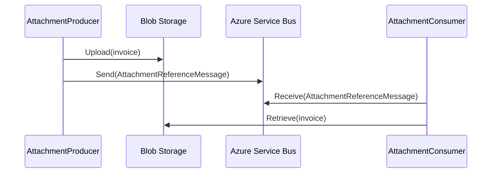

# Lab 12: Claim Check Pattern - Decoupling Payload from Transport

> **In this document:**  
> [[_TOC_]]

In distributed systems, sending large or sensitive payloads directly through a messaging infrastructure is not always efficient or even safe. Enter the **Claim Check** pattern, a strategy that replaces bulky message content with lightweight references, letting downstream services retrieve the data only when needed.

In this lab, you will:

- Implement a producer that stores order attachments (e.g., invoices) in Azure Blob Storage.
- Send a claim reference via Azure Service Bus.
- Build a consumer that retrieves the payload using the claim.
- Explore the benefits of this pattern for scalability, security, and transport hygiene.

Just as a coat check ticket lets you retrieve what’s stored safely behind the scenes, a claim reference enables systems to fetch payloads on demand, without crowding the aisle.

---

## What is the Claim Check Pattern?

The **Claim Check** pattern decouples large or sensitive payloads from transport messages, optimizing event-driven architectures for performance and security. Instead of passing the entire content through the message bus, producers store it externally and include a reference to the "claim check," which allows consumers to retrieve it when needed.

### How It Works

- A producer generates a payload (e.g., an invoice) and stores it in an external service such as Azure Blob Storage.
- Instead of embedding the payload in the message, it emits a lightweight message containing a claim reference (e.g., blob URI or document identifier).
- Consumers receive the message, extract the claim, and retrieve the full payload directly from the storage source.
- This keeps transport channels lean, scalable, and secure, ideal for large attachments, regulated data, or high-volume traffic.



### Key Characteristics

| Feature             | Description                                                 |
| ------------------- | ----------------------------------------------------------- |
| Payload Decoupling  | Large content is separated from transport channels.         |
| Reference Messaging | Messages contain only retrieval metadata or pointers.       |
| Consumer Pull Model | Payload retrieval is deferred to the consumer's control.    |
| External Storage    | Relies on scalable storage like blob or document databases. |

### Key Benefits

- **Transport Efficiency:** Prevents oversized messages from slowing queues or breaching limits.
- **Security Isolation:** Sensitive data can be protected behind granular storage access controls.
- **Modular Retrieval:** Consumers fetch payloads on demand, reducing unnecessary traffic.
- **Reliability:** Large payloads are not lost due to transient transport failures.

### Use Cases

- Event payloads with embedded PDFs, images, or rich media.
- Telemetry systems sending diagnostic bundles for deferred analysis.
- IoT or manufacturing systems passing asset logs that are too large for inline transmission.
- Any scenario where transport hygiene and payload sensitivity are architectural priorities.

---

## Objectives

By the end of this lab, you will be able to:

- **Explain the purpose and mechanics of the Claim Check message pattern**, including how payload decoupling improves scalability and transport reliability.
- **Design a message flow using Azure Service Bus and Blob Storage**, where only lightweight claim references are transmitted across the messaging backbone.
- **Implement producer and consumer components** that interact with external storage via claim references, enabling payload retrieval on demand.
- To ensure resilience and traceability, **handle scenarios involving missing claims, failed payload retrievals, or stale references**.
- **Evaluate how the Claim Check pattern enhances transport hygiene and payload control**, and when to consider alternative approaches like inline payload delivery or batching.

## Prerequisites

- [.NET SDK 8.0 or later](https://dotnet.microsoft.com/download)
- A text editor or IDE such as [Visual Studio Code](https://code.visualstudio.com/) or [Visual Studio](https://visualstudio.microsoft.com/) (any edition).
- [Docker Desktop](https://www.docker.com/products/docker-desktop)
- [Azure Service Bus Emulator](https://github.com/Azure/azure-service-bus-emulator-installer)

---

## Lab Steps

### Step 1: Configure Messaging Emulator for Claim Lab

In this step, you will update the Azure Service Bus emulator's `config.json` file to define a single queue for transmitting claim messages between the producer and consumer.

#### 1.1 Locate the `config.json` File

```
{local-emulator-repository-folder}\ServiceBus-Emulator\Config\config.json
```

#### 1.2 Define the Claim Check Queue

Update the `config.json` to include the following entry within the `Namespace` block. The queue will be named `message-patterns.claimcheck`.

```json
{
  "UserConfig": {
    "Namespaces": [
      {
        "Name": "sbemulatorns",
        "Queues": [
          {
            "Name": "message-patterns.claim-check",
            "Properties": {
              "DeadLetteringOnMessageExpiration": false,
              "DefaultMessageTimeToLive": "PT1H",
              "DuplicateDetectionHistoryTimeWindow": "PT20S",
              "ForwardDeadLetteredMessagesTo": "",
              "ForwardTo": "",
              "LockDuration": "PT1M",
              "MaxDeliveryCount": 3,
              "RequiresDuplicateDetection": false,
              "RequiresSession": false
            }
          }
        ],
        "Topics": [
        ]
      }
    ],
    "Logging": {
      "Type": "File"
    }
  }
}
```

#### 1.3 Restart the Emulator

- Shutdown the emulator instance.
- Restart it to load the new configuration using the OS-specification script.
- Confirm the emulator is running correctly.

## Step 2: Implement the Attachment Producer

In this step, you will build a .NET console app that uploads attachments (e.g., documents,  images) to Blob Storage and sends claim messages to Azure Service Bus.

#### 2.1 Set Up the Solution and Project

```shell
mkdir Lab12_ClaimCheck && cd Lab12_ClaimCheck
dotnet new sln -n Lab012_ClaimCheck
dotnet new console -n AttachmentProducer
dotnet sln add AttachmentProducer/AttachmentProducer.csproj
```

#### 2.2 Install NuGet Dependencies

```shell
dotnet add AttachmentProducer package Azure.Messaging.ServiceBus
dotnet add AttachmentProducer package Azure.Storage.Blobs
dotnet add AttachmentProducer package Microsoft.Extensions.Configuration
dotnet add AttachmentProducer package Microsoft.Extensions.Configuration.Json
dotnet add AttachmentProducer package Microsoft.Extensions.Configuration.Binder
dotnet add AttachmentProducer package Spectre.Console
```

#### 2.3 Add Configuration File

Create `appsettings.json` with Blob and Service Bus emulator settings:

```json
{
  "BlobStorage": {
    "ConnectionString": "UseDevelopmentStorage=true",
    "ContainerName": "attachments"
  },
  "ServiceBus": {
    "ConnectionString": "Endpoint=sb://127.0.0.1;SharedAccessKeyName=RootManageSharedAccessKey;SharedAccessKey=SAS_KEY_VALUE;UseDevelopmentEmulator=true;",
    "QueueName": "message-patterns.claim-check"
  },
  "Sending": {
    "DelayMilliseconds": 3000
  }
}
```

Update your `.csproj` to copy the config file:

```xml
<ItemGroup>
  <None Update="appsettings.json">
    <CopyToOutputDirectory>Always</CopyToOutputDirectory>
  </None>
</ItemGroup>
```

#### 2.4 Implement the Attachment Producer

The Attachment Producer ensures the blob container exists, uploads a dummy file, and sends a claim message containing its reference. Console feedback uses Spectre.Console for visibility and polish.

Replace the existing code in `Program.cs` with:

```c#
using Azure.Messaging.ServiceBus;
using Azure.Storage.Blobs;
using Microsoft.Extensions.Configuration;
using Spectre.Console;
using System.Text.Json;

AnsiConsole.Write(new FigletText("Claim Check Producer").Centered().Color(Color.LightGreen));

IConfigurationRoot config = new ConfigurationBuilder()
	.SetBasePath(Directory.GetCurrentDirectory())
	.AddJsonFile("appsettings.json")
	.Build();

string blobConnection = config["BlobStorage:ConnectionString"]!;
string containerName = config["BlobStorage:ContainerName"]!;
string serviceBusConnection = config["ServiceBus:ConnectionString"]!;
string queueName = config["ServiceBus:QueueName"]!;
int delayMilliseconds = config.GetValue<int>("Sending:DelayMilliseconds", 3000);
string sourceSystem = "AttachmentProducer";

BlobContainerClient containerClient = new(blobConnection, containerName);
await containerClient.CreateIfNotExistsAsync();

ServiceBusClient serviceBusClient = new(serviceBusConnection);
ServiceBusSender sevriceBusSender = serviceBusClient.CreateSender(queueName);

Console.WriteLine("Press any key to start sending claim messages...");
Console.ReadKey(true);

using CancellationTokenSource cts = new();
Console.CancelKeyPress += (_, e) =>
{
	e.Cancel = true;
	cts.Cancel();
	AnsiConsole.MarkupLine("[red]Cancellation requested...[/]");
};

int counter = 1;
while (!cts.Token.IsCancellationRequested)
{
	string blobName = $"attachment-{Guid.NewGuid()}.txt";
	string blobContent = $"This is payload #{counter} from {sourceSystem}.";
	using MemoryStream contentStream = new(System.Text.Encoding.UTF8.GetBytes(blobContent));

	BlobClient blobClient = containerClient.GetBlobClient(blobName);
	await blobClient.UploadAsync(contentStream, overwrite: true, cts.Token);

	ClaimMessage claimMessage = new(blobName, blobClient.Uri.ToString(), sourceSystem, DateTime.UtcNow);

	string json = JsonSerializer.Serialize(claimMessage);
	ServiceBusMessage msg = new(json)
	{
		ContentType = "application/json",
		MessageId = Guid.NewGuid().ToString(),
		CorrelationId = claimMessage.AttachmentId,
		Subject = "AttachmentClaimCheck",
		ApplicationProperties = {
			["eventType"] = "ClaimCheckAttachment",
			["origin"] = sourceSystem
		}
	};

	await sevriceBusSender.SendMessageAsync(msg, cts.Token);

	AnsiConsole.Write(
		new Panel($"[green]Attachment Uploaded[/]\nBlob: [bold]{blobName}[/]\nURI: [blue]{blobClient.Uri}[/]")
			.Header("[green]Claim Message Sent[/]")
			.Border(BoxBorder.Rounded)
	);

	counter++;

	try { await Task.Delay(delayMilliseconds, cts.Token); }
	catch (TaskCanceledException) { break; }
}

internal record ClaimMessage(string AttachmentId, string BlobUri, string SourceSystem, DateTime Timestamp);
```

### Step 3: Build Attachment Consumer

In this step,  you will create a .NET console app that receives claim messages, downloads the referenced blobs, and processes the attachments.

#### 3.1 Set Up the Project

```shell
dotnet new console -n AttachmentConsumer
dotnet sln add AttachmentConsumer/AttachmentConsumer.csproj
```

#### 3.2 Install NuGet Dependencies

```shell
dotnet add AttachmentConsumer package Azure.Messaging.ServiceBus
dotnet add AttachmentConsumer package Azure.Storage.Blobs
dotnet add AttachmentConsumer package Microsoft.Extensions.Configuration
dotnet add AttachmentConsumer package Microsoft.Extensions.Configuration.Json
dotnet add AttachmentConsumer package Spectre.Console
```

#### 3.3 Add Configuration File:

Create `appsettings.json` and add:

```json
{
  "BlobStorage": {
    "ConnectionString": "UseDevelopmentStorage=true",
    "ContainerName": "attachments"
  },
  "ServiceBus": {
    "ConnectionString": "Endpoint=sb://127.0.0.1;SharedAccessKeyName=RootManageSharedAccessKey;SharedAccessKey=SAS_KEY_VALUE;UseDevelopmentEmulator=true;",
    "QueueName": "message-patterns.claim-check"
  }
}
```

Update your `.csproj` to copy the config file:

```xml
<ItemGroup>
  <None Update="appsettings.json">
    <CopyToOutputDirectory>Always</CopyToOutputDirectory>
  </None>
</ItemGroup>
```

#### 3.4 Implement the Consumer Logic

```c#
using Azure.Messaging.ServiceBus;
using Azure.Storage.Blobs;
using Microsoft.Extensions.Configuration;
using Spectre.Console;
using System.Text.Json;

AnsiConsole.Write(new FigletText("ClaimCheck Consumer").Centered().Color(Color.Aqua));

IConfigurationRoot config = new ConfigurationBuilder()
	.SetBasePath(Directory.GetCurrentDirectory())
	.AddJsonFile("appsettings.json")
	.Build();

string blobConnection = config["BlobStorage:ConnectionString"]!;
string containerName = config["BlobStorage:ContainerName"]!;
string serviceBusConnection = config["ServiceBus:ConnectionString"]!;
string queueName = config["ServiceBus:QueueName"]!;

BlobContainerClient containerClient = new(blobConnection, containerName);
ServiceBusClient sbClient = new(serviceBusConnection);
ServiceBusProcessor processor = sbClient.CreateProcessor(queueName, new ServiceBusProcessorOptions
{
	MaxConcurrentCalls = 1,
	AutoCompleteMessages = true
});

processor.ProcessMessageAsync += async args =>
{
	string body = args.Message.Body.ToString();
	ClaimMessage claim = JsonSerializer.Deserialize<ClaimMessage>(body)!;

	AnsiConsole.MarkupLine($"[blue]Received Claim:[/] [bold]{claim.AttachmentId}[/]");

	BlobClient blobClient = containerClient.GetBlobClient(claim.AttachmentId);
	Azure.Response<Azure.Storage.Blobs.Models.BlobDownloadResult> blobContent = await blobClient.DownloadContentAsync();

	AnsiConsole.Write(
		new Panel($"[green]Blob Retrieved[/]\nContent:\n[italic]{blobContent.Value.Content}[/]")
			.Header("[green]Processed Attachment[/]")
			.Border(BoxBorder.Rounded)
	);
};

processor.ProcessErrorAsync += args =>
{
	AnsiConsole.MarkupLine($"[red]Error:[/] {args.Exception.Message}");
	return Task.CompletedTask;
};

await processor.StartProcessingAsync();

Console.WriteLine("Listening for claim check messages. Press any key to exit...");
Console.ReadKey();
await processor.StopProcessingAsync();

record ClaimMessage(string AttachmentId, string BlobUri, string SourceSystem, DateTime Timestamp);
```

### Step 4: Test the End-to-End Flow

This step verifies the full lifecycle, from blob creation to claim processing.

#### 4.1 Start Azurite (if not already running)

Ensure Azurite is running so Blob Storage endpoints are avaialbe:

```shell
azurite --silent --location ./data --debug ./debug.log
```

#### 4.2 Run Attachment Producer

```shell
dotnet run --project AttachmentProducer
```

Expected:

- Blob uploaded to Azure Blob Storage (Azurite)
- Claim message sent to Service Bus
- Spectre console confirms both actions

#### 4.3 Run Attachment Consumer

```shell
dotnet run --project AttachmentConsumer
```

Expected:

- Claim message received
- Blob retrieved using `AttachmentId`
- Payload displayed in Spectre panel

#### 4.4 Validate Behavior

| Signal                       | Validation                                     |
| ---------------------------- | ---------------------------------------------- |
| Blob Exists in Storage       | Blob visible under the `attachments` container |
| Claim Message Received       | Consumer logs `AttachmentId`, blob URL         |
| Payload Fetched Successfully | Console displays full content                  |
| Transport Hygiene Verified   | No large payload in the Service Bus message    |

---

## Conclusion

Using the **Claim Check** pattern, this lab demonstrated how to decouple message payloads from transport, allowing systems to pass lightweight references instead of bulky or sensitive data. By integrating Azure Service Bus and Azure Blob Storage, you practice the core tenets of scalable messaging hygiene and modular payload retrieval.

### What You Built

- A **producer** that uploads payloads (e.g., attachments) to Blob Storage and emits lightweight claim messages.
- A **consumer** that resolves those claim messages and retrieves full content on demand.

### Why It Matters

This pattern provides a powerful alternative to inline payload delivery when:

- Payloads are too large for efficient transmission.
- Security policies required content isolation.
- Transport channels must remain decoupled from data handling concerns.

### Potential Enhancements

For deeper exploration, consider extending the lab with:

- **Dead Letter Routing** for expired or invalid claims.
- **Claim Expiration Windows** via blob metadata or queue TTL.
- **Blob Cleanup Strategy** to remove unused attachments after consumption.
- **Telemetry Tracing** with Open Telemetry to track claim resolution time.
- **Multi-format Support** (e.g., PDFs, images, JSON) for richer payload handling.

### Next Module Preview: Resilience & Reliability

Up next, we will shift focus toward designing systems that recover gracefully under stress and maintain consistency across distributed flows.

You will explore:

- **Idempotent Receiver Pattern**

  Ensure consumers process messages exactly once, even with retries or duplicates.

- **Saga Pattern**

  Model long-running, multi-step workflows with compensating actions and rollback logic.

- **Sequence Convoy Pattern**

  Handle correlated message bursts without bottlenecks, using temporal decoupling and buffering.

If Claim Check was about data discipline, the next module is about *workflow durability*. Get ready to build messaging systems that are not just scalable but bulletproof.