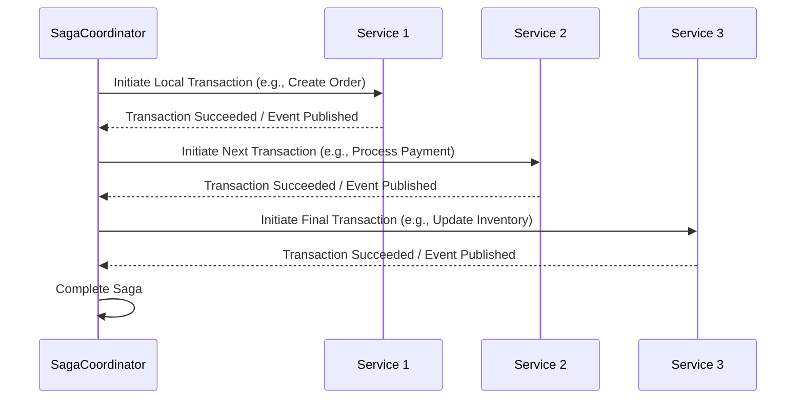

# Hands-on Lab: Saga Messaging Pattern

## Overview

In this lab, you will build a distributed saga-based system that coordinates a multi-step, long-running business process using asynchronous messaging. A Saga sequence of local transactions where each service publishes events and may trigger compensating actions if a later step fails. In our lab scenario, the Saga Coordinator (which also acts as the requester) orchestrates the following workflow:

1. **Create an Order**: The Saga Coordinator requests the **OrderService** to create a new Order.
2. **Charge Payment**: Upon successful order creation, the Saga Coordinator calls the **PaymentService** to process the payment for the order.
3. **Update Inventory**: Once payment is charged, the Saga Coordinator instructs the **InventoryService** to update the inventory to reflect the new order.

Each step represents a local transaction managed by its corresponding service. By coordinating these steps asynchronously, the Saga pattern enables a resilient way to manage distributed transactions, ensuring that the overall workflow maintains consistency even in the event of a failure at any individual step.

### Lab Components

This lab consists of the following projects:

- **Core**: A shared class library that contains common utilities. This library is referenced by the **InventoryService**, **OrderService**, and **PaymentService** to ensure consistent service behavior.
- **InventoryService**: A console application that listens for requests to update inventory. It is responsible for adjusting or reserving inventory based on order transactions.
- **OrderService**: A console application responsible for creating new orders. It initiates a local transaction to record order details and publish an event indicating an order has been made.
- **PaymentService**: A console application that processes order payments. It charges the customer's payment method and returns an acknowledgement of payment processing.
- **SagaCoordinator**: The orchestrator for the saga. This console application acts as the requester. It coordinates the overall process by instructing the **OrderService** to create an order, then calling the **PaymentService** to charge payment, and finally instructing the **InventoryService** to update the inventory. It manages the overall saga flow and handles responses from each service.

---

## What is the Saga Messaging Pattern?

The **Saga Messaging Pattern** is a design approach for coordinating long-running business processes that span multiple services or systems. Instead of a single distributed transaction, which can be complex and hard to scale, the Saga pattern breaks down the overall process into a series of local transactions, each handled by individual services. These services communicate asynchronously through messaging, and the saga coordinator orchestrates the overall workflow, invoking each step sequentially. If any step fails, compensating transactions can be executed to roll back or mitigate the impact of previous steps, ensuring eventual consistency across the system.

### How It Works

The Saga Messaging Pattern breaks a complex distributed transaction into a series of smaller, local transactions managed by an individual service. Rather than using a single, monolithic distributed transaction (which can be difficult to manage and scale), each service performs local work and publishes events or responses indicating the success or failure of its portion of the process.

A typical saga involves the following steps:

1. **Local Transactions**: Each service performs an atomic operation (or local transaction) that is part of the overall saga. For each, one service might create an order, another might process a payment, and another might update inventory. These actions are independent and encapsulated within their respective services.
2. **Asynchronous Messaging**: Communication between services is achieved through asynchronous messages or events. When one service completes its local transaction, it emits an event indicating either success or (in some designs) failure. Other services needing to react to that event listen for it and continue their processing accordingly.
3. **Orchestration by a Coordinator**: A Saga Coordinator oversees the entire process. The coordinator initiates the saga, sends requests to individual services in a specific order, and waits for responses. It then proceeds to the next step only after ensuring that the previous step has succeeded. If any of the steps fail, the coordinator can trigger one or more compensating transactions.
4. **Compensation**: In scenarios where a particular step fails, the saga may not be able to complete itself. Instead, the system can initiate compensating tasks to roll back or mitigate the effects of previously completed transactions. For instance, a compensating transaction might cancel or reverse the order if payment processing fails after order creation. This helps maintain the overall consistency of the system despite partial failures.
5. **Eventual Consistency**: Unlike traditional distributed transactions that require strong consistency and locking, the saga pattern embraces eventual consistency. Each local transaction is committed independently, and the overall process is eventually consistent as the compensation actions (if necessary) and follow-up transactions bring the system back into a consistent state.

Overall, the saga pattern provides a robust framework for managing long-running business processes in a microservices architecture by ensuring that each step is isolated, failures are handled gracefully, and the system remains flexible and scalable.

### Sequence Diagram

Below is a sequence diagram that illustrates the general saga flow:



##### Explanation

- **Local Transactions**: Each service performs its own transaction independently.
- **Asynchronous Communication**: Services communicate via events or messages, ensuring decoupled and asynchronous operation.
- **Coordination**: The Saga Coordinator sequences the steps, ensuring that each step is executed only after the previous step has been successfully completed.
- **Compensation (Not Shown)**: In failure cases, compensating transactions would be executed to reverse earlier steps.

### Key Benefits

- **Decoupling and Modularity**: Each service manages its transactions independently. This leads to better separation of concerns and simpler, more maintainable codebases.
- **Scalability**: Because each transaction is local to its service, the overall system scales more easily without the limitations imposed by distributed locking or two-phase commit protocols.
- **Resilience and Fault Tolerance**: The approach embraces eventual consistency and compensating transactions, allowing the system to recover gracefully from partial failures.
- **Flexibility**: Asynchronous messaging and loosely coupled interactions make updating and evolving individual services easier without distributing the entire process.
- **Improved Observability**: Each local transaction can be logged and monitored independently, providing insights into the overall saga process and helping with troubleshooting and performance tuning.

---

## Objectives

By completing this lab, you will:

- **Understand the Saga Pattern**:
  - Grasp how a distributed saga breaks a long-running business process into a series of local transactions.
  - Learn the role of asynchronous messaging and compensating actions in achieving eventual consistency.
- **Implement a Multi-Step Distributed Workflow**:
  - Develop services that perform local transactions, such as creating orders, processing payments, and updating inventory.
  - Observe how these services interact in a loosely coupled manner to complete a coherent business process.
- **Develop and Integrate Multiple Services**:
  - Build individual console applications for Order Service, Payment Service, and Inventory Service, each responsible for a distinct part of the system.
  - Create a Saga Coordinator that orchestrates the workflow by invoking the services in the appropriate sequence and handling their responses.
- **Utilize a Shared Library (Core)**:
  - Leverage the Core class library to share common utilities across services, ensuring consistency and reducing code duplication.
- **Handle Resiliency and Compensation**:
  - Understand the techniques used to compensate for failed transactions as part of the saga.
  - Examine how compensating transactions can help maintain data integrity in a distributed environment even when a step fails.

---

## Prerequisites

- [.NET SDK 8.0 or later](https://dotnet.microsoft.com/download)
- A text editor or IDE such as [Visual Studio Code](https://code.visualstudio.com/) or [Visual Studio](https://visualstudio.microsoft.com/) (any edition).
- [Docker Desktop](https://www.docker.com/products/docker-desktop)
- [Azure Service Bus Emulator](https://github.com/Azure/azure-service-bus-emulator-installer)

---

## Lab Steps

### Step 1 – Configure the Azure Service Bus Emulator

First, we must set up the queues on your local Service Bus Emulator.

1. **Update the Emulator's `config.json` File**:

   - **Locate the `config.json` file**: This file is found in the local repository folder of the Azure Service Bus Emulator Installer under the following path: `{local-emulator-repository-folder}\ServiceBus-Emulator\Configu\config.json`.

   - **Add the Request and Reply Queues**: Update the queues section to contain the definitions for both the request and reply queues. Your updated `config.json` file should look similar to the following:

     ```json
     {
       "UserConfig": {
         "Namespaces": [
           {
             "Name": "sbemulatorns",
             "Queues": [
               {
                 "Name": "message-patterns.saga.order",
                 "Properties": {
                   "DeadLetteringOnMessageExpiration": false,
                   "DefaultMessageTimeToLive": "PT1H",
                   "DuplicateDetectionHistoryTimeWindow": "PT20S",
                   "ForwardDeadLetteredMessagesTo": "",
                   "ForwardTo": "",
                   "LockDuration": "PT1M",
                   "MaxDeliveryCount": 3,
                   "RequiresDuplicateDetection": false,
                   "RequiresSession": false
                 }
               },
               {
                 "Name": "message-patterns.saga.payment",
                 "Properties": {
                   "DeadLetteringOnMessageExpiration": false,
                   "DefaultMessageTimeToLive": "PT1H",
                   "DuplicateDetectionHistoryTimeWindow": "PT20S",
                   "ForwardDeadLetteredMessagesTo": "",
                   "ForwardTo": "",
                   "LockDuration": "PT1M",
                   "MaxDeliveryCount": 3,
                   "RequiresDuplicateDetection": false,
                   "RequiresSession": false
                 }
               },
               {
                 "Name": "message-patterns.saga.inventory",
                 "Properties": {
                   "DeadLetteringOnMessageExpiration": false,
                   "DefaultMessageTimeToLive": "PT1H",
                   "DuplicateDetectionHistoryTimeWindow": "PT20S",
                   "ForwardDeadLetteredMessagesTo": "",
                   "ForwardTo": "",
                   "LockDuration": "PT1M",
                   "MaxDeliveryCount": 3,
                   "RequiresDuplicateDetection": false,
                   "RequiresSession": false
                 }
               },
               {
                 "Name": "message-patterns.saga.completion",
                 "Properties": {
                   "DeadLetteringOnMessageExpiration": false,
                   "DefaultMessageTimeToLive": "PT1H",
                   "DuplicateDetectionHistoryTimeWindow": "PT20S",
                   "ForwardDeadLetteredMessagesTo": "",
                   "ForwardTo": "",
                   "LockDuration": "PT1M",
                   "MaxDeliveryCount": 3,
                   "RequiresDuplicateDetection": false,
                   "RequiresSession": false
                 }
               }
             ],
             "Topics": [
             ]
           }
         ],
         "Logging": {
           "Type": "File"
         }
       }
     }
     ```

     > **Explanation of `config.json` Settings**
     >
     > **Namespace, Queue, and Topic Definitions**
     >
     > - `Namespaces`: Represent logical groupings for queues and topics. In the local emulator, the only acceptable value is `sbemulators`. All queues and topics under this namespace will inherit their configuration rules.
     > - `Queues`: This array lists the individual queues created under the namespace. In our setup, we define two queues:
     >   - `saga.order`: Used by the Order Service to handle order creation requests.
     >   - `saga.payment`: Used by the Payment Service to process payment transactions.
     >   - `saga.inventory`: Used by the Inventory Service to update or reserve inventory.
     >   - `saga.completion`: Used by the Saga Coordinator to send or receive the final saga completion message.
     > - `Topics`: No topics are defined in this configuration since our Saga lab relies solely on queues for managing message exchanges among services.
     >
     >
     > **Queue Properties**
     >
     > Each queue has a set of properties defined under `Properties`. Here is what each one means:
     >
     > - `DeadLetteringOnMessageExpiration`
     >
     >   This determines whether messages that expire (i.e., exceed their Time-to-Live) are automatically moved to the dead-letter queue. In our config, The Setting is false, which means expired messages will be discarded rather than forwarded to the dead-letter sub-queue.
     >
     > - `DefaultMessageTimeToLive`
     >
     >   This specifies a message's default duration in the queue before it expires if not processed. In our config, `PT1H` means each message will live for 1 hour (using ISO 8601 duration format).
     >
     > - `DuplicateDetectionHistoryTimeWindow`
     >
     >   This determines the window of time during which duplicate messages (based on a message ID) are detected. In our config, `PT20S` means duplicate detection is performed for 20 seconds after receiving a message.
     >
     > - `ForwardDeadLetteredMessagesTo`
     >
     >   If set, any dead-lettered messages are automatically forwarded to another queue. In our config, this is empty, so no forwarding is set up for the dead-letter messages.
     >
     > - `ForwardTo`
     >
     >   This specifies a queue or topic to which messages are forwarded automatically upon arrival. In our config, this is empty, meaning no auto-forwarding is performed.
     >
     > - `LockDuration`
     >
     >   This sets the duration for which a message is locked for processing after being received. This prevents multiple consumers from processing the same message simultaneously. In our config, `PT1M` means the lock lasts for 1 minute.
     >
     > - `MaxDeliveryCount`
     >
     >   This defines the maximum number of times a message delivery can be attempted before it is dead-lettered. In our config, this is set to 3, which means that after three failed attempts, the message is moved to the dead-letter queue.
     >
     > - `RequiresDuplicateDetection`
     >
     >   This indicates whether the queue should perform duplicate message detection. In our config, this turns off duplicate detection on these queues.
     >
     > - `RequiresSession`
     >
     >   This specifies whether the queue requires session-aware processing (grouping related messages together). In our config, this is set to `false`, meaning that session-based message grouping is not enforced.
     >
     > **Logging**
     >
     > This configures the logging mechanism for the Service Bus Emulator. In our configuration, this is set to `"Type": "File"` (the only supported option in the emulator), which means that all logs will be written to a file. This helps in troubleshooting and audit purposes.

2. **Start the Service Bus Emulator**

   - Follow the instructions for your operating system as detailed in the Azure Service Bus Emulator Installer repository. This repository includes OS-specific instructions for installing/starting the emulator.

### Step 2 – Build the Requester Console Application

In this step, you will create and build the Requester application for the Scatter-Gather lab. The Requester publishes a scatter request message to the Service Bus topic and then waits for responses on the designated response queue.

#### 2.1 Create the Project

1. **Open Your IDE**: Use Visual Studio or Visual Studio Code.

2. **Create a New Class Library Project**: Name the project **Core**.

3. **Install Required NuGet Packages**: Open a terminal in your project directory and execute:

   ```bash
   dotnet add package Azure.Messaging.ServiceBus
   dotnet add package System.Text.Json
   ```

   These packages provide functionality for interacting with Azure Service Bus and working with JSON files.

4. **Delete the default Class1.cs file**.

#### 2.2 Build the Service Helper Logic

Create a file named `ServiceHelper.cs` with the Core project and replace the default code with the following:

```c#
using Azure.Messaging.ServiceBus;
using System.Text;

namespace Core;

public static class ServiceHelper
{
	public static async Task SendAcknowledgementAsync(
		ServiceBusClient serviceBusClient,
		string completionQueueName,
		string service,
		bool success)
	{
		await using ServiceBusSender serviceBusSender = serviceBusClient.CreateSender(completionQueueName);
		ServiceBusMessage serviceBusMessage = new(Encoding.UTF8.GetBytes("Acknolwedgement"));
		serviceBusMessage.ApplicationProperties.Add("Service", service);
		serviceBusMessage.ApplicationProperties.Add("Success", success);
		await serviceBusSender.SendMessageAsync(serviceBusMessage);
		Console.WriteLine($"Sent Acknowledgement for {service} : {(success ? "Success" : "Failure")}");
	}
}
```

##### Explanation

1. **Using Directives**:
   - `using Azure.Messaging.ServiceBus` imports the Service Bus client library, providing access to the classes needed for messaging, such as `ServiceBusClient`, `ServiceBusSender`, and `ServiceBusMessage`.
   - `using System.Text` provides functionality to convert the message string into a byte array using UTF-8 encoding.
2. **Namespace and Class Declaration**:
   - The code is encapsulated in the `Core` namespace.
   - The class `ServiceHelper` is declared as `static`, meaning it can be referenced directly without creating an instance. This is appropriate for utility methods.
3. **`SendAcknowledgeAsync` Method**:
   - **Parameters**:
     - `ServiceBusClient serviceBusClient`: Passed in from the calling service, this client creates a sender to send messages.
     - `string completionQueueName`: The name of the queue where the acknowledgement is sent.
     - `string service`: A string representing the name of the service sending the acknowledgement.
     - `bool success`: A flag to indicate if the service's operation was successful.
   - **Creating a Service Bus Sender**:
     - `await using ServiceBusSender serviceBusSender = serviceBusClient.CreateSender(compleitionQueueName);` This line creates a sender targeting the specified completion queue. The `await using` pattern ensures proper disposal by the sender when the method is complete.
   - **Constructing the Message**:
     - The body of the message is the string `"Acknowledgement"` converted to a byte array using UTF-8 encoding.
     - Application properties are added to the message with keys `"Service"` and `"Success"`, enabling the receiving component to easily inspect and route the message based on its origin and status.
   - **Sending the Message**:
     - The result is logged to the console, so you can verify that the acknowledgement was sent and see whether it was a success or failure.

This **Core** class library abstracts out repeated messaging operations, allowing individual services (Order, Payment, and Inventory) to reuse this functionality for sending acknowledgments or other common tasks. It promotes consistency and reduces code duplication across the different parts of your saga-based solution.

### Step 3 – Create the Order Service Console App

In this step, you will create a console application named *OrderService* that listens to incoming order messages, processes an order, and sends an acknowledgment via the Core library.

#### 3.1 Create the Project

1. **Open Your IDE**: Use Visual Studio, Visual Studio Code,  or your favorite C# IDE.

2. **Create a new Class Library Project**:

   - In Visual Studio

     - Go to **File > New > Project**.
     - Select **Console App**.
     - Name the project **OrderService**.

   - In Visual Studio Code or via the command line, run:

     ```bash
     dotnet new console -n OrderService
     ```

3. **Add a reference to the Core Project**:

   - **Using Visual Studio**:

     - Right-click on the **OrderService** project in the Solution Explorer.
     - Choose **Add > Reference...** and then select the **Core** project.

   - **Using the Command Line**: Navigate to the OrderService project folder and run:

     ```bash
     dotnet add reference ../Core/Core.csproj
     ```

   This ensures the OrderService project can use the Core class library's shared code (like `ServiceHelper`).

#### 3.2 Build the Order Service Code

1. **Add Using Statements**

   At the very top of the `Program.cs` file, add the following using directives:

   ```c#
   using Azure.Messaging.ServiceBus;
   using Core;
   ```

   > **Explanation**:
   >
   > - `Azure.Messaging.ServiceBus` gives you access to Service Bus classes like `ServiceBusClient`, `ServiceBusProcessor`, and `ServiceBusMessage`.
   > - `Core` imports the shared class library containing the `ServiceHelper` helper method.

2. **Declare Constants**

   Immediately below the using statements, add the constants for your connection string and the names of the queues you will be using:

   ```c#
   const string connectionString = "Endpoint=sb://127.0.0.1;SharedAccessKeyName=RootManageSharedAccessKey;SharedAccessKey=SAS_KEY_VALUE;UseDevelopmentEmulator=true;";
   const string orderQueueName = "message-patterns.saga.order";
   const string completionQueueName = "message-patterns.saga.completion";
   ```

   > **Explanation**:
   >
   > These constants configure the connection details for the Service Bus Emulator and specify the names of the order queue (from which this service will receive messages) and the completion queue (where acknowledgments will be sent).

3. **Create the ServiceBusClient and ServiceBusProcessor**

   Next, create the Service Bus client and processor instances to connect to the Service Bus and listen for incoming messages on the specified order queue:

   ```c#
   await using ServiceBusClient client = new(connectionString);
   await using ServiceBusProcessor serviceBusProcessor = client.CreateProcessor(orderQueueName);
   ```

   > **Explanation**:
   >
   > - `ServiceBusClient` is used to establish a connection to the Service Bus.
   > - `ServiceBusProcessor` is configured to monitor the "saga.order" queue and receive messages automatically.

4. **Register the Message Handler**

   Add the code that processes incoming messages:

   ```c#
   // Register the message handler
   serviceBusProcessor.ProcessMessageAsync += async args =>
   {
   	Console.WriteLine();
   	string body = args.Message.Body.ToString();
   	Console.WriteLine($"Processing order: {body}");
   	// Process the order
   	await args.CompleteMessageAsync(args.Message);
   	await ServiceHelper.SendAcknowledgementAsync(client, completionQueueName, "Order", true);
   };
   ```

   > **Explanation**:
   >
   > - When a new message arrives, the handler prints the message body.
   > - After processing, the message is marked complete.
   > - An acknowledgement is then sent using the `ServiceHelper.SendAcknowledgementAsync` method from the Code library, indicating the order was processed successfully.

5. **Register the Error Handler**

   Add an error handler to catch and log any exceptions that occur during message processing:

   ```c#
   // Register the error handler
   serviceBusProcessor.ProcessErrorAsync += args =>
   {
   	Console.WriteLine(args.Exception.ToString());
   	return Task.CompletedTask;
   };
   ```

   > **Explanation**:
   >
   > This will print any error details to the console so you can troubleshoot issues during processing.

6. **Start Message Processing**

   Start the Service Bus processor to begin listening for messages:

   ```c#
   // Start processing
   await serviceBusProcessor.StartProcessingAsync();
   Console.WriteLine("Processing Order messages. Press any key to exit...");
   ```

   > **Explanation**: This code initiates message processing. The console displays a message and waits for a key press to signal when to stop processing.

7. **Start Message Processing**

   Once a key is pressed, gracefully stop the processor:

   ```c#
   // Stop processing
   await serviceBusProcessor.StopProcessingAsync();
   Console.WriteLine("Stopped processing Order messages.");
   ```

   > **Explanation**: This ensures that message processing is halted orderly and that a file status message is displayed.

### Step 4 - Create the Payment Service Console App

In this step, you will create a console application named *PaymentService* that listens to incoming payment messages, processes the payment, and sends an acknowledgment via the Core library.

#### 4.1 Create the Project

1. **Open Your IDE**: Use Visual Studio, Visual Studio Code,  or your favorite C# IDE.

2. **Create a new Class Library Project**:

   - In Visual Studio

     - Go to **File > New > Project**.
     - Select **Console App**.
     - Name the project **PaymentService**.

   - In Visual Studio Code or via the command line, run:

     ```bash
     dotnet new console -n PaymentService
     ```

3. **Add a reference to the Core Project**:

   - **Using Visual Studio**:

     - Right-click on the **PaymentService** project in the Solution Explorer.
     - Choose **Add > Reference...** and then select the **Core** project.

   - **Using the Command Line**: Navigate to the OrderService project folder and run:

     ```bash
     dotnet add reference ../Core/Core.csproj
     ```

   This ensures the PaymentService project can use the Core class library's shared code (like `ServiceHelper`).

#### 4.2 Build the Order Service Code

1. **Add Using Statements**

   At the top of your `Program.cs`, include the following using directives:

   ```c#
   using Azure.Messaging.ServiceBus;
   using Core;
   ```

   > **Explanation**:
   >
   > - `Azure.Messaging.ServiceBus` contains the necessary Service Bus classes (e.g., `ServiceBusClient`, `ServiceBusProcessor`).
   > - `Core` makes the shared functionality from your Core library (including `ServiceHelper`) available in the Payment Service.

2. **Declare Constants**

   Below the using statements, declare the connection string and the queue names:

   ```c#
   const string connectionString = "Endpoint=sb://127.0.0.1;SharedAccessKeyName=RootManageSharedAccessKey;SharedAccessKey=SAS_KEY_VALUE;UseDevelopmentEmulator=true;";
   const string paymentQueueName = "message-patterns.saga.payment";
   const string completionQueueName = "message-patterns.saga.completion";
   
   ```

   > **Explanation**:
   >
   > - `connectionString` holds the connection information for the Azure Service Bus Emulator.
   > - `paymentQueueName` specifies the queue in which the Payment Service listens for payment messages.
   > - `completionQueueName` is used to send back acknowledgment messages once a payment is processed.

3. **Create the ServiceBusClient and ServiceBusProcessor**

   Next, create the Service Bus client and processor:

   ```c#
   await using ServiceBusClient client = new(connectionString);
   await using ServiceBusProcessor serviceBusProcessor = client.CreateProcessor(paymentQueueName);
   ```

   > **Explanation**:
   >
   > - `ServiceBusClient` establishes the connection to the Service Bus.
   > - `ServiceBusProcessor` receives messages from the "messaging patterns.saga.payment" queue and processes them asynchronously.

4. **Register the Message Handler**

   Add the message handler code to process incoming payment messages:

   ```c#
   // Register the message handler
   serviceBusProcessor.ProcessMessageAsync += async args =>
   {
   	Console.WriteLine();
   	string body = args.Message.Body.ToString();
   	Console.WriteLine($"Processing payment: {body}");
   	// Process the payment
   	await args.CompleteMessageAsync(args.Message);
   	await ServiceHelper.SendAcknowledgementAsync(client, completionQueueName, "Payment", true);
   };
   ```

   > **Explanation**:
   >
   > - When a message from the payment queue arrives, its body is converted to a string and written to the console.
   > - Your business logic for processing the payment would go where indicated.
   > - Once processed, the message is completed, and then an acknowledgement (indicating success) is sent via the `ServiceHelper.SendAcknowledgementAsync` method.

5. **Register the Error Handler**

   Set up an error handler to capture and log errors during processing:

   ```c#
   // Register the error handler
   serviceBusProcessor.ProcessErrorAsync += args =>
   {
   	Console.WriteLine(args.Exception.ToString());
   	return Task.CompletedTask;
   };
   ```

   > **Explanation**: Errors in the processing pipeline are logged to the console, which helps with monitoring and debugging.

6. **Start Message Processing**

   Start the processor to begin receiving messages:

   ```C#
   // Start processing
   await serviceBusProcessor.StartProcessingAsync();
   Console.WriteLine("Processing Payment messages. Press any key to exit...");
   Console.ReadKey(true);
   ```

   > **Explanation**: The processor begins listening for messages on the payment queue. A prompt on the console lets you know the service is active, and the application waits for a key press to end processing.

7. **Stop Message Processing**

   Once the key is pressed, gracefully stop the processor:

   ```c#
   // Stop processing
   await serviceBusProcessor.StopProcessingAsync();
   Console.WriteLine("Stopped processing Payment messages.");
   ```


### Step 5 – Build the Inventory Service Console App

In this step, you will create the Inventory Service console application that listens to inventory update messages, updates the inventory, and sends an acknowledgment using the shared Core library.

#### 5.1 Create the Project

1. **Open Your IDE**: Use Visual Studio, Visual Studio Code,  or your favorite C# IDE.

2. **Create a new Class Library Project**:

   - In Visual Studio

     - Go to **File > New > Project**.
     - Select **Console App**.
     - Name the project **InventoryService**.

   - In Visual Studio Code or via the command line, run:

     ```bash
     dotnet new console -n InventoryService
     ```

3. **Add a reference to the Core Project**:

   - **Using Visual Studio**:

     - Right-click on the **InventoryService** project in the Solution Explorer.
     - Choose **Add > Reference...** and then select the **Core** project.

   - **Using the Command Line**: Navigate to the OrderService project folder and run:

     ```bash
     dotnet add reference ../Core/Core.csproj
     ```

   This ensures the PaymentService project can use the Core class library's shared code (like `ServiceHelper`).

#### 5.2 Build the Order Service Code

1. **Add Using Statements**

   At the top of your `Program.cs`, include the following using directives:

   ```c#
   using Azure.Messaging.ServiceBus;
   using Core;
   ```

   > **Explanation**:
   >
   > - `Azure.Messaging.ServiceBus` contains the necessary Service Bus classes (e.g., `ServiceBusClient`, `ServiceBusProcessor`).
   > - `Core` makes the shared functionality from your Core library (including `ServiceHelper`) available in the Payment Service.

2. **Declare Constants**

   Below the using statements, declare the connection string and the queue names:

   ```c#
   const string connectionString = "Endpoint=sb://127.0.0.1;SharedAccessKeyName=RootManageSharedAccessKey;SharedAccessKey=SAS_KEY_VALUE;UseDevelopmentEmulator=true;";
   const string ivnentoryQueueName = "message-patterns.saga.inventory";
   const string completionQueueName = "message-patterns.saga.completion";
   ```

   > **Explanation**:
   >
   > - `connectionString` holds the connection information for the Azure Service Bus Emulator.
   > - `inventoryQueueName` specifies the queue in which the Inventory Service listens for payment messages.
   > - `completionQueueName` is used to send back acknowledgment messages once a payment is processed.

3. **Create the ServiceBusClient and ServiceBusProcessor**

   Next, create the Service Bus client and processor:

   ```c#
   await using ServiceBusClient client = new(connectionString);
   await using ServiceBusProcessor serviceBusProcessor = client.CreateProcessor(ivnentoryQueueName);
   ```

   > **Explanation**:
   >
   > - `ServiceBusClient` establishes the connection to the Service Bus.
   > - `ServiceBusProcessor` is configured to listen to the inventory queue (`message-patterns.saga.inventory`).

4. **Register the Message Handler**

   Add the message handler code to process incoming payment messages:

   ```c#
   // Register the message handler
   serviceBusProcessor.ProcessMessageAsync += async args =>
   {
   	Console.WriteLine();
   	string body = args.Message.Body.ToString();
   	Console.WriteLine($"Updating inventory: {body}");
   	// Update the inventory
   	await args.CompleteMessageAsync(args.Message);
   	await ServiceHelper.SendAcknowledgementAsync(client, completionQueueName, "Inventory", true);
   };
   ```

   > **Explanation**:
   >
   > - When a message from the payment queue arrives, its body is converted to a string and written to the console.
   > - Your business logic for processing the payment would go where indicated.
   > - Once processed, the message is completed, and then an acknowledgement (indicating success) is sent via the `ServiceHelper.SendAcknowledgementAsync` method.

5. **Register the Error Handler**

   Set up an error handler to capture and log errors during processing:

   ```c#
   // Register the error handler
   serviceBusProcessor.ProcessErrorAsync += args =>
   {
   	Console.WriteLine(args.Exception.ToString());
   	return Task.CompletedTask;
   };
   ```

   > **Explanation**: This error handler ensures that exceptions during message processing are captured and written to the console for troubleshooting.

6. **Start Message Processing**

   Begin listening for messages on the inventory queue:

   ```C#
   // Start processing
   await serviceBusProcessor.StartProcessingAsync();
   Console.WriteLine("Processing Inventory messages. Press any key to exit...");
   Console.ReadKey(true);
   ```

   > **Explanation**: The processor starts incoming messages, and the console informs you that the service is running and waits for a key press to stop.

7. **Stop Message Processing**

   Gracefully stop the processor when finished:

   ```c#
   // Stop processing
   await serviceBusProcessor.StopProcessingAsync();
   Console.WriteLine("Stopped processing Inventory messages.");
   ```

   > **Explanation**: This stops the message processing, ensuring that the processor shuts down gracefully.


### Step 6 – Build the Saga Coordinator Console App

In this step, you will create a console application that orchestrates the overall saga and coordinates the distributed transactions. The Saga Coordinator project contains three class files:

- **SagaAcknowledgements.cs**: Holds the data structure to track acknowledgements from each service.
- **SagaCoordinator.cs**: This contains the logic to send messages to the participating service, receive acknowledgements, and trigger compensating actions if needed.
- **Program.cs**: This function acts as the application's entry point, sets up the Service BUs connection, instantiates the coordinator, and starts the saga.

#### 6.1 Create the Project

1. **Open Your IDE**: Use Visual Studio, Visual Studio Code,  or your favorite C# IDE.

2. **Create a new Class Library Project**:

   - In Visual Studio

     - Go to **File > New > Project**.
     - Select **Console App**.
     - Name the project **SagaCoordinator**.

   - In Visual Studio Code or via the command line, run:

     ```bash
     dotnet new console -n SagaCoordinator
     ```

3. **Add Required NuGet Packages**:

   - Ensure your project has an installed  package. You can add it via:

     ```bash	
     dotnet add package Azure.Messaging.ServiceBus
     ```


#### 6.2 Add the SagaAcknowledgements.cs Class File

1. **Create the File**: In your **SagaCoordinator** project, add a new class file called `SagaAcknowledgements.cs`.

2. **Add the Following Code**:

   ```c#
   namespace SagaCoorindator;
   
   public class SagaAcknowledgements
   {
   	public bool OrderAcknowledged { get; set; }
   	public bool PaymentAcknowledged { get; set; }
   	public bool InventoryAcknowledged { get; set; }
   	public bool SagaIsComplete => OrderAcknowledged && PaymentAcknowledged && InventoryAcknowledged;
   }
   ```

   > **Explanation**:
   >
   > - This class defines three Boolean properties that indicate whether the Order, Payment, and Inventory services have acknowledged their steps.
   > - The computed property `SsagaIsComplete` returns `true` only when all three acknowledgements are received, allowing the coordinator to know when the saga has fully completed.

#### 6.3 Add the SagaCoordinator.cs File

1. **Create the File**: Add a new class file called `SagaCoordinator.cs` in your project.

2. **Add the Following Code**:

   ```c#
   using Azure.Messaging.ServiceBus;
   using System.Text;
   
   namespace SagaCoorindator;
   
   public class SagaCoordinator(
   	ServiceBusClient serviceBusClient,
   	string orderQueueName,
   	string paymentQueueName,
   	string inventoryQueueName,
   	string completionQueueName)
   {
   
   	private readonly ServiceBusClient _serviceBusClient = serviceBusClient;
   	private readonly string _orderQueueName = orderQueueName;
   	private readonly string _paymentQueueName = paymentQueueName;
   	private readonly string _inventoryQueueName = inventoryQueueName;
   	private readonly string _completionQueueName = completionQueueName;
   
   	public async Task StartSagaAsync(string orderId)
   	{
   		try
   		{
   			SagaAcknowledgements acknowledgements = new();
   
   			Console.WriteLine($"Saga for {orderId} has been started");
   			await SendMessageAsync(_orderQueueName, $"Create Order for {orderId}");
   			await SendMessageAsync(_paymentQueueName, $"Charge Payment for {orderId}");
   			await SendMessageAsync(_inventoryQueueName, $"Update Inventory for {orderId}");
   
   			// Wait for the acknowledgements
   			await using ServiceBusReceiver serviceBusReceiver = _serviceBusClient.CreateReceiver(_completionQueueName);
   			while (!acknowledgements.SagaIsComplete)
   			{
   				ServiceBusReceivedMessage receivedMessage = await serviceBusReceiver.ReceiveMessageAsync();
   				if (receivedMessage is not null)
   				{
   					string? serviceName = receivedMessage.ApplicationProperties["Service"].ToString();
   					if (serviceName is not null)
   					{
   						bool success = (bool)receivedMessage.ApplicationProperties["Success"];
   						Console.WriteLine($"Received acknowledgement from {serviceName}: {(success ? "Success" : "Failure")}");
   						if (!success)
   						{
   							await CompenstateAsync(orderId);
   							Console.WriteLine($"Saga for {orderId} has been aborted due to an error in {serviceName}");
   							break;
   						}
   						switch (serviceName)
   						{
   							case "Order":
   								acknowledgements.OrderAcknowledged = true;
   								break;
   							case "Payment":
   								acknowledgements.PaymentAcknowledged = true;
   								break;
   							case "Inventory":
   								acknowledgements.InventoryAcknowledged = true;
   								break;
   						}
   						await serviceBusReceiver.CompleteMessageAsync(receivedMessage);
   					}
   				}
   			}
   
   			if (acknowledgements.SagaIsComplete)
   				Console.WriteLine($"Saga for {orderId} has been completed");
   			else
   				Console.WriteLine($"Saga for {orderId} has been aborted due to an error");
   
   		}
   		catch (Exception ex)
   		{
   			await CompenstateAsync(orderId);
   			Console.WriteLine($"Saga for {orderId} has been aborted due to an error: {ex.Message}");
   		}
   	}
   
   	private async Task SendMessageAsync(string queueName, string message)
   	{
   		await using ServiceBusSender serviceBusSender = _serviceBusClient.CreateSender(queueName);
   		await serviceBusSender.SendMessageAsync(new ServiceBusMessage(Encoding.UTF8.GetBytes(message)));
   		Console.WriteLine($"Message sent to {queueName}: {message}");
   	}
   
   	private async Task CompenstateAsync(string orderId)
   	{
   		await SendMessageAsync(_inventoryQueueName, $"Revert Inventory for {orderId}");
   		await SendMessageAsync(_paymentQueueName, $"Refund Payment for {orderId}");
   		await SendMessageAsync(_orderQueueName, $"Cancel Order for {orderId}");
   		Console.WriteLine($"Saga for {orderId} has been compensated");
   	}
   
   }
   ```

   > **Explanation**:
   >
   > - **Constructor and Private Fields**: The constructor accepts a `ServiceBusClient` and the names of the queues to be used by the saga. These values are stored in private fields for later use.
   > - **StartSagaAsync Method**:
   >   - This method begins the saga by sending messages to create an order, charge payment, and update inventory.
   >   - It the creates a receiver for the completion queue to wait for acknowledgements from the participating services.
   >   - As each acknowledgement comes in, it updates the `SagaAcknowledgements` instance.
   >   - If any service reports a failure, it calls the `Compenstate Async` method to revert to the previous steps.
   > - **SendMessageAsync Method**: A helper method that sends a message to the specified queue using the Service Bus client.
   > - **CompenstateAsync Method**: If the saga fails, this method sends compensation messages to each service to undo or mitigate the effects of the previous actions.

#### 6.4 Update the Program.cs

1. **Replace Default Program.cs Code**:

   ```c#
   using Azure.Messaging.ServiceBus;
   using SagaCoorindator;
   
   const string connectionString = "Endpoint=sb://127.0.0.1;SharedAccessKeyName=RootManageSharedAccessKey;SharedAccessKey=SAS_KEY_VALUE;UseDevelopmentEmulator=true;";
   const string orderQueueName = "message-patterns.saga.order";
   const string paymentQueueName = "message-patterns.saga.payment";
   const string inventoryQueueName = "message-patterns.saga.inventory";
   const string completionQueueName = "message-patterns.saga.completion";
   
   // Create the ServiceBusClient
   await using ServiceBusClient serviceBusClient = new(connectionString);
   
   // Create the SagaCoordinator, OrderService, PaymentService, and InventoryService
   SagaCoordinator sagaCoordinator = new(serviceBusClient, orderQueueName, paymentQueueName, inventoryQueueName, completionQueueName);
   
   // Wait for the user to press a key before starting the saga
   Console.WriteLine("Press any key to start the saga...");
   Console.ReadKey(true);
   Console.WriteLine();
   
   // Start the saga
   await sagaCoordinator.StartSagaAsync("123");
   
   // Wait for the user to press a key before closing the console
   Console.WriteLine();
   Console.WriteLine("Press any key to exit...");
   Console.ReadKey(true);
   ```

   > **Explanation**:
   >
   > - **Using Statements and Constant Declarations**: The file begins by importing the necessary namespaces and declaring constants for the connection string and the names of the order, payment, inventory, and completion queues.
   > - **ServiceBusClient Creation**: A `ServiceBusClient` is instantiated using the connection string.
   > - **Instantiate and Start the SagaCoordinator**: A new instance of `SagaCoordinator` is created, and then the `StartSagaAsync` method is called with a sample order ID (here, "123"). This initiates the saga process by sending messages to all involved services.
   > - **User Prompts**: The application waits for user input before starting the saga and before closing, allowing you to observe the console output during processing.

#### 6.5 Final Folder Structure and Code Summary

   Your **SagaCoordinator** project should have the following files:

   - **SagaAcknowledgements.cs**: Contains the acknowledgement tracking class.
   - **SagaCoordinator.cs**: Contains the logic for sending messages, waiting for acknowledgements, and compensating if necessary.
   - **Program.cs**: The entry point that sets up the Service Bus connection, instantiates the SagaCoordinator, and starts the saga.

 When you run the SagaCoordinator application, it coordinates the saga by sending requests to the Order, Payment, and Inventory queues. It then processes acknowledgement messages from the completion queue to determine whether the saga completes successfully or is aborted with compensation.

### Step 7 - Run the Saga Messaging Lab

##### Overiew

Before running the lab, ensure that:

- The Azure Service Bus Emulator runs with the configuration you set up (from [Step 1](#step-1-–-configure-the-azure-service-bus-emulator)).
- All your projects (Core, OrderService, PaymentService, InventoryService, SagaCoordinator) have been built without errors.
- Each service targets the correct queues (i.e., "message-patterns.saga.order", "message-patterns.saga.payment", "message-patterns.saga.inventory", and "message-patterns.saga.completion").

##### Running the Components

1. **Start the OrderService**, **PaymentService**, and **InventoryService**: Open separate console windows (or run them in separate terminal sessions) for each of the following services:
   - **OrderService**: Launch the OrderService application. It will start listening for incoming order messages on the "message-patterns.saga.order" queue. The console should display messages like `Processing Order messages. Press any key to exit...`
   - **PaymentService**: Similarly, launch the PaymentService application. It will listen to the " messaging patterns.saga.payment" queue and print messages like "Processing Payment messages." Press any key to exit.
   - **InventoryService**: Launch the InventoryService application, It will wait for inventory update messages on the "message-patterns.saga.inventory" queue and display: `Processing Inventory messages. Press any key to exit...`
2. **Start the SagaCoordinator Application**: Open another console window for the SagaCoordinaotr application. This application serves as the orchestrator of the entire saga:
   - When you run it, you will see a prompt that says, `Press any key to start the saga...`
   - Once you press a key, the SagaCoordinator sends messages to the Order, Payment, and Inventory services, initiating the saga with a sample order (for example, order ID "123").
   - Each service process returns an acknowledgment on the "message-patterns.saga.completion" queue.
   - The SagaCoordinator monitors the acknowledgements; when all three services have successfully processed their messages, it prints a completion message such as `Saga for 123 has been completed`. In case of any error, the coordinator will trigger compensation, reverting the operations and printing compensation messages.
3. **Monitor the Console Outputs**:
   - **For each service**, please observe that the OrderService, PaymentService, and InventoryService print out the processing details for their respective messages.
   - **For the SagaCoordinator**, watch for logs that display messages sent, acknowledgements received, and possibly compensation if a failure is detected.
4. **Shut Down the Applications**:
   - When you are finished testing or have observed the complete flow, follow each service's console prompt (typically Press any key to exit...).
   - This orderly shutdown helps confirm that each component gracefully stops processing messages.

#### Sequence Diagram

To visualize the flow, consider the following sequence diagram:

---

## Next Steps

Congratulations on completing the Saga messaging lab! Now that you have built and run a complete distributed messaging solution using Azure Service Bus Emulator, here are a few directions to continue your learning and further enhance your solution:

- **Enhance Compensation Logic**: Expand the scope of your compensation strategies to cover more complex failure scenarios. For example, implement compensating transactions that include retries or alternate fallback actions, ensuring the system can gracefully handle partial transactions.
- **Implement Robust Error Handling and Logging**: Integrate a structured logging framework (such as Serilog or Application Insights) to capture detailed logs and telemetry data from each service. This will help monitor the saga's lifecycle and diagnose issues promptly.
- **Introduce Timeouts and Delays**: Consider adding timeouts or delays for expecting acknowledgements in the Saga workflow. This can help simulate real-world network latencies or temporary service outages, allowing you to test Saga's consoleServiceBusClient await resiliency.
- **Develop a Dynamic Saga Coordinator**: Evolve the Saga Coordinator to handle multiple sagas concurrently and support dynamic workflows. Consider enabling the coordinator to read saga steps from a configuration file or database, thus making the system more flexible and adaptable.
- **Test with Realistic Scenarios**: Deploy your solution to an Azure Service Bus instance in a cloud environment. This will allow you to test the saga under production-like conditions and ensure that your services scale and operate reliably in a distributed system.
- **Enhance Observability**: Add health checks and dashboards to monitor the status of your various services. Tools like Azure Monitor, Grafana, or Prometheus can provide you with real-time insights into the performance and health of your distributed transactions.

By exploring these enhancements, you will create a more resilient and production-ready solution and deepen your understanding of the challenges and trade-offs inherent in distributed system design. The lab is a solid foundation for further experimentation and learning in orchestrating long-running business processes.